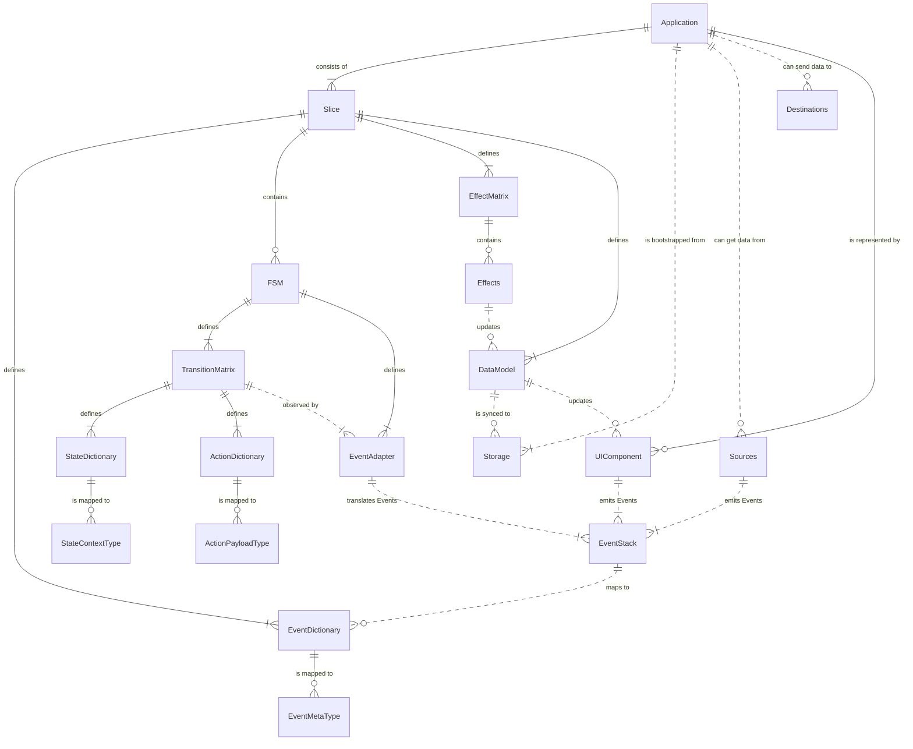
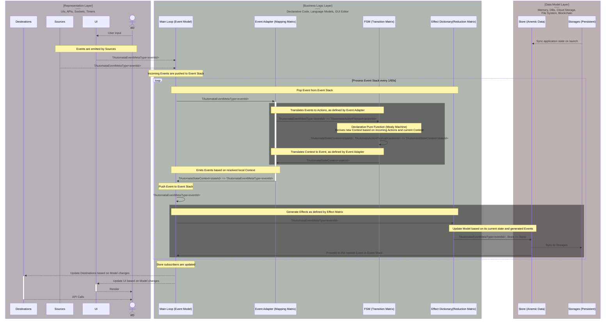

# Yantrix - Opinionated FSM Framework

Yantrix is a TypeScript framework that provides a set of tools to create robust and self-documented functional applications by code generation. The business logic is represented by declarative, event-driven [finite state machines](https://en.wikipedia.org/wiki/Finite-state_machine), while the application state is an [Anemic Domain Model](https://en.wikipedia.org/wiki/Anemic_domain_model), making it great a counterpart to any traditional state manager like [Redux](https://redux.js.org/), while allowing devs to focus on describing contracts and workflows, rather then writing and debugging the actual code. 

Lends itself perfectly to [Architecture-as-Code](https://jondavid-black.github.io/AaC/) paradigm and no-code/less-code tools for developers, like [n8n](https://github.com/n8n-io/n8n).

## Installation

To install Yantrix, you can use NPM or Yarn:

```
npm install yantrix
```

or

```
yarn add yantrix
```

## Core Concepts

Yantrix suggests the following application model:
- Responsibility layers are built in accordance with slightly adapted [MVC approach](https://en.wikipedia.org/wiki/Model%E2%80%93view%E2%80%93controller)
- an [Event-Driven Architecture](https://en.wikipedia.org/wiki/Event-driven_architecture) is used to communicate between layers of "Contoller" part, with a globally available dictionary of `Events`, specific for the Application
- _"Controller"_ is comprised of `Slices`, which are sets of interconnected `FSM`s (finite state machines), which communicate with `Events` and produce `Effects` to update the _"Model"_
- _"View"_ part (including UI and external I/O) is updated asynchronously with a **Render Loop**
- I/O streams are non-duplex and are separated into `Sources`, which generate `Events` for "Controller", and `Destinations`, which are updated when the _"Model"_ has changed
- _"Model"_ component is a serializeable ([anemic](https://en.wikipedia.org/wiki/Anemic_domain_model)) data structure (`Data Model`), which provides a single global store for the whole application, though it can and should be built with composition of `Slices`. It can be propagated to external `Storages` in a asynchronous **Sync Loop**
- the **Main Loop** is taking `Events` from UI and I/O and repeatedly updates the `Data Model` and `Slices` internal states based on their internal rules

The basic building block of state logic is a `FSM` (more specifically - a [Mealy Machine](https://en.wikipedia.org/wiki/Mealy_machine)), which exposes two predefined sets: `Actions` and `States`, with `Transition Matrix` describing the relations between those. Every `Action` type can have a derived `Payload` type, while every `State` has a dependent `Context`, and the latter two represent the current internal state of the machine. 



### EDA Loop


