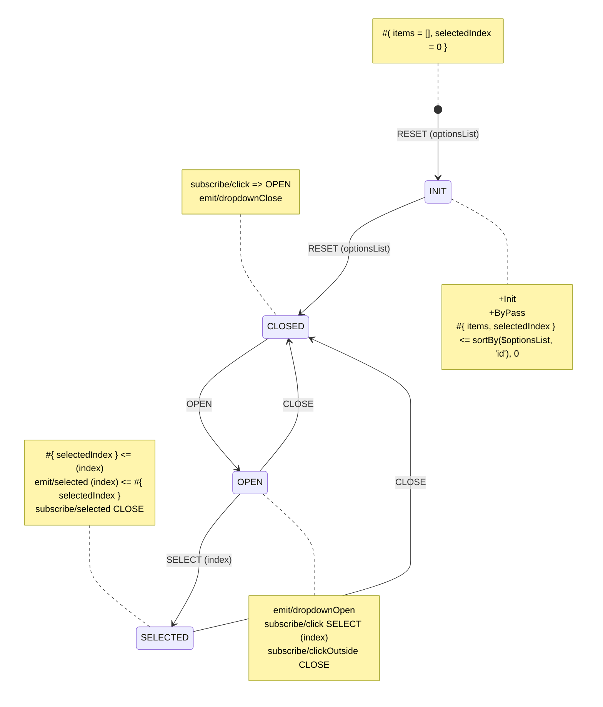

# Yantrix—Opinionated FSM Framework

Yantrix is a TypeScript framework that provides a set of tools to create robust and self-documented functional
applications by code generation.
The business logic is represented by declarative,
event-driven [finite state machines](https://en.wikipedia.org/wiki/Finite-state_machine), while the application state is
an [Anemic Domain Model](https://en.wikipedia.org/wiki/Anemic_domain_model), making it great a counterpart to any
traditional state manager like [Redux](https://redux.js.org/), while allowing devs to focus on describing contracts and
workflows, rather than writing and debugging the
actual code.

Lends itself perfectly to [Architecture-as-Code](https://jondavid-black.github.io/AaC/) paradigm and no-code/less-code
tools for developers, like [n8n](https://github.com/n8n-io/n8n).

## Installation

To install Yantrix end-to-end command line tool, you can use NPM, Yarn or PNPM:

```bash
$ npm install @yantrix/cli
# or
$ yarn add @yantrix/cli
# or
$ pnpm install @yantrix/cli
```

If your main language is TypeScript, you may prefer to install all available APIs or list only those you require

```bash
$ pnpm install yantrix
$ npm install @yantrix/automata @yantrix/utils @yantrix/yantrix-parser
```

## Usage

[📚 Documentation](https://tfcp68.github.io/yantrix/)

Basically, you turn diagrams into a code module in required language

```bash
$ yantrix codegen --outfile ../yantrix-generated.ts --language TypeScript --className SampleFSM --eval "A-->B"
```

## Sample Diagrams

### Dropdown Control



- `+Init` marks that **INIT** is the initial `State` of the `FSM`. `+ByPass` also implies that transition through
  this `State` is synchronous
- `#{items, selectedIndex}` describes a shape of `Context` for all `States`. `items` is the list of dropdown values,
  and `selectedIndex` stores currently selected item. Without extra expressions these values are copied from the
  preceding `Context`
- `#{items=[], selectedIndex = 0}` sets the initial value for that `Context`
- `#{items, selectedIndex} <= sortBy($optionsList, 'id'), 0` fills both `Context` properties from `Payload`:
	- `items` is a sorted `optionsList` property, assuming it's a List of Objects that have property of `id`.
	- `selectedIndex` is set to 0, when the options list is updated
- `subscribe/click => OPEN` in **CLOSED** state produces **OPEN** `Action` on incoming `click` `Event`, which
  transitions the `FSM` into **OPEN** state
- likewise, `subscribe/click SELECT (index)` produces **SELECT** `Action` and passes `index` property
  from `Event Meta` to its `Payload`, which transitions the `FSM` into the **SELECTED** `State`
- `subscribe/clickOutside => CLOSE` produces a **CLOSE** `Action` to return the dropdown to the
  original `State` (**CLOSED**)
- Both **CLOSED** and **OPEN** `States` emit corresponding `Events`, that are pipelined into `Event Bus` and connect the
  component to others.
- **SELECTED** is a transitional `State`: while `emit/selected (index) <= #{ selectedIndex }` lets the `Event Bus` know
  which item was selected, at the same time `subscribe/selected => CLOSE` transitions the `FSM`
  back to **CLOSED** `State` via **CLOSE** `Action`. It behaves similar to **INIT** `State` &ndash; the `FSM` goes
  through it. However, unlike that case, here it will emit `Event` and wait for its settlement before it runs further
  processing.

## Contributing

See [Contributing](https://tfcp68.github.io/yantrix/contributing/)
