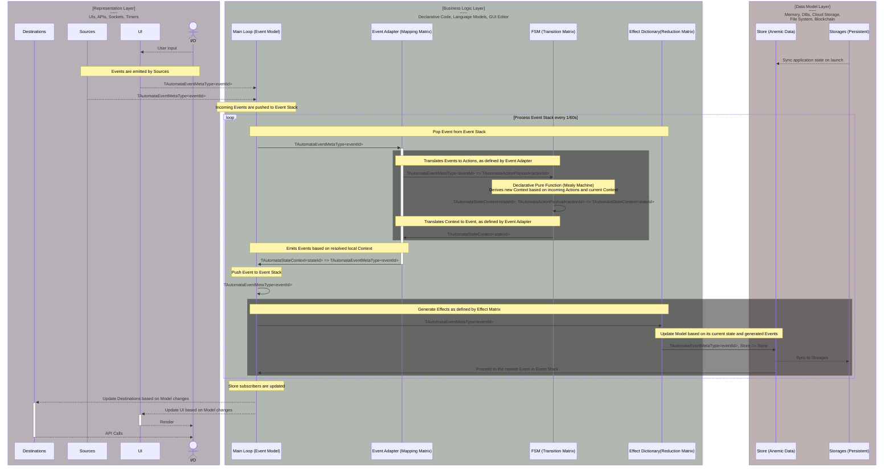

# Yantrix - FSM Framework on steroids

Yantrix is a TypeScript framework that provides a set of tools to create a code-generated state management, using
event-driven finite state machines and anemic data model. It represents an application state as a flock of independent
FSMs which communicate through a common event bus and operate on a single state object, which is separated from actual
business logic, making it a great counterpart to any functional state manager like [Redux](https://redux.js.org/), while
keeping the logic part of it robust and declarative

## Installation

To install Yantrix, you can use NPM or Yarn:

```
npm install yantrix
```

or

```
yarn add yantrix
```

## Concepts



