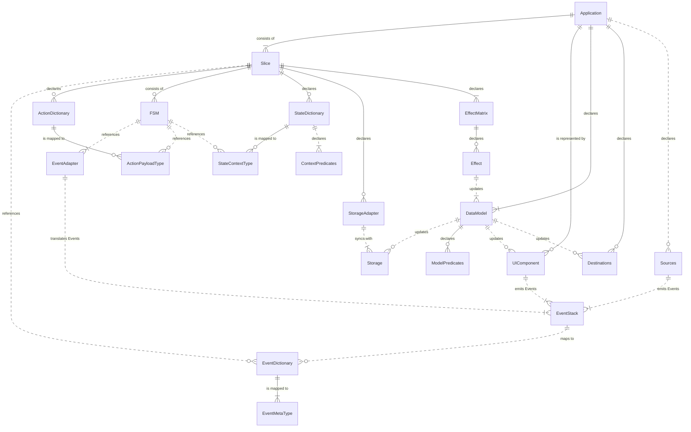
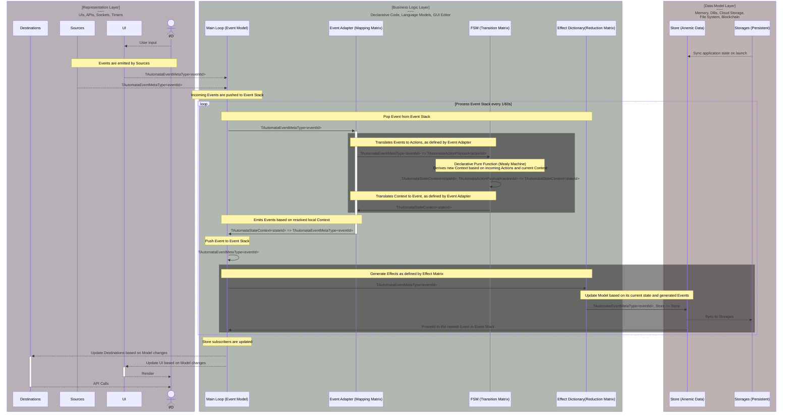
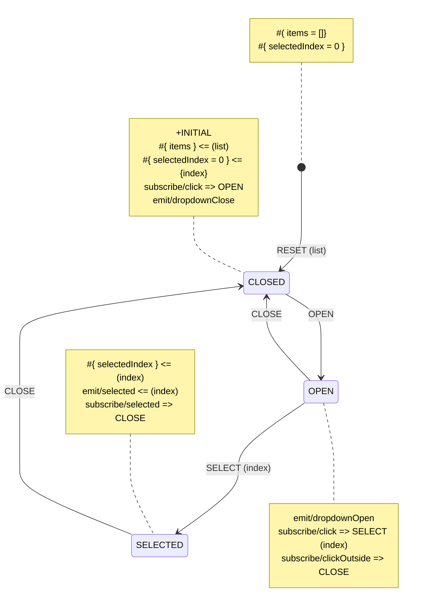

# Yantrix—Opinionated FSM Framework

Yantrix is a TypeScript framework that provides a set of tools to create robust and self-documented functional applications by code generation.
The business logic is represented by declarative, event-driven [finite state machines](https://en.wikipedia.org/wiki/Finite-state_machine), while the application state is an [Anemic Domain Model](https://en.wikipedia.org/wiki/Anemic_domain_model), making it great a counterpart to any traditional state manager like [Redux](https://redux.js.org/), while allowing devs to focus on describing contracts and workflows, rather than writing and debugging the
actual code.

Lends itself perfectly to [Architecture-as-Code](https://jondavid-black.github.io/AaC/) paradigm and no-code/less-code tools for developers, like [n8n](https://github.com/n8n-io/n8n).

<!-- TOC -->

-   [Yantrix—Opinionated FSM Framework](#yantrixopinionated-fsm-framework)
    -   [Installation](#installation)
    -   [Contributing](#contributing)
    -   [Core Concepts](#core-concepts)
        -   [Ontology](#ontology)
            -   [Data Model](#data-model)
            -   [Events](#events)
            -   [Slices](#slices)
            -   [FSM](#fsm)
            -   [Event Adapter](#event-adapter)
            -   [Predicates](#predicates)
            -   [Effects](#effects)
            -   [Transformers](#transformers)
            -   [Sources and Destinations](#sources-and-destinations)
            -   [Storage](#storage)
        -   [Event Stack](#event-stack)
            -   [Data Flow](#data-flow)
    -   [State behaviour subsyntax](#state-behaviour-subsyntax)
        -   [Expressions](#expressions)
        -   [Key Lists](#key-lists)
        -   [Event Subscriptions](#event-subscriptions)
    -   [Sample Automata Diagrams](#sample-automata-diagrams)
        -   [Dropdown UI](#dropdown-ui)
            -   [Syntax explanation](#syntax-explanation)

<!-- TOC -->

## Installation

To install Yantrix, you can use NPM, Yarn or PNPM:

```bash
npm install yantrix
# or
yarn add yantrix
# or
pnpm install yantrix
```

## Contributing

This project uses [**Yarn**](https://yarnpkg.com/), so make sure you have it installed globally. If not, install it using your package manager.

To get started, first clone the repository using:

```bash
git clone https://github.com/tfcp68/yantrix.git
```

Navigate to the project folder:

```bash
cd ./yantrix
```

Install all dependencies:

```bash
yarn
```

Build all packages using:

```bash
yarn build
```

That will produce Javascript module files along with `d.ts` type definitions.

Always create a new branch from `main` with `git checkout -b <your_contribution_name>`. Make the changes you want and then create a PR with them.

## Core Concepts

Yantrix suggests the following application model:

-   Responsibility layers are built in accordance with a slightly adapted [MVC approach](https://en.wikipedia.org/wiki/Model%E2%80%93view%E2%80%93controller)
-   an [Event-Driven Architecture](https://en.wikipedia.org/wiki/Event-driven_architecture) is used to communicate between layers of "Controller" part, with a globally available dictionary of `Events`, specific for the Application
-   _"Controller"_ is composed of `Slices`, which are sets of interconnected `FSMs` (finite state machines), which communicate with `Events` and produce `Effects` to update the _"Model"_
-   _"View"_ part (including UI and external I/O) is updated asynchronously with a **Render Loop**
-   I/O streams are non-duplex and are separated into `Sources`, which generate `Events` for "Controller", and `Destinations`, which are updated when the _"Model"_ has changed
-   _"Model"_ component is a serializable ([anemic](https://en.wikipedia.org/wiki/Anemic_domain_model)) data structure (`Data Model`), which provides a single global store for the whole application, though it can and should be built with composition of `Slices`. It can be propagated to external `Storages` in an asynchronous **Sync Loop**
-   the **Main Loop** is taking `Events` from UI and I/O and repeatedly updates the `Data Model` and `Slices` internal states based on their internal rules

### Ontology



#### Data Model

All the App states are stored in a single anemic object structure, which is persisted between runs and deterministically describe the behavior of the App. Designing the proper `Data Model` is the essential and the most important step to start laying out logic using `Events` and `Slices`.

`Data Model` contract can be composited from `Slices`, much like [Redux Toolkit](https://redux-toolkit.js.org/) does

#### Events

`Event Dictionary` is an enumerable set of constants (`Events`) that is shared throughout the App. `Events` represent every significant atomic change in the App state and are the default way to propagate updates throughout the rest of the architecture. Every `Event` type is associated with a particular type contract named `Event Meta`, which is typically implemented as generic type `TEventMetaType<TEventType>`. `Event Meta` can be irrelevant for certain `Event` types, in which case the `null` value and type is used.

#### Slices

`Slices` are independent parts of business logic layer, each having its own `Effect Matrix` and a set of `FSMs`. `Slices` are a suggested way to chop the App logic into independent smaller pieces, which

-   reduces the complexity of `Data Model` and provides a clear concern separation
-   enables for better performance and smart caching
-   enables for smooth refactoring of the resulting App to microservices or micro-frontends if it gets too intertwined

#### FSM

The basic building block of state logic is a `FSM` (more specifically - a [Mealy Machine](https://en.wikipedia.org/wiki/Mealy_machine)), which exposes a predefined `Transition Matrix` that comprises the relations between `States` and `Actions`, representing the decision tree of the machine. Every `Action`
type can have a derived `Payload` type, while every `State` has a dependent `Context`, and the latter two represent the current internal state of the machine.

`Actions`/`Payloads` and `States`/`Contexts` are enumerable values that can be composed of different Dictionaries, and can be reused independently on each other. It's perfectly fine to create several `FSMs` that operate either on the same set of `Actions` or `States`, or both.

#### Event Adapter

Unless `FSM` includes an `Event Adapater`, it would not accept or emit `Events` into the `Event Stack` and can only be controlled directly. However, in most cases it's desirable to connect it to the `Event Stack` via a pub/sub mechanism, which contains asymmetrical `Mapping Matrix`, that is responsible for:

-   Casting handled `Events` into `Actions`, including mapping of `Event Meta` to `Payload`
-   Producing `Events` from `State` changes, including mapping of `Context` to `Event Meta`

The reason `Event Adapter` is separated from `FSM` is reusability. If two `FSMs` share compatible contracts of `Actions`
and `States`, they can use the same `Event Adapter` too, if needed.

#### Predicates

`Predicates` are functions that return a Boolean value and are used to fork the flow of operations inside `FSMs`. All `Predicates` are high-order functions that allow compositing them. They come in three flavors:

-   `Built-in Predicates` are used to combine other `Predicates` and implement logical operations like `not`, `and` and so on.
-   `Model Predicates` have a `Data Model` as a dependency and are supposed to implement conditions that rely on the current state of `Application`
-   `Context Predicates` are bound to a certain `Slice` and its `State Dictionary`, and have a `State`/`Context` pair as a dependency. It's designed to create decision branching inside a `Transition Matrix`

#### Effects

`Effects` are pure high-order functions that update `Data Model` based on its current state and emitted `Events`, very similar to the way `FSMs` operate (and Redux's _reducers_). However, `FSMs` cannot alter the `Data Model` directly, locked inside their local scope, they can emit `Events` through the `Event Adapter`, which is mapped to a particular `Effect` by the `Effect Matrix` of the owning slice.

All the `Effects` triggered by different slices are batched every iteration of `Main Loop`, yielding exactly one (or none) `Data Model` update regardless of how many `FSM` transitions were performed.

#### Transformers

`Transformers` are projection-type functions that come with `Slice` and translate the same types between each other. They can be:

-   `Context Transformers` translate `Contexts` between each other. They are used inside `Transition Matrix` to update the internal data of the `FSM` when changing `States`. They are defined as a part of `State Dictionary`
-   `Reducer Transformers` translate from `State`+`Action/Payload` to `State/Context`
-   `Model Transformers` are a subtype of `Effects` which is context-free and is basically a function that mutates the `Data Model`. They can be composed with `Predicates` to produce `Effects`
-   `Generic Transformers` are built-in and user-defined pure functions that operate on any contract type and map the values. They are the basic building blocks of data manipulation.

#### Sources and Destinations

`Sources` and `Destinations` are abstractions for, respectively, input and output channels of the App. They include, but not limited to:

-   Internal Timers inside App
-   Remote API calls with various protocols for backend Apps
-   Hardware controls and UI interaction for frontend Apps
-   Message brokers, like Kafka or RabbitMQ
-   Network transports, like WebRTC or UDP streams
-   Environmental calls, i.e. pipes, sockets, system clock, file system, OS or WEB APIs

Every particular kind of `Source` or `Destination` is represented by a corresponding class:

-   `ISourceEmitter` for `Source` channels, which allows to declare rules of publishing `Events` from `Source`. That could be done via subscription, long and short polling or by exposing hook methods to be used directly throughout the App, notably in frontend `UI Components` and/or webserver routes.
-   `IDestinationGateway` for `Destination` channels, which observes the `Data Model` and propagates the required changes into the target endpoint

#### Storage

`Storage` is an adapter class to persist the `Data Model` and to load its snapshot, like:

-   LocalStorage for web apps
-   in-memory key storages, like Redis
-   Databases, like Mongo or Postgres
-   Physical and cloud file systems
-   Distributed storages like Blockchain or IPFS

The App can have multiple `Storages` which can store different subsets of `Data Model`. When the App starts, it polls all the Storages and integrates the received data into an initial `Data Model` snapshot, using composition of Selectors.

### Event Stack

Input streams (`UI Components` and `Sources`) and `FSMs` are emitting `Events`, that are put into a special LIFO structure, known as `Event Stack`. It is processed continuously by the `Main Loop`, which handles them one by one, always taking the last emitted `Event` and passing it to all connected `Slices`, and thus `FSMs`

#### Data Flow



## State behaviour subsyntax

### Constants and Object constructors

-   `'foo'` defines a string
-   `[]` creates an empty array
-   `$(foo)` references a Constant named foo

### Expressions

Expressions are function chains applied to particular values, most often during transitions. Expressions can include [Transformers](#transformers) and [Predicates](#predicates), and are generally just nested function calls around some property key, so Expression is either a `<PROPERTY_NAME>`, a `<FUNC_OPERATOR>(<PROPERTY_NAME>[,<CONSTANT_ARGS>...])` or a `<FUNC_OPERATOR>(<FUNC_OPERATOR>)`, i.e.

-   `index` : returns value of `index` key in a related source object
-   `sum(index,2)` : returns arithmetic result `index+2`, where `index` is converted to decimal
-   `round(sum(index,2))` : return the rounded result of a previous operation

In any case, an `Expression` has a primary operand which is hereby called `Bound Property`. The `Property` is always the first (leftmost) argument in the tree of calls.

#### Recursion

Using recursion is allowed, however, maximum depth of stack in any `Expression` is 8. This limitation is intentional, forcing you to explicitly define complex composition of functions as a new function.

#### Multiple properties

An `Expression` can reference more than one property as arguments of functions, but all except for the leftmost one are not considered `Bound Properties`

#### Null Property

If the most deeply nested function of an `Expression` does not require a parameter, the `Bound Property` is considered to equal `Null` for the sake of unification. This value would be passed as an argument to the function if its definition does actually have a parameter. Example:

-   `random()`: returns `Math.random()` value, compare to `random`, which would be a property reference
-   `if(greater(random(),0.5),f1(some_property),f2(some_property))`: applies one of two functions `f1`,`f2` to `some_property` randomly with 50% chance. However, since the leftmost argument is absend, the `Bound Property` is `Null`

### Key Lists

Many operations revolve around mapping data objects, which is achieved by enumerating affected source and target object keys (properties) and their transformations. Key list is defined as the following:

```
KEY_ITEM::=<TARGET_PROPERTY>[=<SOURCE_EXPRESSION>]
KEY_LIST::=KEY_ITEM[,KEY_ITEM...]
```

`SOURCE_EXPRESSION` is an `Expression` derived from source object properties, bound to any of them. The particular meaning of _"source"_ and _"target"_ here is contextual and depends on where the Key List is used. Examples:

-   `id,name` : copies corresponding fields from a source object to target
-   `id,name=trim(name)` : does the same, but applies `String.trim()` to source value
-   `id,name=concat(trim(name),' ',trim(lastname))`: extracts two properties from the source object, trims them and joins them with a predefined string constant

### State Transformers

To project values between `Action Paylowd` and `State Context` the following syntax is used:

-   `#{<KEY_LIST>}<=(<KEY_LIST>)` : maps `Payload` to `Context`, where `Payload` keys referenced on the right side, and `Context` keys are referenced on the left side- `#(<KEY_LIST>)<=(<KEY_LIST>)` : maps previous `Context` to `Context`, where the previous `Context` keys referenced on the right side

### Event Subscriptions

`subscribe/<EVENT_NAME> => <ACTION_NAME> [(<KEY_LIST>)]`

### Event Emitters

`emit/<EVENT_NAME> [<= (<KEY_LIST>)]`

### Side Effects

`effect/<EFFECT_NAME> [<= (<KEY_LIST>)]`

## Sample Automata Diagrams

### Dropdown UI



#### Syntax explanation

-   `*DEFAULT` marks that `CLOSED` is the initial state of the `FSM`
-   `::{items}` describes a list of dropdown values, stored in `Context` of a given `State`. Without extra expressions the value is copied from the preceding `Context`
-   `::{items} <= (list)` fills the `items` `Context` from the `Payload` property named `list`, if present
-   `::{selectedIndex}` is another `Context` value that stores currently highlighted element in the list, that is also copied from the preceding `Context` by default
-   `::{selectedIndex|0}` sets the initial value for that `Context`
-   altogether, `::{selectedIndex|0} <= (index)` sets the value of `selectedIndex` contextual value equal to `index` value of the incoming `Payload`, or to `0` if the corresponding `Action` does not have a `Payload`, i.e., it is `RESET`
-   `subscribe/click => OPEN` in `CLOSED` state produces `OPEN` `Action` on incoming `click` `Event`, which transitions the `FSM` into `OPEN` state
-   likewise, `subscribe/click => SELECT (index)` produces `SELECT` `Action` and passes `index` property in `Payload` to the `SELECTED` state
-   `subscribe/clickOutside => CLOSE` produces a `CLOSE` `Action` to return the dropdown to the original `State` (`CLOSED`)
-   Both `CLOSED` and `OPEN` `States` emit corresponding `Events`, that are pipelined into `Event Bus` and connect the component to others.
-   `SELECTED` is a transitional `State`: while `emit/selected <= (index)` lets the `Event Bus` know which item was selected, at the same time `subscribe/selected => CLOSE` transitions the `FSM` back to `CLOSED` `State` via `CLOSE` `Action`.
