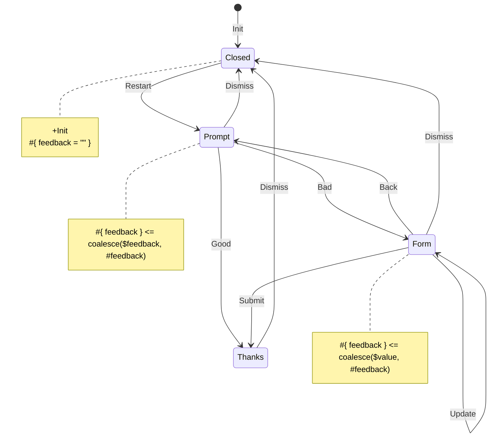

# Feedback Machine — XState vs Yantrix

A side-by-side comparison of the same feedback flow implemented in XState v5 and Yantrix.

## The machine



Context: `{ feedback: string }` — updated in `Form` on each `Update`, initialized to `""` in `Closed`, reset on `Restart` via payload.

## Key differences

| | XState | Yantrix |
| --- | --- | --- |
| Machine definition | TypeScript (`setup().createMachine()`) | Mermaid diagram → codegen |
| Source of truth | `src/machine.ts` | `src/diagrams/feedback-machine.mermaid` |
| Context updates | Per-transition `assign()` actions | Per-state `note` blocks with expression syntax |
| Guards | `guard: 'feedbackValid'` in transition | Component-level check (`feedback.length > 0`) |
| React integration | `createActorContext` provider + `useSelector` / `useActorRef` | `useFSM(Automata)` singleton hook — no provider needed |
| State IDs | String literals (`'prompt'`, `'form'`, …) | Numeric hashes resolved via `getState('Prompt')` |

### Context reset: a structural difference

In XState, `feedback` is reset explicitly by the `restart` event's `assign` action.
In Yantrix, `#{field = value}` in a note compiles to "preserve or initialize" semantics — the field is set only when null. The equivalent reset is achieved by passing `{feedback: ''}` in the `Restart` payload and using `coalesce($feedback, #feedback)` in the `Prompt` note, so `Back` (no payload) preserves the typed value while `Restart` clears it.

### Submit guard

XState expresses the guard inside the machine definition:

```ts
submit: { guard: 'feedbackValid', target: 'thanks' }
```

Yantrix has no diagram-level guard syntax. The same constraint is enforced at the dispatch site:

```ts
const canSubmit = context.feedback.length > 0;
dispatch({ action: getAction('Submit'), payload: {} }); // only called when canSubmit
```
