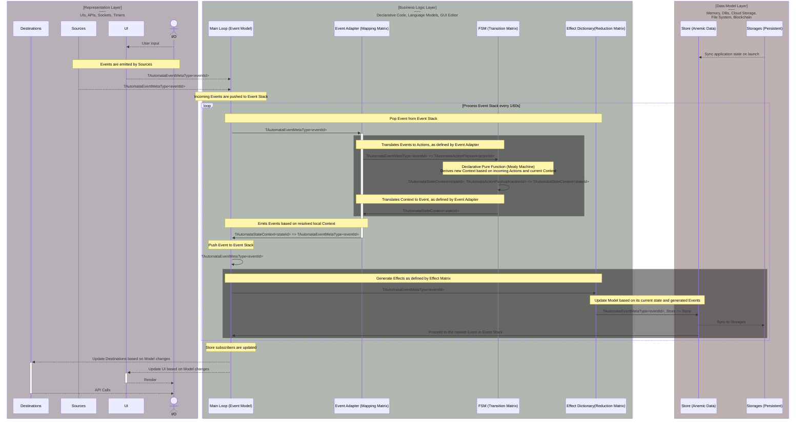

# Data Flow

## Data Model

Regardless of what's happening in the outside world, there's always a data snapshot of Application which is fully descriptive of its behaviour. This snapshot is stored in a `Data Model` &mdash; a global anemic storage that can be accessed via API. `Data Model` is something like a savegame, which can be used to serialize the application state to a text format and then instantiate the application to a previously saved state. Sometimes, minor conditions are not preserved, because they are stored inside `FSM`s instead, but most often than not `Data Model` is an application-global store, similar to Redux, which can be observed partially or extensively to update UI and endpoints.

## Data Sources

`Data Sources` are the lowest level abstractions in Yantrix. They represent the driving force of all the things in the Universe &ndash; Data. It is packed into [`Data Objects`](../syntax/100_data_objects.html) and moves the pieces of framework, such as `FSM`s, `Slices` and `Event Bus`, which is the preferred way. In Yantrix, while `FSM`s and `Data Model` are abstractions that store "internal" state of the Application, the external state of the environment has no single interface. Instead, various abstractions are used to produce declarative `Events`, that are processed synchronously. In real world scenarios, those would be:

-   Remote APIs, webhooks
-   Network streams: WebSockets, WebRTC, UDP
-   Message brokers, like Kafka or RabbitMQ
-   UI and peripherals
-   Internal Timers inside App
-   Environment: pipes, sockets, system clock, file system, OS or WEB APIs

Each of those can have slightly varying interfaces, but generally they are one of two:

-   Polling APIs for `Events`
-   Receiving `Events` through an exposed API

Yantrix can be used both for frontend and backend apps, and the choice of build target defines which approach is favorable in any given case.

## Event Adapters

## Effects

## Full Cycle

