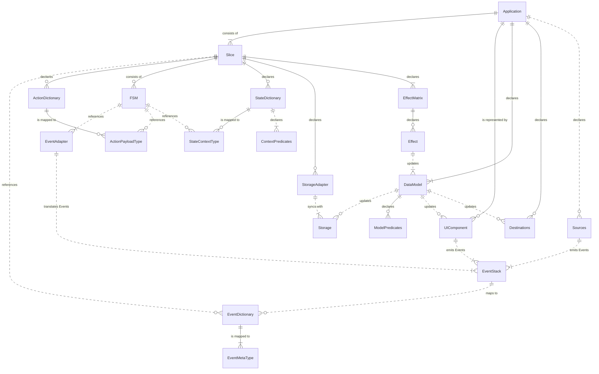

# Framework Architecture

Yantrix provides a set of mixed functional and objective APIs, each of them being self-sufficient for a particular application layer.
However, when used together, they form an all-around framework that manages things like:

- Sync and Async I/O
- Timers, Events and integrations
- Declarative data storage
- Application State management

Being primary a Typescript solution, the intended application is mostly Frontend, working well with libraries like React and Redux.
Due to its codegen approach Yantrix could work well in Svelte environment and "dumb" s2s NodeJS integrations.

## Core Concepts

Yantrix suggests the following application model:

- Responsibility layers are built in accordance with a slightly adapted [MVC approach](https://en.wikipedia.org/wiki/Model%E2%80%93view%E2%80%93controller)
- an [Event-Driven Architecture](https://en.wikipedia.org/wiki/Event-driven_architecture) is used to communicate between layers of "Controller" part, with a globally available dictionary of `Events`, specific for the Application
- _"Controller"_ is composed of `Slices`, which are sets of interconnected `FSMs` (finite state machines), which communicate with `Events` and produce `Effects` to update the _"Model"_
- _"View"_ part (including UI and external I/O) is updated asynchronously with a **Render Loop**
- I/O streams are non-duplex and are separated into `Sources`, which generate `Events` for "Controller", and `Destinations`, which are updated when the _"Model"_ has changed
- _"Model"_ component is a serializable ([anemic](https://en.wikipedia.org/wiki/Anemic_domain_model)) data structure (`Data Model`), which provides a single global store for the whole application, though it can and should be built with composition of `Slices`. It can be propagated to external `Storages` in an asynchronous **Sync Loop**
- the **Main Loop** is taking `Events` from UI and I/O and repeatedly updates the `Data Model` and `Slices` internal states based on their internal rules

## APIs relation diagram

