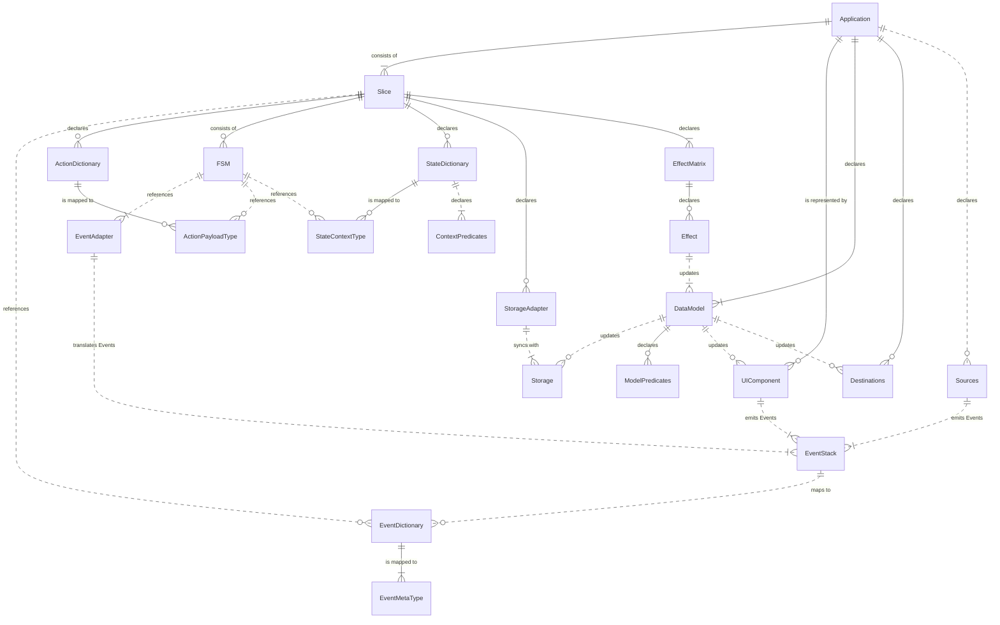
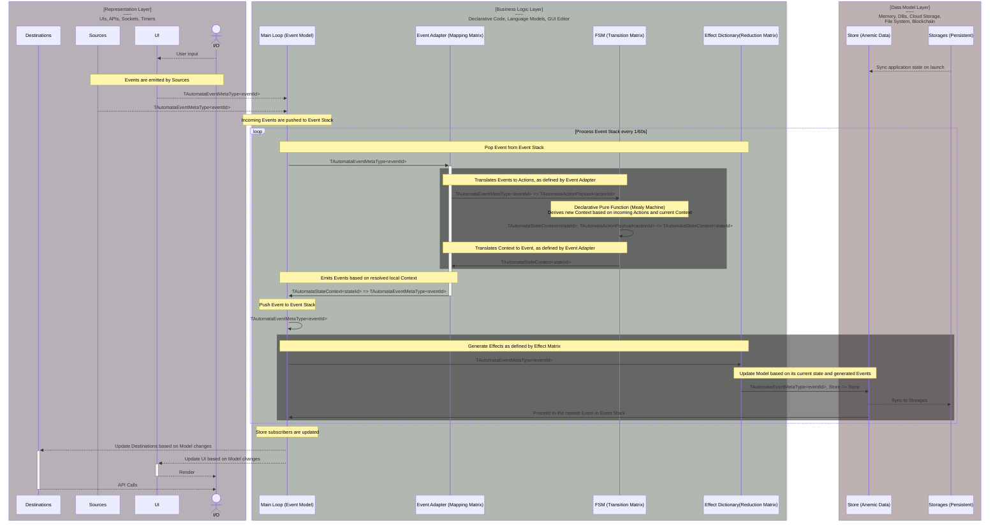

Yantrix provides a set of mixed functional and objective APIs, each of them being self-sufficient for a particular application layer.
However, when used together they form an all-around framework that manages things like:

-   Sync and Async I/O
-   Timers, Events and integrations
-   Declarative data storage
-   Application State management

Being primary a Typescript solution, the intended application is mostly Frontend, working well with libraries like React and Redux.
Due to its codegen approach Yantrix could work well in Svelte environment and "dumb" s2s NodeJS integrations.

## APIs relation diagram

## Data Flow

