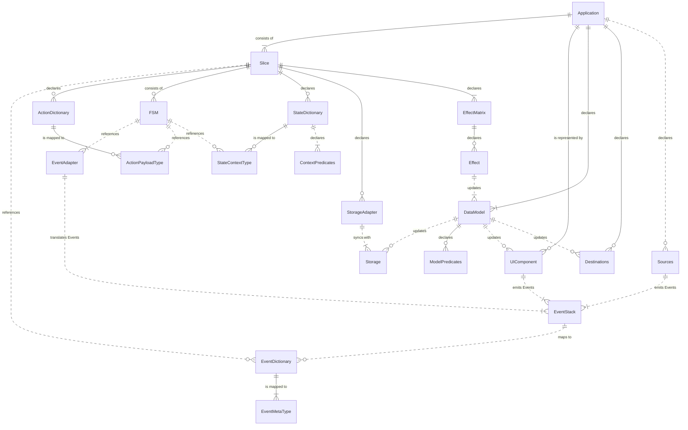

# Architecture

Yantrix provides a set of mixed functional and objective APIs, each of them being self-sufficient for a particular application layer.
However, when used together, they form an all-around framework that manages things like:

-   Sync and Async I/O
-   Timers, Events and integrations
-   Declarative data storage
-   Application State management

## Basic entities

Yantrix suggests the following design paradigm:

-   Responsibility layers are built in accordance with a slightly adapted [MVC approach](https://en.wikipedia.org/wiki/Model%E2%80%93view%E2%80%93controller)
-   _"Controller"_ layer is composed of `Slices`, which are sets of interconnected `FSMs` (finite state machines), which communicate with `Events` and produce `Effects` to update the _"Model"_
-   _"View"_ layer (including UI and external I/O) is updated asynchronously with a **Render Loop**
    -   I/O streams are non-duplex and are separated into `Sources`, which generate `Events` for "Controller", and `Destinations`, which are updated when the _"Model"_ has changed
    -   All external interfaces are designed using [Event-Driven Architecture](https://en.wikipedia.org/wiki/Event-driven_architecture)
-   _"Model"_ component is a serializable ([anemic](https://en.wikipedia.org/wiki/Anemic_domain_model)) data structure (`Data Model`), which provides a single global store for the whole application, though it can and should be built with composition of `Slices`. It can be propagated to external `Storages` in an independent **Sync Loop**
-   the **Main Loop** is taking `Events` from UI and I/O and repeatedly updates the `Data Model` and `Slices` internal states based on their internal rules

### FSM

The basic building block of state logic is a `FSM` (more specifically -
a [Mealy Machine](https://en.wikipedia.org/wiki/Mealy_machine)), which is built upon a transition map &ndash; a structure that describes relations between `States` and `Actions`, built from the decision tree of the machine. Every `Action` type can have a derived `Payload` type, while every `State` has a dependent `Context`, and the latter two represent the current internal state of the machine. Both are plain objects, that are processed immutably.

`Actions`/`Payloads` and `States`/`Contexts` are enumerable values that can be combined from various Dictionaries, and also can be reused independently on each other. For instance, it's perfectly fine to create several `FSMs` that operate either on the same set of `Actions` or `States`, or both.

For more details [follow here](./200_FSM.html)

### Slices

`Slices` are independent parts of business logic layer, each having its own `Effect Matrix` and a set
of `FSMs`. `Slices` are a suggested way to chop the App logic into independent smaller pieces, which

-   reduces the complexity of [`Data Model`](#data-model) and provides a clear concern separation
-   enables for better performance and smart caching
-   enables for smooth refactoring of the resulting App to microservices or micro-frontends if it gets too intertwined

## Data abstractions

### Data Model

All the App states are stored in a single anemic object structure, which is persisted between runs and deterministically
describe the behavior of the App. Designing the proper `Data Model` is the essential and the most important step to start laying out logic using `Events` and `Slices`.

`Data Model` contract can be composited from `Slices`, much like [Redux Toolkit](https://redux-toolkit.js.org/) does

### I/O

`Sources` and `Destinations` are abstractions for, respectively, input and output channels of the App. They include, but
not limited to:

-   Internal Timers inside App
-   Remote API calls with various protocols for backend Apps
-   Hardware controls and UI interaction for frontend Apps
-   Message brokers, like Kafka or RabbitMQ
-   Network transports, like WebRTC or UDP streams
-   Environmental calls, i.e. pipes, sockets, system clock, file system, OS or WEB APIs

Every particular kind of `Source` or `Destination` is represented by a corresponding class:

-   `IDataSource` for `Source` channels, which allows to declare rules of publishing `Events` from `Source`. That could
    be done via subscription, long and short polling or by exposing hook methods to be used directly throughout the App,
    notably in frontend `UI Components` and/or webserver routes.
-   `IDataDestionation` for `Destination` channels, which receives chosen `Events` and `Data Model` and propagates the required changes
    into the target endpoint based on them.

### Storage

`Storage` is an adapter class to persist the `Data Model` and to load its snapshot, like:

-   LocalStorage for web apps
-   in-memory key storages, like Redis
-   Databases, like Mongo or Postgres
-   Physical and cloud file systems
-   Distributed storages like Blockchain or IPFS

The App can have multiple `Storages` which can store different subsets of `Data Model`. When the App starts, it polls
all the Storages and integrates the received data into an initial `Data Model` snapshot, using composition of Selectors.

## Event Model

### Events

`Events` represent every significant atomic change in the App state and are the default way to propagate updates throughout the rest of the architecture. `Event Dictionary` is an enumerable set of `Events` constants that is shared throughout the App.

Every `Event` type is associated with a particular type contract named `Event Meta`, which is typically implemented as generic type `TEventMetaType<TEventType>`. `Event Meta` can be irrelevant for certain `Event` types, in which case the `null` value and type is used.

### Event Adapter

Unless `FSM` includes an `Event Adapater`, it would not accept or emit `Events` into the `Event Stack` and can only be
controlled directly. However, in most cases it's desirable to connect it to the `Event Stack` via a pub/sub mechanism,
which contains asymmetrical `Mapping Matrix`, that is responsible for:

-   Casting handled `Events` into `Actions`, including mapping of `Event Meta` to `Payload`
-   Producing `Events` from `State` changes, including mapping of `Context` to `Event Meta`

The reason `Event Adapter` is separated from `FSM` is reusability. If two `FSMs` share compatible contracts of `Actions`
and `States`, they can use the same `Event Adapter` too, if needed.

### Event Stack

Input streams (`UI Components` and `Sources`) and `FSMs` are emitting `Events`, that are put into a special LIFO
structure, known as `Event Stack`. It is processed continuously by the `Main Loop`, which handles them one by one,
always taking the last emitted `Event` and passing it to all connected `Slices`, and thus `FSMs`

## Data operations

### Predicates

`Predicates` are functions that return a Boolean value and are used to fork the flow of operations inside `FSMs`.
All `Predicates` are high-order functions that allow compositing them. They come in three flavors:

-   `Built-in Predicates` are used to combine other `Predicates` and implement logical operations like `not`, `and` and so
    on.
-   `Model Predicates` have a `Data Model` as a dependency and are supposed to implement conditions that rely on the
    current state of `Application`
-   `Context Predicates` are bound to a certain `Slice` and its `State Dictionary`, and have a `State`/`Context` pair as a
    dependency. It's designed to create decision branching inside a `Transition Matrix`

### Transformers

`Transformers` are projection-type functions that come with `Slice` and translate the same types between each other.
They can be:

-   `Context Transformers` translate `Contexts` between each other. They are used inside `Transition Matrix` to update the
    internal data of the `FSM` when changing `States`. They are defined as a part of `State Dictionary`
-   `Reducer Transformers` translate from `State`+`Action/Payload` to `State/Context`
-   `Model Transformers` are a subtype of `Effects` which is context-free and is basically a function that mutates
    the `Data Model`. They can be composed with `Predicates` to produce `Effects`
-   `Generic Transformers` are built-in and user-defined pure functions that operate on any contract type and map the
    values. They are the basic building blocks of data manipulation.

### Effects

`Effects` are pure high-order functions that update `Data Model` based on its current state and emitted `Events`, very
similar to the way `FSMs` operate (and Redux's _reducers_). However, `FSMs` cannot alter the `Data Model` directly,
locked inside their local scope, they can emit `Events` through the `Event Adapter`, which is mapped to a
particular `Effect` by the `Effect Matrix` of the owning slice.

All the `Effects` triggered by different slices are batched every iteration of `Main Loop`, yielding exactly one (or
none) `Data Model` update regardless of how many `FSM` transitions were performed.

## APIs relation diagram

