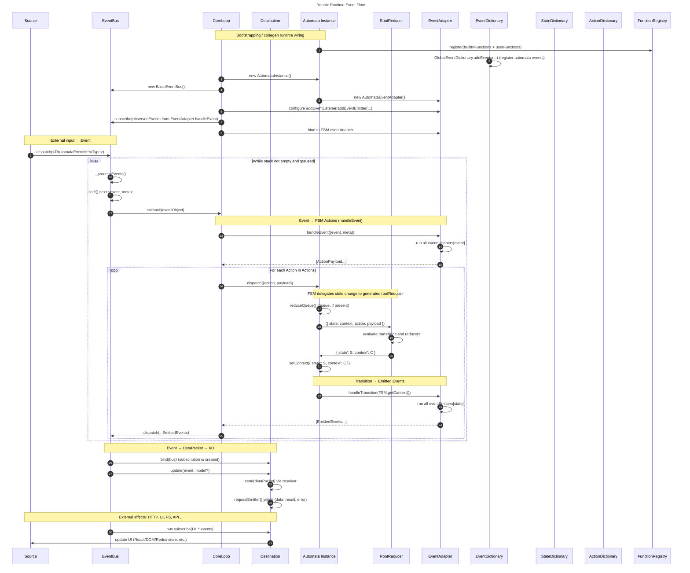

# Event Model

Yantrix uses a reactive event loop to connect external inputs, FSM state machines, and
output destinations. All communication between layers goes through an `EventBus`. The
`CoreLoop` orchestrates the processing: it listens on the bus, translates events into FSM
actions via an `EventAdapter`, feeds them into the automaton, and dispatches the resulting
emitted events back onto the bus.

## Runtime Event Flow

_Figure 1: Runtime event flow in Yantrix: external events are dispatched to the EventBus,
processed by the CoreLoop through the EventAdapter into actions, reduced by the generated
automaton and its RootReducer, and finally emitted to destinations such as UI or external I/O_

## How event processing works

### 1. External dispatch

A `Source` (UI interaction, timer, API response, or any external trigger) calls
`bus.dispatch(eventMetaObject)`. The event is pushed onto the `EventBus` stack.

### 2. Event to action translation

The `EventBus` processes its stack in a loop. For each event it calls registered subscribers,
one of which is the `CoreLoop`'s callback. The `CoreLoop` passes the event to its
`EventAdapter`, which runs all registered `eventListeners` for that event ID and collects
the resulting `ActionPayload` objects.

### 3. FSM reduction

For each action, the `CoreLoop` calls `fsm.dispatch({ action, payload })`. The automaton
looks up the transition for `(currentState, action)`, calls the generated `reducer` for the
target state, and sets the new `{ state, context }` pair.

### 4. Transition to event emission

After each state change, the `EventAdapter`'s `eventEmitters` for the new state run and
return a list of emitted events. The `CoreLoop` dispatches these back onto the `EventBus`,
which may trigger further processing cycles until the stack is empty or the bus is paused.
