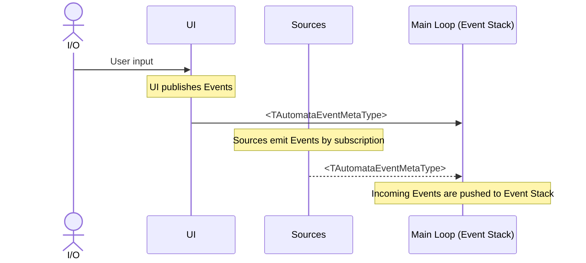
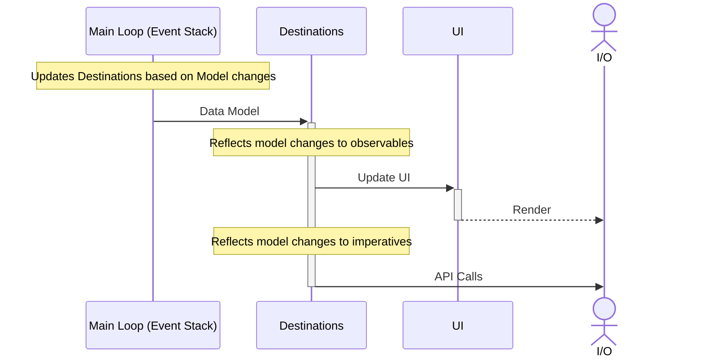
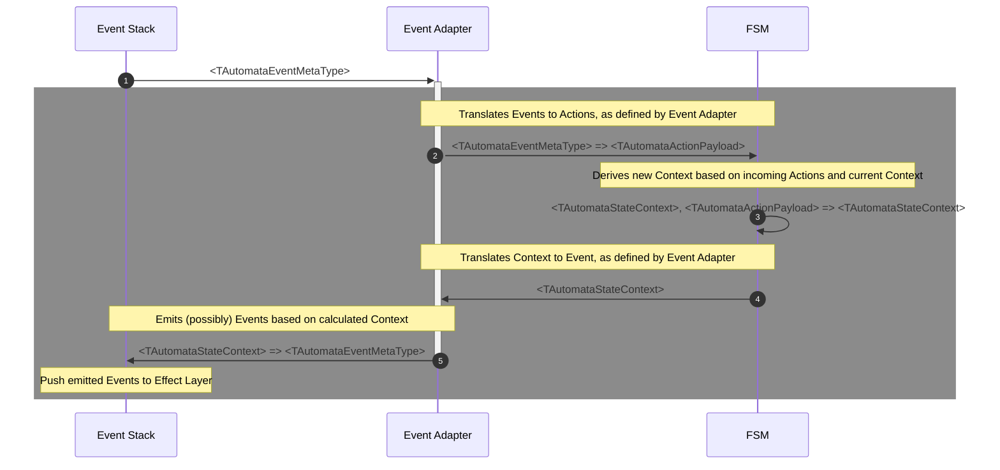
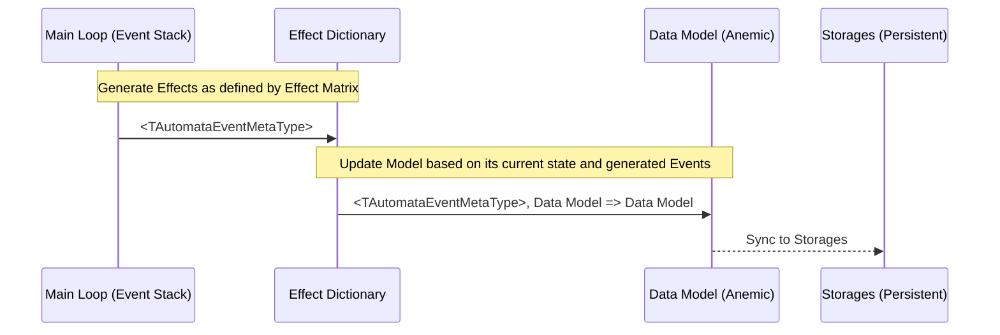
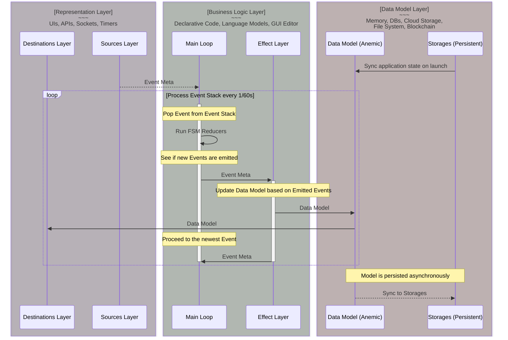

# Data Flow

## Data Model

Regardless of what's happening in the outside world, there's always a data snapshot of an Application that is fully descriptive of its behavior. This snapshot is stored in a `Data Model` &mdash; a global anemic storage that can be accessed via API. `Data Model` is something like a savegame, which can be used to serialize the application state to a text format and then instantiate the application to a previously saved state. Sometimes, minor conditions are not preserved, because they are stored inside `FSM`s instead, but most often than not `Data Model` is an application-global store, similar to Redux, which can be observed partially or extensively to update UI and endpoints.

## Data Sources

`Data Sources` are the lowest level abstractions in Yantrix. They represent the driving force of all the things in the Universe &mdash; information. It is packed into [`Data Objects`](../syntax/100_data_objects.html) and moves the pieces of framework, such as `FSM`s, `Slices` and `Event Bus`, which is the preferred way. In Yantrix, while `FSM`s and `Data Model` are abstractions that store "internal" state of the Application, the external state of the environment has no single interface. Instead, various abstractions are used to produce declarative `Events`, that are processed synchronously. In real world scenarios, those would be:

-   Remote APIs, webhooks
-   Network streams: WebSockets, WebRTC, UDP
-   Message queues in brokers, like Kafka or RabbitMQ
-   Databases and Object Storages
-   UI and peripherals
-   Internal Timers inside App
-   Environment: pipes, sockets, system clock, file system, OS or WEB APIs

Each of those can have slightly varying interfaces, but generally they are one of two:

-   Polling APIs for `Events`
-   Receiving `Events` dispatched imperatively through an exposed API

Yantrix can be used both for frontend and backend apps, and the choice of build target defines which approach is favorable in any given case.

_Figure 1: Yantrix Sources Layer_

## Destinations

The architecture of Yantrix suggests that it every of its layers operates as a black box and can be "plugged in" independent of each other. `Destinations` is an umbrella term for all possible outputs that can be connected to `Application`, and it is the "outermost" layer of all. When all the calculations are done and the `Data Model` is updated accordingly, it's time to deliver the changes to whatever your `Application` works with. It's easy to figure in some cases `Destinations` are the same as `Sources`, for instance:

-   User Interface
-   Duplex streams and/or sockets
-   File System
-   Databases and Object Storages

However, all aforementioned endpoints provide different interface for `Destination` rather than for `Source`. For instance, to update UI you might choose to use [React] or [Redux]('../integrations/200_redux.md) integrations, in which case `Destination` is operating as a subscription endpoint. At the same time, if your UI is updated imperatively, `Destination` would be operating as a publishing endpoint.

Another example would be an SQL RDBMS, when binding it for a `Source` technically requires only <abbr title="Data Querying Language">DQL</abbr> queries (`SELECT`) and read permissions, while binding the same database for a `Destination` requires writing permissions and <abbr title="Data Modification Language">DML</abbr> queries (`UPDATE` or `REPLACE`)

Other `Destinations`, which mostly operate as publishing endpoint, might include:

-   API calls
-   `stdout` and other terminals
-   Exchanges in message brokers, like Kafka or RabbitMQ
-   pretty much any callback in target language

_Figure 2: Yantrix Destinations Layer_

## Event Adapters

`Event Adapter` is a component that plugs into an `FSM` and then connects to `Event Stack`. Every incoming `Event` is passed to an [interface](../API-Reference/automata/interfaces/IAutomataEventAdapter.html#handleevent) that may produce a `Payload` from it. If so, the `Payload` is then passed to an attached `FSM`, and after the transition concludes, another [interface](../API-Reference/automata/interfaces/IAutomataEventAdapter.html#handletransition) translates a resulting `Context` into another `Event`, if required. The `Event` is then added to the `Event Stack`.

This, each `Event Adapter` is dependent on all three semantic spaces: `Events`, `Actions` and `States`. If several `FSM`s use the same `States` and `Actions`, they also can use same `Event Adapters` attached to the same `Event Stack`, making them reusable. However, when autogenerating `Slices` with Yantrix, there's no fine control over namespaces, providing only two options:

-   `single` dictionary for all encountered `Actions` and `States` (respectively) and a combined `Event Adapter` that is plugged into every generated `FSM`
-   `independent` dictionaries and unique `Event Adapters` for every generated `FSM`

_Figure 3: Yantrix Main Loop_

## Effects

While Main Loop drives the sequence of execution, every `FSM` is locked onto oneself and cannot directly update the "outer world data" that is expressed by `Data Model`. To do so, `Effects` are invoked by Main Loop every time it repeats its cycle. `Effects` are pure functions that take `Data Model` and `Event Meta` as parameters and return updated `Data Model`. While every `FSM` can declare its own `Effects`, in fact they are invoked after all `FSM`s are already done with their `Reducer` loops, and some `Events` are produced by `Event Adapters`. Only those `Events` would be translated to `Effects`, while `Events` emitted by `Sources` are first translated into `Actions`.

_Figure 4: Yantrix Effect Layer_

## Architectural Diagram

-   `Sources` and `Destinations` are strictly isolated from all `Slices` logic and `Data Model`, behaving as a representation layer, aka **View**.
-   `Slices` and `FSMs` represent the **Controller** layer, defining all the business logic. **Controller** communicates bidirectionally with **View** with `Events`, which are plain [Data Objects](../syntax/100_data_objects.html)
-   `Data Model` (along with persistent storages to save it between Application sessions) is a plain data object without any runtime state, behaving strictly as **Model** in MVC. It is updated by the same `Events` which reflect the **View** layer, but influences neither the **View** nor the **Controller** directly, used only for storing the `Application` state and user data.

