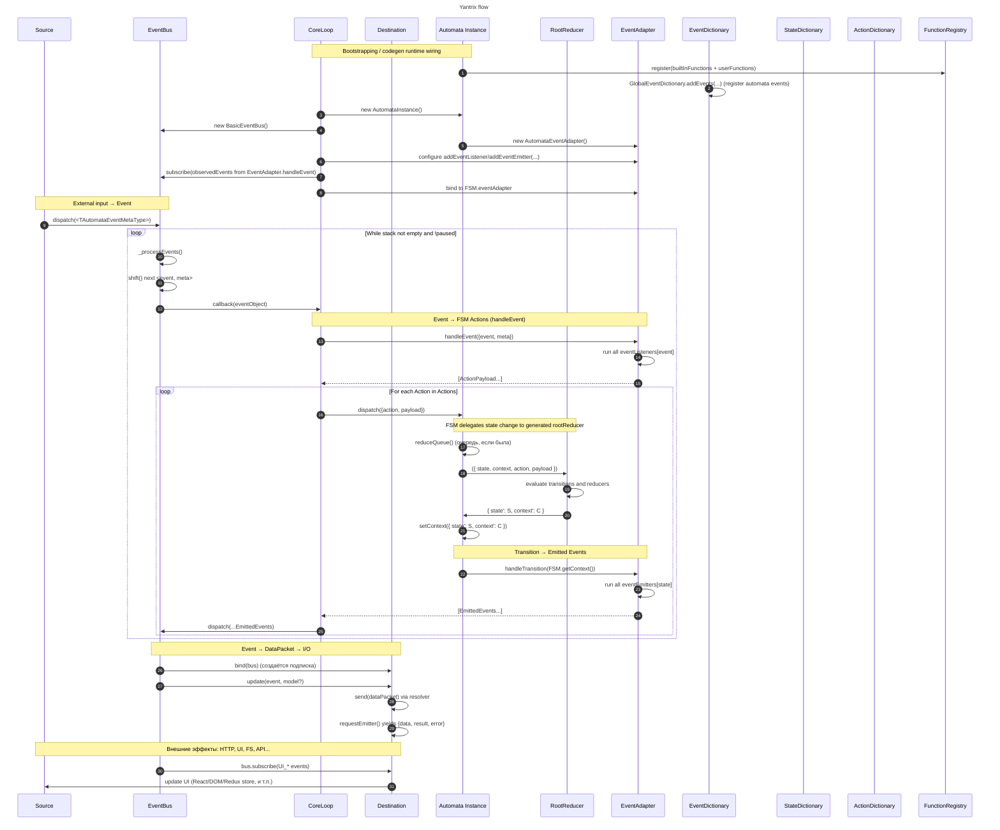
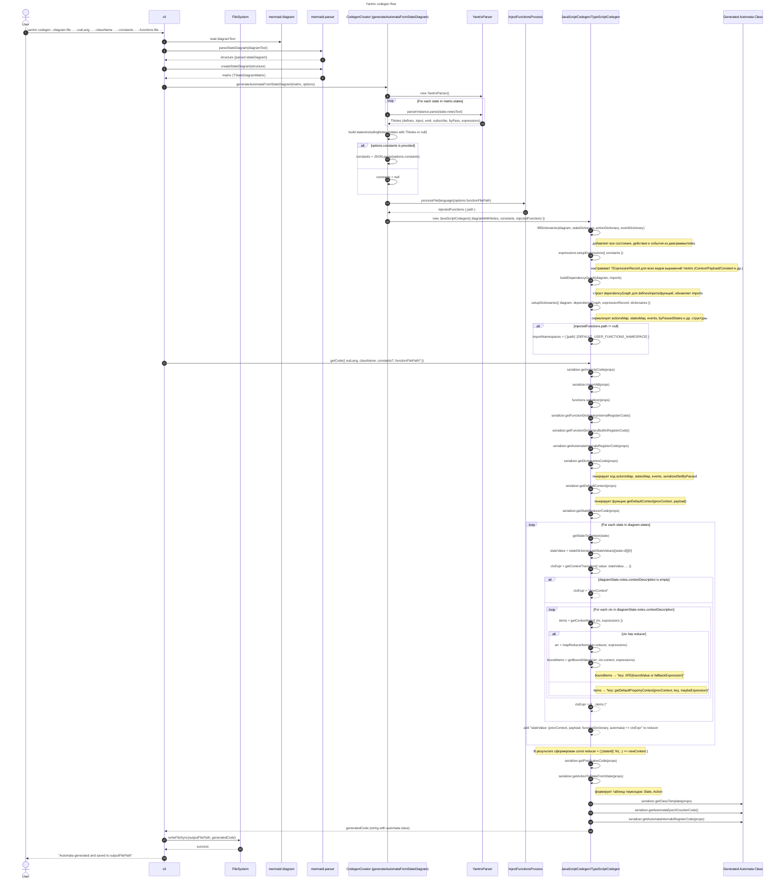

# Codegen diagrams

## Yantrix Runtime Event Flow

_Figure 1: This diagram shows the runtime event flow in Yantrix: external events are dispatched to the EventBus, processed by the CoreLoop through the EventAdapter into actions, reduced by the generated automaton and its RootReducer, and finally emitted to destinations such as UI or external I/O_

## Yantrix Code Generation Pipeline

_Figure 2: This diagram illustrates the code generation pipeline in Yantrix: the CLI reads a Mermaid state diagram and Yantrix notes, parses them with mermaid-parser and YantrixParser, runs the codegen module to build dictionaries, reducers and the automaton class, and finally writes the generated automaton code to a file_
