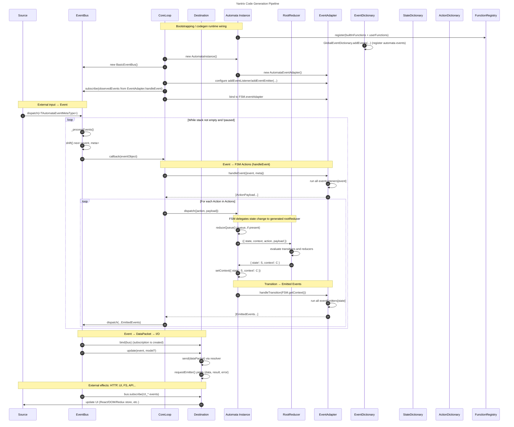
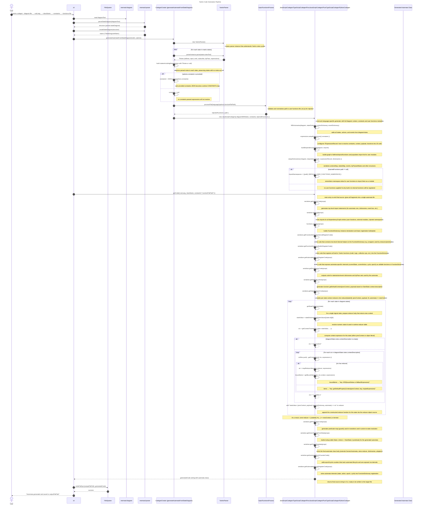

# Codegen diagrams

## Yantrix Runtime Event Flow



_Figure 1: This diagram shows the runtime event flow in Yantrix: external events are dispatched to the EventBus, processed by the CoreLoop through the EventAdapter into actions, reduced by the generated automaton and its RootReducer, and finally emitted to destinations such as UI or external I/O_

## Yantrix Code Generation Pipeline


_Figure 2: This diagram illustrates the code generation pipeline in Yantrix: the CLI reads a Mermaid state diagram and Yantrix notes, parses them with mermaid-parser and YantrixParser,
runs the codegen module to build dictionaries, reducers and the automaton class, and finally writes the generated automaton code to a file_

### Reducer compilation details

This section explains in detail how reducer functions for each state are compiled from Yantrix notes into JavaScript/TypeScript code.
All the logic described here corresponds to the implementation in `packages/codegen/src/core/modules/JavaScript/JavaScriptCompiler/context/serializer.ts`.

#### 1. Overall goal

The `contextSerializer` is responsible for generating two main pieces of runtime code:

- `const reducer = { [stateId]: (prevContext, payload, functionDictionary, automata) => newContext }`
- `const getDefaultContext = (prevContext, payload) => { ... }`

These are later embedded into the generated automata class and are used at runtime to compute the next context for each state transition.

The key exported helpers are:

- `getStateReducerCode` – builds the `reducer` object.
- `getStateToContext` – generates per-state reducer functions.
- `getContextTransition` – computes the context expression for a given state.
- `getContextItem` – converts a single `contextDescription` block into `key: expression` pairs.
- `mapReducerItems` – converts reducer rows into right-hand-side expressions.
- `getBoundValues` – binds intermediate values to final context properties, with fallbacks.
- `getDefaultContext` – generates the default context constructor based on `StartState`.

#### 2. From `getStateReducerCode` to `getContextTransition`

At the top level, `getStateReducerCode` produces the `reducer` definition:

```ts
function getStateReducerCode(props) {
  return `const reducer = {
    ${getStateToContext(props).join(',\n\t')}
  }`;
}
```

`getStateToContext` walks all states in the diagram and creates one reducer function per state:

```ts
function getStateToContext(props) {
  return props.diagram.states.map((state) => {
    const stateValue = props.stateDictionary.getStateValues({ keys: [state.id] })[0];

    if (!stateValue) {
      throw new Error('Invalid state');
    }

    return `${stateValue}: (prevContext, payload, functionDictionary, automata) => {

      return ${getContextTransition({
        value: stateValue,
        stateDictionary: props.stateDictionary,
        diagram: props.diagram,
        expressions: props.expressions,
      })}
    }`;
  });
}
```

For each logical state:

- it looks up the numeric `stateValue` from `BasicStateDictionary` by `state.id`;
- it then delegates to `getContextTransition(...)`, which returns a **string expression** representing the new context for that state:
  - either `"prevContext"` (identity),
  - or an object literal string like `{ foo: ..., bar: ... }`.

The result is a reducer object of the form:

```ts
const reducer = {
  // expression reducer: all params potentially used
  1: (prevContext, payload, functionDictionary, automata) => {
    return { /* compiled context for state 1 */ };
  },
  // identity reducer (TS mode): unused params are _ -prefixed to satisfy noUnusedParameters
  2: (prevContext, _payload, _functionDictionary, _automata) => {
    return prevContext;
  },
  // ...
};
```

`getContextTransition` is the entry point for computing the per-state context expression:

```ts
function getContextTransition(props) {
  const stateFromDict = props.stateDictionary.getStateKeys({ states: [props.value] })[0];

  if (stateFromDict === null) {
    throw new Error(`Invalid state - ${props.value}`);
  }

  const diagramState = props.diagram.states.find((diagramState) => {
    return diagramState.id === stateFromDict;
  });

  if (!diagramState) {
    throw new Error(`Invalid state - ${props.value}`);
  }

  const ctxRes: string[] = [];

  diagramState.notes?.contextDescription.forEach((ctx) => {
    const newContext = getContextItem({
      ctx,
      expressions: props.expressions,
    });

    ctxRes.push(...newContext);
  });

  if (ctxRes.length === 0) return 'prevContext';

  return `{${ctxRes.join(',\n\t')}}`;
};
```

Steps:

1. Reverse-lookup `stateFromDict` from the numeric `value` using `stateDictionary.getStateKeys`.
2. Find the corresponding `diagramState` in `diagram.states`.
3. For each `ctx` in `diagramState.notes?.contextDescription`, call `getContextItem` to obtain a list of `"key: expression"` strings and accumulate them in `ctxRes`.
4. If there is no context description (`ctxRes.length === 0`), return `'prevContext'` so the reducer becomes an identity function.
5. Otherwise, wrap all context entries into an object literal: `` `{${ctxRes.join(',\n\t')}}` ``.

The final reducer function for a state then effectively looks like:

```ts
stateValue: (prevContext, payload, functionDictionary, automata) => {
  return {
    foo: (function(){ ... }()),
    bar: (function(){ ... }()),
  };
}
```

#### 3. `getContextItem`: with and without reducer blocks

`getContextItem` is responsible for transforming a single `TContextItem` (one block from `notes.contextDescription`) into an array of `"key: expression"` strings:

```ts
function getContextItem(props: { ctx: TContextItem; expressions: TExpressionRecord; }) {
  if (isContextWithReducer(props.ctx)) {
    const { context, reducer } = props.ctx;

    return getBoundValues({
      expressions: props.expressions,
      arr: mapReducerItems({ reducer, expressions: props.expressions }),
      context,
    });
  } else {
    const { context } = props.ctx;
    return context.map(({ keyItem }) => {
      const { identifier } = keyItem;
      if (isKeyItemWithExpression(keyItem)) {
        const expressionValue = expressions.functions.getExpressionValue({
          expression: keyItem.expression,
          expressionRecord: props.expressions,
        });

        return `${identifier}: ${expressions.serializer.getDefaultPropertyContext('prevContext', identifier, expressionValue)}`;
      } else {
        return `${identifier}: ${expressions.serializer.getDefaultPropertyContext('prevContext', identifier)}`;
      }
    });
  }
};
```

There are two major branches:

1. **`isContextWithReducer(ctx)` is true:**
   - This means the context block declares an explicit `reducer` section in Yantrix notes.
   - The flow is:
     - `mapReducerItems({ reducer, expressions })` – converts each reducer row into a **right-hand-side expression string**.
     - `getBoundValues({ arr, context, expressions })` – zips these expressions with the `context` definitions to produce final `"targetProperty: expression"` pairs.
   - The output is an array of strings like:

     ```ts
     [
       "foo: (function(){ const boundValue = ...; return boundValue; }())",
       "bar: (function(){ const boundValue = ...; if(boundValue !== null) return boundValue; else return <fallback>; }())",
     ]
     ```

2. **No reducer in `ctx`:**
   - This is the simpler form, where each `context` entry only defines a target identifier (and maybe an expression for default value).
   - For each `keyItem` in `context`:
     - If it has an expression:

       ```ts
       const expressionValue = expressions.functions.getExpressionValue({
         expression: keyItem.expression,
         expressionRecord: props.expressions,
       });

       return `${identifier}: ${expressions.serializer.getDefaultPropertyContext('prevContext', identifier, expressionValue)}`;
       ```

       Here:
       - `getExpressionValue` turns the Yantrix expression into a JS snippet.
       - `getDefaultPropertyContext('prevContext', identifier, expressionValue)` generates code that prefers `prevContext[identifier]`, but falls back to `expressionValue`.

     - If there is no expression:

       ```ts
       return `${identifier}: ${expressions.serializer.getDefaultPropertyContext('prevContext', identifier)}`;
       ```

       In this case the value is fully taken from `prevContext[identifier]` (or some default inside `getDefaultPropertyContext`).

In summary, `getContextItem` returns an array of `"key: expression"` strings, either driven by an explicit reducer or by simple context defaults.

#### 4. `mapReducerItems`: compiling reducer rows

`mapReducerItems` takes a `reducer: TKeyItems<'reducer'>` and produces an array of **raw expressions** (`arr: string[]`), which are later bound to target context properties by `getBoundValues`:

```ts
function mapReducerItems(props: {
  reducer: TKeyItems<'reducer'>;
  sourcePath?: string;
  expressions: TExpressionRecord;
}) {
  return props.reducer
    .map(({ keyItem }) => {
      if (isKeyItemReference(keyItem)) {
        const { expressionType, identifier: boundIdentifier } = keyItem;
        const path = props.sourcePath ?? pathRecord[expressionType];

        if (keyItem.expressionType === ExpressionTypes.Constant) {
          const expressionValueRight = expressions.functions.getExpressionValue({
            expression: keyItem,
            expressionRecord: props.expressions,
          });
          return `(function(){
            return ${expressionValueRight}
          }())`;
        }

        if (isKeyItemWithExpression(keyItem)) {
          const { expression } = keyItem;

          const expressionValueRight = expressions.functions.getExpressionValue({
            expression,
            expressionRecord: props.expressions,
          });

          return expressions.serializer.getDefaultPropertyContext(path, boundIdentifier, expressionValueRight);
        }

        return expressions.serializer.getDefaultPropertyContext(path, boundIdentifier);
      } else {
        const { expression } = keyItem;

        const expressionValueRight = expressions.functions.getExpressionValue({
          expression,
          expressionRecord: props.expressions,
        });
        return `(function(){
          return ${expressionValueRight}
        }())`;
      }
    });
}
```

Key branches:

- **`isKeyItemReference(keyItem)` is true:**
  - Indicates that the row refers to some **source path** (context, payload, constants, etc.) and binds it to an identifier.
  - `expressionType` (from `ExpressionTypes`) determines which path to use via `pathRecord[expressionType]`.

  1. **`expressionType === Constant`:**

     ```ts
     const expressionValueRight = expressions.functions.getExpressionValue({
       expression: keyItem,
       expressionRecord: props.expressions,
     });
     return `(function(){
       return ${expressionValueRight}
     }())`;
     ```

     - `getExpressionValue` resolves the constant reference (e.g. `%%FOO`) into a JS snippet, such as `CONSTANTS.FOO`.
     - The result is wrapped in an IIFE so it becomes an evaluated value at runtime.

  2. **`isKeyItemWithExpression(keyItem)` is true:**

     ```ts
     const expressionValueRight = expressions.functions.getExpressionValue({
       expression,
       expressionRecord: props.expressions,
     });

     return expressions.serializer.getDefaultPropertyContext(path, boundIdentifier, expressionValueRight);
     ```

     - Builds an expression that first tries `path[boundIdentifier]`, then falls back to the explicit `expressionValueRight`.

  3. **No expression on the keyItem:**

     ```ts
     return expressions.serializer.getDefaultPropertyContext(path, boundIdentifier);
     ```

     - Just uses `path` and `boundIdentifier` (e.g. `context.foo`, `payload.bar`).

- **`isKeyItemReference(keyItem)` is false:**

  - The row is a plain expression not tied to a specific source path.

  ```ts
  const expressionValueRight = expressions.functions.getExpressionValue({
    expression,
    expressionRecord: props.expressions,
  });
  return `(function(){
    return ${expressionValueRight}
  }())`;
  ```

The result of `mapReducerItems` is `arr: string[]`, where each element is a **right-hand-side expression** that computes some intermediate value. These expressions are not yet associated with final context properties; that is handled next.

#### 5. `getBoundValues`: zipping values to context properties

`getBoundValues` takes:

- `arr` – the array of expressions from `mapReducerItems`.
- `context` – the target context description (with `keyItem.identifier` for each property).

It produces final `"targetProperty: expression"` strings:

```ts
function getBoundValues(props: {
  expressions: TExpressionRecord;
  arr: string[];
  context: any;
}) {
  return props.arr
    .map((el, index) => {
      const item = props.context[index];
      if (!item) {
        throw new Error('Unexpected index bound property');
      }
      const { keyItem } = item;
      const { identifier: targetProperty } = keyItem;

      if (isKeyItemWithExpression(keyItem)) {
        const { expression } = keyItem;

        const expressionValueRight = expressions.functions.getExpressionValue({
          expression,
          expressionRecord: props.expressions,
        });

        return `${targetProperty}: (function(){
          const boundValue = ${el}
          if(boundValue !== null){
            return boundValue
          }
          else {
            return ${expressionValueRight}
          }

        }())`;
      } else {
        return `${targetProperty}: (function(){
          const boundValue = ${el}

          return boundValue

        }())`;
      }
    });
}
```

Logic:

1. It iterates over `arr` with an index and finds the corresponding `context[index]` entry.
   - If there is no matching context item, it throws an error (defensive check).
2. Extracts the `targetProperty` name from `keyItem.identifier`.
3. If `keyItem` has its own expression:

   - It builds a **fallback value** with `getExpressionValue`.
   - It generates a final expression:

     ```ts
     targetProperty: (function(){
       const boundValue = <arr[index]>;
       if(boundValue !== null){
         return boundValue
       }
       else {
         return <expressionValueRight>
       }
     }())
     ```

   - This means: prefer the intermediate `boundValue` (from `mapReducerItems`), but if it is `null`, fall back to the local expression defined on the context key.

4. If `keyItem` has no expression:

   - The final expression simply returns the intermediate `boundValue`:

     ```ts
     targetProperty: (function(){
       const boundValue = <arr[index]>;
       return boundValue;
     }())
     ```

This step is where the intermediate expressions produced by `mapReducerItems` are **bound** to their final context properties, using the positional pairing between reducer rows and context items.

#### 6. `getDefaultContext`: initial context from `StartState`

The `getDefaultContext` function is generated based on the context description for `StartState`:

```ts
function getDefaultContext(props) {
  const state = props.stateDictionary.getStateValues({ keys: [StartState] })[0];

  if (state) {
    const ctx = getContextTransition({
      diagram: props.diagram,
      expressions: props.expressions,
      stateDictionary: props.stateDictionary,
      value: state,
    });

    return `const getDefaultContext = (prevContext, payload) => {
      const ctx = ${ctx}
      return  Object.assign({}, prevContext, ctx);
    }
    `;
  }

  return `const getDefaultContext = (prevContext, payload) => {
    return prevContext
  }`;
}
```

- It resolves the numeric state id for `StartState` from `BasicStateDictionary`.
- If present, it reuses `getContextTransition` to compute the context expression for the start state.
- It then generates:

  ```ts
  const getDefaultContext = (prevContext, payload) => {
    const ctx = <ctxExprForStartState>;
    return Object.assign({}, prevContext, ctx);
  };
  ```

- If no start state is found, `getDefaultContext` is a simple identity function that returns `prevContext` unchanged.

#### 7. Role of `TExpressionRecord` and `getExpressionValue`

`TExpressionRecord` (provided by `../expressions`) is a registry that knows how to:

- interpret different kinds of Yantrix expressions (context references, payload references, constants, function calls, etc.),
- serialize these expressions into JavaScript code snippets,
- provide helpers such as `getDefaultPropertyContext`.

The most important API from this record, used in `serializer.ts`, is:

```ts
expressions.functions.getExpressionValue({
  expression,
  expressionRecord: props.expressions,
});
```

This function:

- takes a high-level Yantrix `expression` node,
- uses `expressionRecord` to dispatch to the correct handler,
- returns a **string** representing the JavaScript code that must be inserted into the generated output.

`expressions.serializer.getDefaultPropertyContext(...)` complements this by generating higher-level patterns that combine access to a source object with optional fallback expressions.

Together, `getExpressionValue` and the serializer helpers allow the reducer compiler to stay declarative: it does not hardcode the shape of every expression; instead it relies on `TExpressionRecord` to generate the exact JavaScript code for each case.

This is the complete flow of how textual Yantrix reducer declarations in diagram notes become executable JavaScript/TypeScript reducer functions in the generated automata class.

---

## Template Architecture

### Dialect Overview

| Dialect | Base class | Output | Architecture | Runtime deps | Instance type |
| ------- | ---------- | ------ | ------------ | ------------ | ------------- |
| JavaScript | `JavaScriptCodegen` | Single `.js` | Class, extends `GenericAutomata` | `@yantrix/core` | Class instance |
| TypeScript | `TypeScriptCodegen` | Single `.ts` | Class, extends `GenericAutomata` | `@yantrix/core` | Class instance |
| PureJavaScript | `PureJavaScriptCodegen` | Single `.js` | Functional factory, zero imports | Inline builtins | Plain object with getters |
| PureTypeScript | `PureTypeScriptCodegen` | `.js` + `.d.ts` | Functional factory + type declarations | Inline builtins | Typed plain object |
| Python | `PythonCodegen` (standalone) | Single `.py` | Functional factory, zero imports | `pydash` (runtime peer) | Dict with lambda accessors |

Inheritance: `JavaScriptCodegen` is the base for `TypeScriptCodegen` (adds `hasTypes: true`), `PureJavaScriptCodegen` (adds inlined builtins, no imports), and `PureTypeScriptCodegen` (adds `hasTypes: true` on top of PureJS). `PythonCodegen` is a standalone class with its own expression system.

**`createEventBus` signature differs by dialect group:**

- Class-based (JS, TS): accepts constructors - `FSMs: Record<string, new () => GenericAutomata>`
- Factory-based (PureJS, PureTS): accepts factory functions - `FSMs: Record<string, () => TInstance>`

---

### JavaScript / TypeScript Template Hierarchy

The `it` object passed to every JS/TS template (built in `buildTemplateModel()`):

```
it = {
  className,
  hasTypes,                         // boolean - true for TS output
  imports,                          // TImports - { [pkg]: string[] }
  importNamespaces,                 // TNullable<TImports>
  diagram,                          // TStateDiagramMatrixIncludeNotes
  stateDictionary,                  // BasicStateDictionary
  actionDictionary,                 // BasicActionDictionary
  eventDictionary,                  // BasicEventDictionary
  expressions,                      // TExpressionRecord
  defines,                          // DefineStatement[]
  injects,                          // InjectStatement[]
  injectedPath,                     // TNullable<string>
  functions: {
    userFunctionsCheck,             // { injectIdentifiers: string[] }
    customRegistrations,            // TCustomRegistration[]
    userFunctionsNamespace,         // string | null
  },
  initialStateId,                   // string
  initialStateValue,                // number
  initialContext,                   // Record<string, unknown>
  startStateKey,                    // StartState
  byPassAction,                     // ByPassAction
  context: {
    reducer,                        // { entries: { stateValue, transition }[] }
    defaultContext,                  // { startStateValue, transition }
  },
  forks: {
    predicates,                     // Record<stateId, Record<actionId, { transitions }>>
  },
  events: {
    eventAdapter,                   // { emitters, listeners }
    createEventBus,                 // { resultVarName }
  },
  dictionaries: {
    actionToStateFromState,         // Record<stateId, Record<actionId, { state, withPredicate }>>
    byPassedList,                   // number[]
    actionsMap,                     // Record<string, number>
    statesMap,                      // Record<string, number>
  },
}
```

#### Full template hierarchy diagram

```mermaid
flowchart TB
  classDef entryJs fill:#2d6a4f,color:#fff,stroke:#1b4332
  classDef entryTs fill:#1d3557,color:#fff,stroke:#0d1b2a
  classDef shared fill:#7209b7,color:#fff,stroke:#3a0ca3
  classDef sharedLeaf fill:#b5179e,color:#fff,stroke:#7209b7
  classDef jsOnly fill:#588157,color:#fff,stroke:#344e41
  classDef jsLeaf fill:#a3b18a,color:#000,stroke:#588157
  classDef tsOnly fill:#457b9d,color:#fff,stroke:#1d3557
  classDef tsLeaf fill:#a8dadc,color:#000,stroke:#457b9d

  JS_MOD["<b>js/module.eta</b><br/><i>Entry point JS</i>"]:::entryJs
  TS_MOD["<b>ts/module.eta</b><br/><i>Entry point TS</i>"]:::entryTs

  subgraph SHARED_IMPORTS ["js/shared/imports/"]
    direction TB
    SH_IMP_MOD["imports/module"]:::shared
    SH_IMP_NAMED["imports/named<br/><i>it.imports</i>"]:::sharedLeaf
    SH_IMP_NS["imports/namespace<br/><i>it.importNamespaces</i>"]:::sharedLeaf
  end
  SH_IMP_MOD -->|it| SH_IMP_NAMED
  SH_IMP_MOD -->|it| SH_IMP_NS

  subgraph SHARED_FORKS ["js/shared/forks/"]
    direction TB
    SH_FORK_MOD["forks/module"]:::shared
    SH_FORK_STATE_ENTRY["forks/stateEntry<br/><i>stateId, actionPredicates</i>"]:::sharedLeaf
    SH_FORK_ACT_ENTRY["forks/actionEntry<br/><i>actionId, predicate</i>"]:::sharedLeaf
    SH_FORK_TRANS["forks/transition<br/><i>transition, transitionIndex</i>"]:::sharedLeaf
  end
  SH_FORK_MOD -->|"{ stateId, actionPredicates }"| SH_FORK_STATE_ENTRY
  SH_FORK_STATE_ENTRY -->|"{ actionId, predicate }"| SH_FORK_ACT_ENTRY
  SH_FORK_ACT_ENTRY -->|"{ transition, transitionIndex }"| SH_FORK_TRANS

  subgraph SHARED_DICTS ["js/shared/dictionaries/"]
    direction TB
    SH_DICT_MOD["dictionaries/module"]:::shared
    SH_DICT_DECL["declarations<br/><i>states, actions, events, functionDictionary</i>"]:::sharedLeaf
    SH_DICT_RUNTIME["runtime<br/><i>byPassedStates, runtimeRegistries, epoch helpers</i>"]:::sharedLeaf
    subgraph TRANS ["transitions/"]
      direction TB
      SH_DICT_TRANS_MOD["transitions/module"]:::shared
      SH_DICT_A2S_STATE["transitions/stateEntry<br/><i>stateId, actions</i>"]:::sharedLeaf
      SH_DICT_A2S_ENTRY["transitions/entry<br/><i>stateId, actionId, entry</i>"]:::sharedLeaf
    end
  end
  SH_DICT_MOD -->|it| SH_DICT_DECL
  SH_DICT_MOD -->|it| SH_DICT_RUNTIME
  SH_DICT_MOD -->|it| SH_DICT_TRANS_MOD
  SH_DICT_TRANS_MOD -->|"{ stateId, actions }"| SH_DICT_A2S_STATE
  SH_DICT_A2S_STATE -->|"{ stateId, actionId, entry }"| SH_DICT_A2S_ENTRY

  subgraph SHARED_FUNCS ["js/shared/functions/"]
    direction TB
    SH_FUNC_MOD["functions/module"]:::shared
    SH_FUNC_REG["registrations"]:::sharedLeaf
    subgraph USER ["user/"]
      direction TB
      SH_FUNC_USER_MOD["user/module"]:::shared
      SH_FUNC_RESOLVE["user/resolve<br/><i>namespace</i>"]:::sharedLeaf
    end
  end
  SH_FUNC_MOD -->|"{ ...it, registrations }"| SH_FUNC_USER_MOD
  SH_FUNC_MOD -->|"{ ...it, registrations }"| SH_FUNC_REG
  SH_FUNC_USER_MOD -->|"{ namespace }"| SH_FUNC_RESOLVE

  subgraph SHARED_EVENTS ["js/shared/events/"]
    direction TB
    SH_EVT_MOD["events/module"]:::shared
    subgraph ADAPTER ["adapter/"]
      direction TB
      SH_EVT_ADAPT_MOD["adapter/module"]:::shared
      SH_EVT_PAYLOAD["adapter/payload"]:::shared
      SH_EVT_SOURCE["adapter/source"]:::sharedLeaf
      subgraph EMIT ["emit/"]
        SH_EVT_EMIT_MOD["emit/module"]:::shared
        SH_EVT_EMIT_ENTRY["emit/entry"]:::sharedLeaf
        SH_EVT_EMIT_CODE["emit/code"]:::sharedLeaf
      end
      subgraph LISTEN ["listen/"]
        SH_EVT_LISTEN_MOD["listen/module"]:::shared
        SH_EVT_LISTEN_ENTRY["listen/entry"]:::sharedLeaf
      end
    end
    subgraph BUS ["bus/"]
      SH_EVT_BUS_MOD["bus/module"]:::shared
      SH_EVT_BUS_FACTORY["bus/factory"]:::sharedLeaf
      SH_EVT_BUS_SUBS["bus/subscriptions"]:::sharedLeaf
    end
  end
  SH_EVT_MOD -->|it| SH_EVT_ADAPT_MOD
  SH_EVT_MOD -->|it| SH_EVT_BUS_MOD
  SH_EVT_ADAPT_MOD -->|"{ emitters }"| SH_EVT_EMIT_MOD
  SH_EVT_ADAPT_MOD -->|"{ listeners }"| SH_EVT_LISTEN_MOD
  SH_EVT_BUS_MOD -->|it| SH_EVT_BUS_FACTORY
  SH_EVT_BUS_MOD -->|it| SH_EVT_BUS_SUBS

  subgraph SHARED_EXPR ["js/shared/expressions/"]
    SH_EXPR_MOD["expressions/module"]:::shared
    SH_EXPR_CALLS["expressions/calls"]:::shared
    SH_EXPR_DEF_PROP["expressions/context/defaultPropertyContext"]:::sharedLeaf
  end
  SH_EXPR_MOD -->|"{ model }"| SH_EXPR_CALLS
  SH_EXPR_CALLS -.->|"recursive"| SH_EXPR_MOD

  subgraph JS_CTX ["js/context/"]
    JS_CTX_MOD["js/context/module"]:::jsOnly
    JS_CTX_REDUCER["context/reducer"]:::jsOnly
    JS_CTX_DEFAULT["context/defaultContext"]:::jsLeaf
    subgraph JS_REDUCERS ["js/context/reducers/"]
      JS_CTX_RED_MOD["reducers/module"]:::jsOnly
      JS_CTX_ITEM["reducers/item"]:::jsOnly
      JS_CTX_BV_CONST["reducers/constant"]:::jsLeaf
      JS_CTX_BV_EXPR["reducers/expression"]:::jsLeaf
    end
  end
  JS_CTX_MOD -->|"{ reducer }"| JS_CTX_REDUCER
  JS_CTX_MOD -->|"{ defaultContext }"| JS_CTX_DEFAULT
  JS_CTX_REDUCER -->|"{ stateValue, transition }"| JS_CTX_RED_MOD
  JS_CTX_RED_MOD -->|"{ transition }"| JS_CTX_ITEM

  subgraph JS_CLASS ["js/class/"]
    JS_CLS_MOD["js/class/module"]:::jsOnly
    JS_CLS_STATIC["class/static"]:::jsOnly
    subgraph JS_REDUCER_CLS ["js/class/reducer/"]
      JS_RED_MOD["reducer/module"]:::jsOnly
      JS_GET_NEW["reducer/getNew"]:::jsOnly
    end
  end
  JS_CLS_MOD -->|it| JS_CLS_STATIC
  JS_CLS_MOD -->|it| JS_RED_MOD

  subgraph TS_TYPES ["ts/types/"]
    TS_TYPES_MOD["ts/types/module"]:::tsOnly
    TS_TYPES_AUTOMATA["ts/types/automata"]:::tsLeaf
    TS_TYPES_REDUCER["ts/types/reducer"]:::tsLeaf
  end

  subgraph TS_CLASS ["ts/class/"]
    TS_CLS_MOD["ts/class/module"]:::tsOnly
    TS_CLS_STATIC["ts/class/static"]:::tsLeaf
  end

  JS_MOD -->|it| SH_IMP_MOD
  JS_MOD -->|it| SH_FORK_MOD
  JS_MOD -->|it| SH_DICT_MOD
  JS_MOD -->|it| SH_FUNC_MOD
  JS_MOD -->|it| SH_EVT_MOD
  JS_MOD -->|it| JS_CTX_MOD
  JS_MOD -->|it| JS_CLS_MOD

  TS_MOD -->|it| SH_IMP_MOD
  TS_MOD -->|it| SH_FORK_MOD
  TS_MOD -->|it| SH_DICT_MOD
  TS_MOD -->|it| TS_TYPES_MOD
  TS_MOD -->|it| SH_FUNC_MOD
  TS_MOD -->|it| SH_EVT_MOD
  TS_MOD -->|"it (hasTypes=true)"| JS_CTX_MOD
  TS_MOD -->|it| TS_CLS_MOD
```



#### Include order

**`js/module.eta`** (7 steps):
1. `js/shared/imports/module` - `it.imports`, `it.importNamespaces`
2. `js/shared/forks/module` - `it.forks.predicates`
3. `js/shared/dictionaries/module` - `it.stateDictionary`, `it.actionDictionary`, `it.dictionaries.*`
4. `js/shared/functions/module` - `it.functions.*`
5. `js/shared/events/module` - `it.events.*`
6. `js/context/module` - `it.context.*`
7. `js/class/module` - `it.className`, `it.initialStateValue`, `it.initialContext`, `it.byPassAction`

**`ts/module.eta`** (8 steps):
1. `js/shared/imports/module`
2. `js/shared/forks/module`
3. `js/shared/dictionaries/module`
4. `ts/types/module` - `TContext`, `TPayload`, `TRootReducer` type exports
5. `js/shared/functions/module`
6. `js/shared/events/module`
7. `js/context/module` (hasTypes=true - adds TS type annotations)
8. `ts/class/module`

#### Cross-directory includes

| From | To | Data |
|------|----|------|
| `js/context/reducers/item` | `js/shared/expressions/context/defaultPropertyContext` | `{ path, identifier, expression }` |
| `js/context/defaultContext` | `js/context/reducers/item` | `{ transition }` |
| `js/class/module` | `js/shared/dictionaries/runtime` | `it` |
| `ts/class/module` | `js/shared/dictionaries/runtime` | `it` |
| `js/shared/events/adapter/source` | `js/shared/expressions/context/defaultPropertyContext` | `{ path, identifier, expression }` |
| `js/shared/functions/registrations` | `js/shared/expressions/module` | `{ model: registration.bodyModel }` |
| `js/shared/expressions/calls` | `js/shared/expressions/module` (recursive) | `{ model: arg }` |

---

### PureJavaScript / PureTypeScript Template Hierarchy

PureJavaScript and PureTypeScript generate self-contained output with no imports from `@yantrix/core`. All built-in functions are bundled inline at build time by `scripts/buildBuiltins.mjs`.

PureTypeScript runs the same code generation as PureJavaScript (same `buildTemplateModel`, same JS templates), and additionally generates a `.d.ts` declaration file from `pure-ts/declarations.eta`.

The `it` object extends the JS/TS base with one extra field:

```
it = {
  // ...all base JS/TS fields...
  builtins,    // string - pre-bundled @yantrix/functions source, inlined verbatim
}
```

**Entry: `pure-js/module.eta`** (9 includes in order):

| Step | Template | Purpose |
|------|----------|---------|
| 1 | `js/shared/imports/namespace` | Namespace import (only when `functionFilePath` is set) |
| 2 | `<%~ it.builtins %>` | Inlined functions bundle (raw string, no include) |
| 3 | `pure-js/runtime/module` | `createFunctionRegistry()`, `createEventAdapter()` |
| 4 | `pure-js/functions/module` | Function dictionary, user defines, inject registrations |
| 5 | `js/shared/forks/module` | Predicate map for fork/choice states |
| 6 | `pure-js/dictionaries/module` | `statesDictionary`, `actionsDictionary`, `eventDictionary`, `epoch`/`incrementEpoch`/`getEpoch` |
| 7 | `pure-js/events/module` | `eventAdapter`, `createEventBus()` factory |
| 8 | `js/context/module` | `reducer`, `getDefaultContext` (shared with class-based) |
| 9 | `pure-js/factory/module` | `create<ClassName>()` factory + `getState`/`getAction`/`createAction`/`hasState` helpers |

**Entry: `pure-ts/declarations.eta`** (`.d.ts` only):
- Declares all exports: `statesDictionary`, `actionsDictionary`, `eventDictionary`, helpers, factory, `createEventBus`
- Defines `T<ClassName>Instance` type with all instance methods and getters
- Defines `TActions<ClassName>` union type

**Module-level exports:**

| Export | Type | Description |
|--------|------|-------------|
| `statesDictionary` | `Record<string, number>` | State name to hash mapping |
| `actionsDictionary` | `Record<string, number>` | Action name to hash mapping |
| `eventDictionary` | `Record<string, number>` | Event name to hash mapping |
| `actionsMap`, `statesMap` | `Record<string, string>` | Identity name maps |
| `functionDictionary` | `{ get, register, call, has }` | Inline function registry |
| `epoch` | `{ val: number }` | Shared epoch counter (module-level) |
| `incrementEpoch()` | `() => void` | Increments epoch on each dispatch |
| `getEpoch()` | `() => number` | Returns current epoch value |
| `getState(name)` | `(name: string) => number` | Lookup state value by name |
| `getAction(name)` | `(name: string) => number` | Lookup action value by name |
| `createAction(name, payload)` | `(name, payload) => { action, payload }` | Build action payload |
| `hasState(instance, state)` | `(inst, name) => boolean` | Check FSM state by name |
| `createEventBus(id, factories)` | `(id, Record<string, factory>) => [EventBus, automatas, cleanup]` | Wire FSM instances to a shared event bus |
| `create<ClassName>()` | `() => Instance` | Factory function |
| `default` | same as factory | Re-export of factory |

---

### Python Template Hierarchy

Python generates a single self-contained `.py` file. Built-in functions are concatenated from `packages/functions/src/python/` at build time. There is no class, no import of external packages beyond `pydash`.

**`it.python` object** (built in `PythonCodegen.buildTemplateModel()`):

```typescript
python: {
  builtins: string,            // contents of builtins.py.tpl (pydash-based functions)
  functionDict: Array<{        // all function_dictionary entries
    key: string;               // Yantrix key (e.g. 'coalesce')
    pyName: string;            // Python binding (e.g. 'coalesce' or '_if')
  }>,
  snakeName: string,           // snake_case factory name (e.g. 'traffic_light')
  initialContext: Record<string, null>,  // all context keys initialised to None
  reducers: Array<{
    stateValue: number;
    bodyLines: string[];       // Python assignment lines for _result dict
  }>,
  transitions: Array<{         // action_to_state_from_state_dict structure
    fromStateValue: number;
    actions: Array<{
      actionValue: number;
      targetStateValues: number[];
    }>;
  }>,
  defaultContextLines: string[],  // Python lines for _get_default_context body
  defines: Array<{             // user define/fn() => expr directives
    identifier: string;
    args: string[];
    body: string;              // Python lambda body expression
  }>,
  injectedCode: string | null, // raw .py inject file content, or null
}
```

**Entry: `python/module.eta`** (5 includes in order):

| Step | Template | Purpose |
|------|----------|---------|
| 1 | `python/runtime/module` | Emits `it.python.builtins` inline (pydash-based built-in functions) |
| 2 | `python/functions/module` | `function_dictionary = {...}`, lambda defines, injected code |
| 3 | `python/dictionaries/module` | `states_dictionary`, `actions_dictionary`, `action_to_state_from_state_dict` |
| 4 | `python/context/module` | `_reducer_N()` functions, `reducer` dict, `_get_default_context()` |
| 5 | `python/factory/module` | Helper functions + `create_<name>()` factory |

**Module-level exports:**

| Export | Description |
|--------|-------------|
| `states_dictionary` | `{ 'StateName': hash, ... }` |
| `actions_dictionary` | `{ 'ActionName': hash, ... }` |
| `actions_map`, `states_map` | Identity name dicts |
| `action_to_state_from_state_dict` | Nested `{ fromState: { action: { 'state': [targets] } } }` |
| `function_dictionary` | `{ 'fnName': callable, ... }` |
| `reducer` | `{ stateValue: _reducer_N, ... }` |
| `get_state(name)` | Lookup state value by name |
| `get_action(name)` | Lookup action value by name |
| `create_action(name, payload)` | Build action payload dict |
| `has_state(instance, state_value)` | Check FSM state |
| `create_<name>()` | Factory returning instance dict |

**Instance shape** (dict returned by `create_<name>()`):

```python
{
    'state':         lambda: _state[0],
    'context':       lambda: dict(_context[0]),
    'last_action':   lambda: _last_action[0],
    'current_cycle': lambda: _current_cycle[0],
    'dispatch':      dispatch,
    'get_context':   get_context,
    'pause':         pause,
    'resume':        resume,
    'enable':        enable,
    'disable':       disable,
    'destroy':       destroy,
}
```

---

### Feature Support by Dialect

| Feature | JS | TS | PureJS | PureTS | Python |
| ------- | -- | -- | ------ | ------ | ------ |
| State transitions | ✅ | ✅ | ✅ | ✅ | ✅ |
| Context / reducers | ✅ | ✅ | ✅ | ✅ | ✅ |
| Built-in functions | ✅ | ✅ | ✅ | ✅ | ✅ |
| `define/fn(args) => expr` | ✅ | ✅ | ✅ | ✅ | ✅ |
| Inject `.ts`/`.js` functions | ✅ | ✅ | ✅ | ✅ | ❌ |
| Inject `.py` functions | ❌ | ❌ | ❌ | ❌ | ✅ |
| Forks / predicates | ✅ | ✅ | ✅ | ✅ | ❌ |
| `subscribe/EventName` | ✅ | ✅ | ✅ | ✅ | ❌ |
| `emit/EventName` | ✅ | ✅ | ✅ | ✅ | ❌ |
| `createEventBus()` factory | ✅ | ✅ | ✅ | ✅ | ❌ |
| CoreLoop integration | ✅ | ✅ | ❌ | ❌ | ❌ |
| Epoch tracking (`getEpoch`) | ✅ | ✅ | ✅ | ✅ | ✅ |
| Cycle counter | ✅ | ✅ | ✅ | ✅ | ✅ |
| Opaque ID types (`TStateId`, `TActionId`) | ❌ | ✅ | ❌ | ✅ | ❌ |
| TypeScript declarations | ❌ | ✅ | ❌ | ✅ | ❌ |
| Pause / resume / disable | ✅ | ✅ | ✅ | ✅ | ✅ |
| Zero external runtime deps | ❌ | ❌ | ✅ | ✅ | ❌ |
