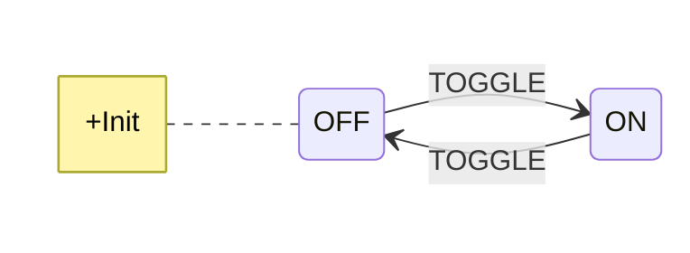
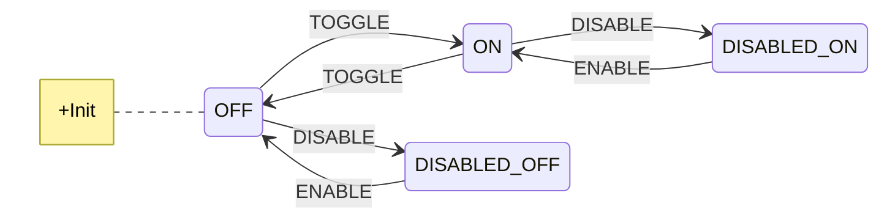
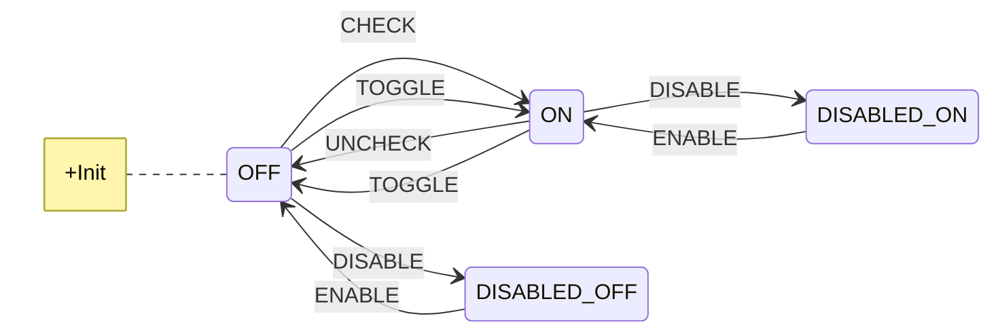
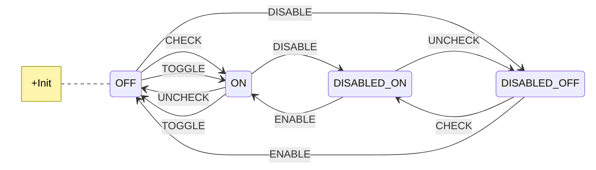
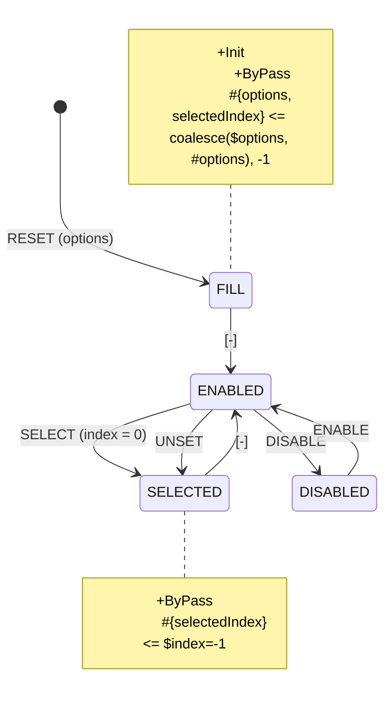
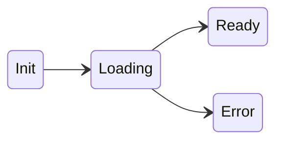
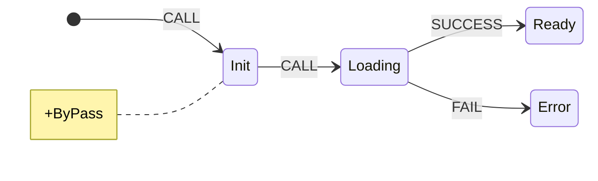
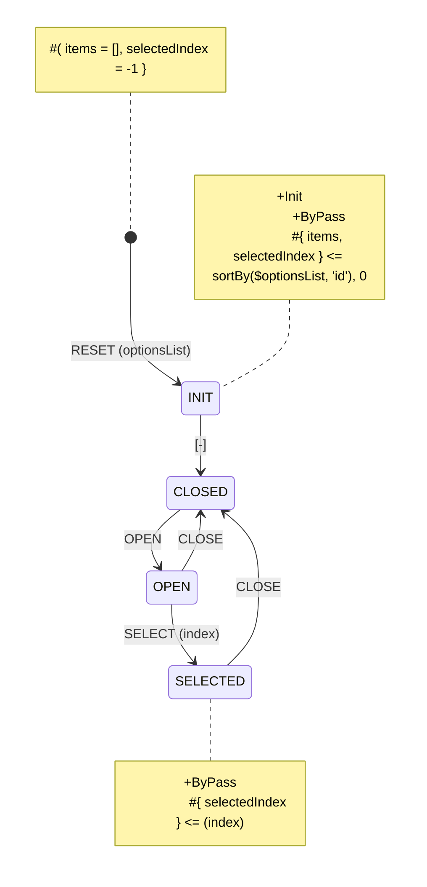
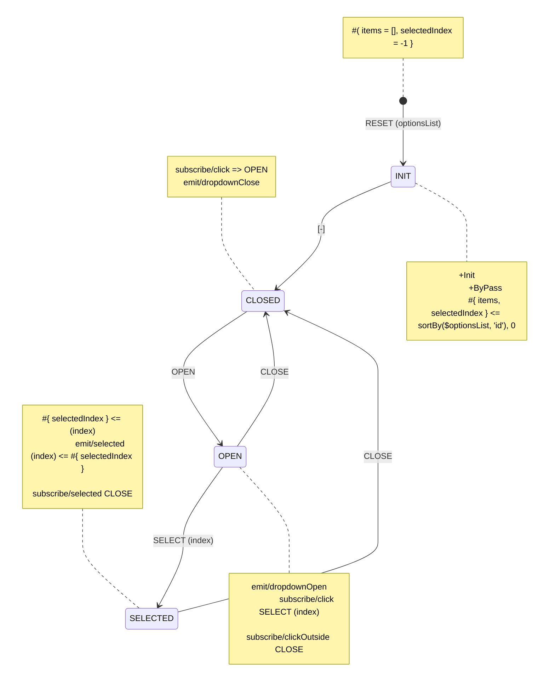

# Sample Designs

## Checkboxes

#### Basic Checkbox

This checkbox starts in unchecked state and can be switched on and off by a single `Action`

#### Enabled/Disabled

Since a checkbox can be disabled both with checkmark and without it, it requires two `State`s for disabled condition.

#### Direct assignment

With two extra `Action`s it's now possible to set the desired `State` of a checkbox to a particular condition without prior knowledge of its current `State`. For instance, **CHECK** `Action` is guaranteed to bring the checkbox into **ON** `State`, unless it was disabled.

#### Overwriting disabled states

The same `Action`s as above can be applied to disabled `State`s, allowing to change the value of checkbox without enabling it. However, not that **TOGGLE** `Action` will not work in disabled `State`s.

## Radio Group

Here we create an `FSM` that stores a list of options in its `Context` and allows to select one of them by dispathing a **SELECT** `Action`.

Here we also create a single **DISABLED** `State`, because we uphoisted the state of many controls rather than controlling a single one, as in [Checkbox](#checkboxes) example, allowing us to preserve the visible state of every radio option when being **DISABLED**.

Also, a special **UNSET** `Action`, that removes the selection: it works by _not_ passing a `Payload`, which triggers `$index = -1` fallback to [default value](../syntax/120_values_and_constants.html#default-values)

## Data Loader

The most notable example of a stateful control object in web programming is an asynchronous request, or, in general Javascript, a Promise type. The most basic variant of Mermaid representation of it is already a Yantrix code for an async call:

the more beautiful and _best-practice_ approach to it though would look like this:

## Dropdown Control

-   `+Init` marks that **INIT** is the initial `State` of the `FSM`.
-   `+ByPass` also implies that transition through this `State` is synchronous, i.e. the `State` is [intermediary](#intermediary-states). That is emphasized by a special descriptor of the outgoing `Action`: **[-]**
-   `#{items, selectedIndex}` describes a shape of `Context` for all `States`. `items` is the list of dropdown values, and `selectedIndex` stores currently selected item. Without extra expressions these values are copied from the preceding `Context`
-   `#{items=[], selectedIndex = 0}` sets the initial value for that `Context`
-   `#{items, selectedIndex} <= sortBy($optionsList, 'id'), 0` fills both `Context` properties from `Payload`:
    -   `items` is a sorted `optionsList` property, assuming it's a List of Objects that have property of `id`.
    -   `selectedIndex` is set to 0, when the list of options is externally updated

### Event integration

There's no big reason to create a `FSM` for merely a dropdown unless you want to connect it to the global `Event Stack` and build something bigger on Yantrix:

-   `subscribe/click => OPEN` in **CLOSED** state produces **OPEN** `Action` on incoming `click` `Event`, which
    transitions the `FSM` into **OPEN** state
-   likewise, `subscribe/click SELECT (index)` produces **SELECT** `Action` and passes `index` property
    from `Event Meta` to its `Payload`, which transitions the `FSM` into the **SELECTED** `State`
-   `subscribe/clickOutside => CLOSE` produces a **CLOSE** `Action` to return the dropdown to the
    original `State` (**CLOSED**)
-   Both **CLOSED** and **OPEN** `States` emit corresponding `Events`, that are pipelined into `Event Bus` and connect the component to others.
-   **SELECTED** is another sort of [intermediary State](#intermediary-states): while `emit/selected (index) <= #{ selectedIndex }` lets the `Event Bus` know
    which item was selected, at the same time `subscribe/selected => CLOSE` transitions the `FSM`
    back to **CLOSED** `State` via **CLOSE** `Action`. It behaves similar to **INIT** `State` &ndash; the `FSM` goes through it. However, unlike that case, here it will emit `Event` and wait for its settlement before it runs further
    processing.
