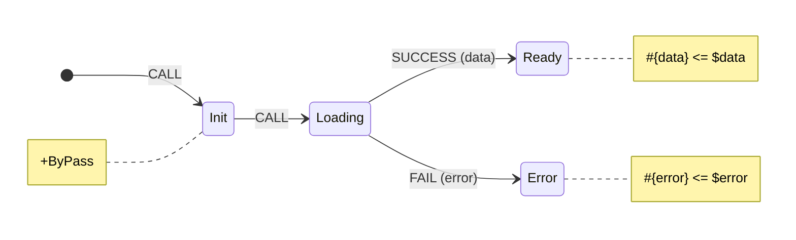

# Core Concepts

Automata-based programming is a programming paradigm that utilizes finite state machines and other automata models for software development, often employed for tasks involving pattern recognition, parsing, and data validation. It involves defining states and transitions to manage the flow and behavior of a program.

The finite state machine model, with its clearly defined states and transitions, makes it easier to understand the behavior of a system, even for complex applications. It becomes even better, when visualized &mdash; this provides a simple and understandable approach to software development. One of the first to implement this in Javascript was [XState](https://xstate.js.org/).

We employ a different approach - visualization-first programming in automata-based style. Yantrix code defines state/action reactive logic in a declarative manner, and it can be immediately visualized with [MermaidJS](https://mermaid.js.org/), becoming both a graphical specification and a source code for some small piece of reusable logic. The final source code is obtained in all [required languages](https://tfcp68.github.io/yantrix/integrations/100_language_support.html) by code generation, which enables sharing algorithms between systems and stacks more efficient.

The canonical example would be asynchronous calls, which are _sometimes_ implemented outrageously verbose. For instance, this code may (or may not) be more or less enigmatic depending on your programming background:
```javascript
const [data, setData] = useState(null);
const [error, setError] = useState(null);
const [loading, setLoading] = useState(false);

const getAsyncData = async () => {
	setLoading(true);
	try {
		const data = await callAsyncApi();
		setData(data);
	} catch (e) {
		setError(e.message);
	}
	setLoading(false);
};

useEffect(() => {
	getAsyncData();
}, []);
```

Meanwhile, **this** is still a _code_ but it can be interpreted to some extent by any person. And, even more important, by another code.


The design language allows for basic logic and maths, similar to Excel formulas, being a pretty solid solution for basic programming and business logic implementation. To achieve complex functionality, basic logic elements, such as FSMs, should be interconnected with the help of Events.

Being primary a Typescript solution, the best appliance of Yantrix as of now is Frontend, well-matched to libraries like React and Redux. Due to its codegen approach, Yantrix could work well in Svelte environment and "dumb" s2s Node.js integrations.

## The "Why?"

Consider the following:

-   Writing less code produces fewer errors.
-   Writing it in a declarative way makes the code more adaptive and supportable.
-   Writing it with pure functions adds reliability and provides for an easy testability
-   Boilerplate code is undesirable, while it's best to write code in high-level abstractions that are close enough to business logic
-   It's better to define behavior with data rather than with code
-   Documenting the code makes it sustainable, and the best documentation is visual

If you agree to most of these takes, you'd probably like Yantrix. If not, still give it a shot, it might widen your view on programming as a genre.
