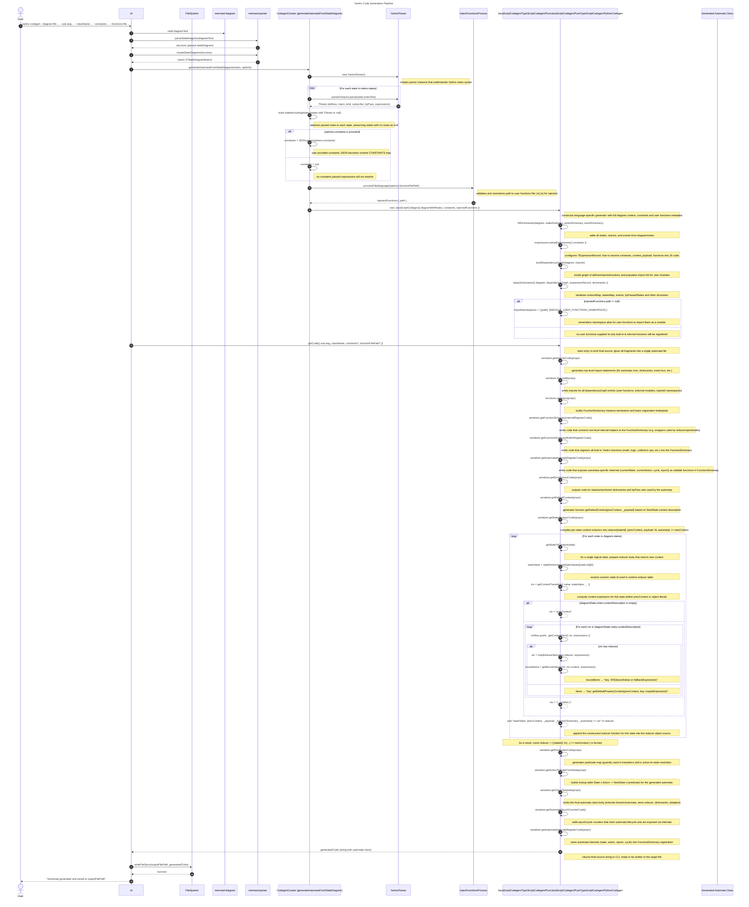

# Codegen Architecture Overview

## Dialect Overview

| Dialect | Base class | Output | Architecture | Runtime deps | Instance type |
| ------- | ---------- | ------ | ------------ | ------------ | ------------- |
| JavaScript | `JavaScriptCodegen` | Single `.js` | Class, extends `GenericAutomata` | `@yantrix/core` | Class instance |
| TypeScript | `TypeScriptCodegen` | Single `.ts` | Class, extends `GenericAutomata` | `@yantrix/core` | Class instance |
| PureJavaScript | `PureJavaScriptCodegen` | Single `.js` | Functional factory, zero imports | Inline builtins | Plain object with getters |
| PureTypeScript | `PureTypeScriptCodegen` | `.js` + `.d.ts` | Functional factory + type declarations | Inline builtins | Typed plain object |
| Python | `PythonCodegen` (standalone) | Single `.py` | Functional factory, zero imports | `pydash` (runtime peer) | Dict with lambda accessors |

Inheritance: `JavaScriptCodegen` is the base for `TypeScriptCodegen` (adds `hasTypes: true`),
`PureJavaScriptCodegen` (adds inlined builtins, no imports), and `PureTypeScriptCodegen`
(adds `hasTypes: true` on top of PureJS). `PythonCodegen` is a standalone class with its
own expression system.

**`createEventBus` signature differs by dialect group:**

- Class-based (JS, TS): accepts constructors - `FSMs: Record<string, new () => GenericAutomata>`
- Factory-based (PureJS, PureTS): accepts factory functions - `FSMs: Record<string, () => TInstance>`

---

## Yantrix Code Generation Pipeline

_Figure 1: The code generation pipeline in Yantrix: the CLI reads a Mermaid state diagram and
Yantrix notes, parses them with mermaid-parser and YantrixParser, runs the codegen module to
build dictionaries, reducers and the automaton class, and finally writes the generated automaton
code to a file_
