# JS / TS Dialect Template Reference

## Template Hierarchy

The `it` object passed to every JS/TS template (built in `buildTemplateModel()`):

```
it = {
  className,
  hasTypes,                         // boolean - true for TS output
  imports,                          // TImports - { [pkg]: string[] }
  importNamespaces,                 // TNullable<TImports>
  diagram,                          // TStateDiagramMatrixIncludeNotes
  stateDictionary,                  // BasicStateDictionary
  actionDictionary,                 // BasicActionDictionary
  eventDictionary,                  // BasicEventDictionary
  expressions,                      // TExpressionRecord
  defines,                          // DefineStatement[]
  injects,                          // InjectStatement[]
  injectedPath,                     // TNullable<string>
  functions: {
    userFunctionsCheck,             // { injectIdentifiers: string[] }
    customRegistrations,            // TCustomRegistration[]
    userFunctionsNamespace,         // string | null
  },
  initialStateId,                   // string
  initialStateValue,                // number
  initialContext,                   // Record<string, unknown>
  startStateKey,                    // StartState
  byPassAction,                     // ByPassAction
  context: {
    reducer,                        // { entries: { stateValue, transition }[] }
    defaultContext,                  // { startStateValue, transition }
  },
  forks: {
    predicates,                     // Record<stateId, Record<actionId, { transitions }>>
  },
  events: {
    eventAdapter,                   // { emitters, listeners }
    createEventBus,                 // { resultVarName }
  },
  dictionaries: {
    actionToStateFromState,         // Record<stateId, Record<actionId, { state, withPredicate }>>
    byPassedList,                   // number[]
    actionsMap,                     // Record<string, number>
    statesMap,                      // Record<string, number>
  },
}
```

### Full template hierarchy diagram

```mermaid
flowchart TB
  classDef entryJs fill:#2d6a4f,color:#fff,stroke:#1b4332
  classDef entryTs fill:#1d3557,color:#fff,stroke:#0d1b2a
  classDef shared fill:#7209b7,color:#fff,stroke:#3a0ca3
  classDef sharedLeaf fill:#b5179e,color:#fff,stroke:#7209b7
  classDef jsOnly fill:#588157,color:#fff,stroke:#344e41
  classDef jsLeaf fill:#a3b18a,color:#000,stroke:#588157
  classDef tsOnly fill:#457b9d,color:#fff,stroke:#1d3557
  classDef tsLeaf fill:#a8dadc,color:#000,stroke:#457b9d

  JS_MOD["<b>js/module.eta</b><br/><i>Entry point JS</i>"]:::entryJs
  TS_MOD["<b>ts/module.eta</b><br/><i>Entry point TS</i>"]:::entryTs

  subgraph SHARED_IMPORTS ["js/shared/imports/"]
    direction TB
    SH_IMP_MOD["imports/module"]:::shared
    SH_IMP_NAMED["imports/named<br/><i>it.imports</i>"]:::sharedLeaf
    SH_IMP_NS["imports/namespace<br/><i>it.importNamespaces</i>"]:::sharedLeaf
  end
  SH_IMP_MOD -->|it| SH_IMP_NAMED
  SH_IMP_MOD -->|it| SH_IMP_NS

  subgraph SHARED_FORKS ["js/shared/forks/"]
    direction TB
    SH_FORK_MOD["forks/module"]:::shared
    SH_FORK_STATE_ENTRY["forks/stateEntry<br/><i>stateId, actionPredicates</i>"]:::sharedLeaf
    SH_FORK_ACT_ENTRY["forks/actionEntry<br/><i>actionId, predicate</i>"]:::sharedLeaf
    SH_FORK_TRANS["forks/transition<br/><i>transition, transitionIndex</i>"]:::sharedLeaf
  end
  SH_FORK_MOD -->|"{ stateId, actionPredicates }"| SH_FORK_STATE_ENTRY
  SH_FORK_STATE_ENTRY -->|"{ actionId, predicate }"| SH_FORK_ACT_ENTRY
  SH_FORK_ACT_ENTRY -->|"{ transition, transitionIndex }"| SH_FORK_TRANS

  subgraph SHARED_DICTS ["js/shared/dictionaries/"]
    direction TB
    SH_DICT_MOD["dictionaries/module"]:::shared
    SH_DICT_DECL["declarations<br/><i>states, actions, events, functionDictionary</i>"]:::sharedLeaf
    SH_DICT_RUNTIME["runtime<br/><i>byPassedStates, runtimeRegistries, epoch helpers</i>"]:::sharedLeaf
    subgraph TRANS ["transitions/"]
      direction TB
      SH_DICT_TRANS_MOD["transitions/module"]:::shared
      SH_DICT_A2S_STATE["transitions/stateEntry<br/><i>stateId, actions</i>"]:::sharedLeaf
      SH_DICT_A2S_ENTRY["transitions/entry<br/><i>stateId, actionId, entry</i>"]:::sharedLeaf
    end
  end
  SH_DICT_MOD -->|it| SH_DICT_DECL
  SH_DICT_MOD -->|it| SH_DICT_RUNTIME
  SH_DICT_MOD -->|it| SH_DICT_TRANS_MOD
  SH_DICT_TRANS_MOD -->|"{ stateId, actions }"| SH_DICT_A2S_STATE
  SH_DICT_A2S_STATE -->|"{ stateId, actionId, entry }"| SH_DICT_A2S_ENTRY

  subgraph SHARED_FUNCS ["js/shared/functions/"]
    direction TB
    SH_FUNC_MOD["functions/module"]:::shared
    SH_FUNC_REG["registrations"]:::sharedLeaf
    subgraph USER ["user/"]
      direction TB
      SH_FUNC_USER_MOD["user/module"]:::shared
      SH_FUNC_RESOLVE["user/resolve<br/><i>namespace</i>"]:::sharedLeaf
    end
  end
  SH_FUNC_MOD -->|"{ ...it, registrations }"| SH_FUNC_USER_MOD
  SH_FUNC_MOD -->|"{ ...it, registrations }"| SH_FUNC_REG
  SH_FUNC_USER_MOD -->|"{ namespace }"| SH_FUNC_RESOLVE

  subgraph SHARED_EVENTS ["js/shared/events/"]
    direction TB
    SH_EVT_MOD["events/module"]:::shared
    subgraph ADAPTER ["adapter/"]
      direction TB
      SH_EVT_ADAPT_MOD["adapter/module"]:::shared
      SH_EVT_PAYLOAD["adapter/payload"]:::shared
      SH_EVT_SOURCE["adapter/source"]:::sharedLeaf
      subgraph EMIT ["emit/"]
        SH_EVT_EMIT_MOD["emit/module"]:::shared
        SH_EVT_EMIT_ENTRY["emit/entry"]:::sharedLeaf
        SH_EVT_EMIT_CODE["emit/code"]:::sharedLeaf
      end
      subgraph LISTEN ["listen/"]
        SH_EVT_LISTEN_MOD["listen/module"]:::shared
        SH_EVT_LISTEN_ENTRY["listen/entry"]:::sharedLeaf
      end
    end
    subgraph BUS ["bus/"]
      SH_EVT_BUS_MOD["bus/module"]:::shared
      SH_EVT_BUS_FACTORY["bus/factory"]:::sharedLeaf
      SH_EVT_BUS_SUBS["bus/subscriptions"]:::sharedLeaf
    end
  end
  SH_EVT_MOD -->|it| SH_EVT_ADAPT_MOD
  SH_EVT_MOD -->|it| SH_EVT_BUS_MOD
  SH_EVT_ADAPT_MOD -->|"{ emitters }"| SH_EVT_EMIT_MOD
  SH_EVT_ADAPT_MOD -->|"{ listeners }"| SH_EVT_LISTEN_MOD
  SH_EVT_BUS_MOD -->|it| SH_EVT_BUS_FACTORY
  SH_EVT_BUS_MOD -->|it| SH_EVT_BUS_SUBS

  subgraph SHARED_EXPR ["js/shared/expressions/"]
    SH_EXPR_MOD["expressions/module"]:::shared
    SH_EXPR_CALLS["expressions/calls"]:::shared
    SH_EXPR_DEF_PROP["expressions/context/defaultPropertyContext"]:::sharedLeaf
  end
  SH_EXPR_MOD -->|"{ model }"| SH_EXPR_CALLS
  SH_EXPR_CALLS -.->|"recursive"| SH_EXPR_MOD

  subgraph JS_CTX ["js/context/"]
    JS_CTX_MOD["js/context/module"]:::jsOnly
    JS_CTX_REDUCER["context/reducer"]:::jsOnly
    JS_CTX_DEFAULT["context/defaultContext"]:::jsLeaf
    subgraph JS_REDUCERS ["js/context/reducers/"]
      JS_CTX_RED_MOD["reducers/module"]:::jsOnly
      JS_CTX_ITEM["reducers/item"]:::jsOnly
      JS_CTX_BV_CONST["reducers/constant"]:::jsLeaf
      JS_CTX_BV_EXPR["reducers/expression"]:::jsLeaf
    end
  end
  JS_CTX_MOD -->|"{ reducer }"| JS_CTX_REDUCER
  JS_CTX_MOD -->|"{ defaultContext }"| JS_CTX_DEFAULT
  JS_CTX_REDUCER -->|"{ stateValue, transition }"| JS_CTX_RED_MOD
  JS_CTX_RED_MOD -->|"{ transition }"| JS_CTX_ITEM

  subgraph JS_CLASS ["js/class/"]
    JS_CLS_MOD["js/class/module"]:::jsOnly
    JS_CLS_STATIC["class/static"]:::jsOnly
    subgraph JS_REDUCER_CLS ["js/class/reducer/"]
      JS_RED_MOD["reducer/module"]:::jsOnly
      JS_GET_NEW["reducer/getNew"]:::jsOnly
    end
  end
  JS_CLS_MOD -->|it| JS_CLS_STATIC
  JS_CLS_MOD -->|it| JS_RED_MOD

  subgraph TS_TYPES ["ts/types/"]
    TS_TYPES_MOD["ts/types/module"]:::tsOnly
    TS_TYPES_AUTOMATA["ts/types/automata"]:::tsLeaf
    TS_TYPES_REDUCER["ts/types/reducer"]:::tsLeaf
  end

  subgraph TS_CLASS ["ts/class/"]
    TS_CLS_MOD["ts/class/module"]:::tsOnly
    TS_CLS_STATIC["ts/class/static"]:::tsLeaf
  end

  JS_MOD -->|it| SH_IMP_MOD
  JS_MOD -->|it| SH_FORK_MOD
  JS_MOD -->|it| SH_DICT_MOD
  JS_MOD -->|it| SH_FUNC_MOD
  JS_MOD -->|it| SH_EVT_MOD
  JS_MOD -->|it| JS_CTX_MOD
  JS_MOD -->|it| JS_CLS_MOD

  TS_MOD -->|it| SH_IMP_MOD
  TS_MOD -->|it| SH_FORK_MOD
  TS_MOD -->|it| SH_DICT_MOD
  TS_MOD -->|it| TS_TYPES_MOD
  TS_MOD -->|it| SH_FUNC_MOD
  TS_MOD -->|it| SH_EVT_MOD
  TS_MOD -->|"it (hasTypes=true)"| JS_CTX_MOD
  TS_MOD -->|it| TS_CLS_MOD
```



### Include order

**`js/module.eta`** (7 steps):

1. `js/shared/imports/module` - `it.imports`, `it.importNamespaces`
2. `js/shared/forks/module` - `it.forks.predicates`
3. `js/shared/dictionaries/module` - `it.stateDictionary`, `it.actionDictionary`, `it.dictionaries.*`
4. `js/shared/functions/module` - `it.functions.*`
5. `js/shared/events/module` - `it.events.*`
6. `js/context/module` - `it.context.*`
7. `js/class/module` - `it.className`, `it.initialStateValue`, `it.initialContext`, `it.byPassAction`

**`ts/module.eta`** (8 steps):

1. `js/shared/imports/module`
2. `js/shared/forks/module`
3. `js/shared/dictionaries/module`
4. `ts/types/module` - `TContext`, `TPayload`, `TRootReducer` type exports
5. `js/shared/functions/module`
6. `js/shared/events/module`
7. `js/context/module` (hasTypes=true - adds TS type annotations)
8. `ts/class/module`

### Cross-directory includes

| From | To | Data |
|------|----|------|
| `js/context/reducers/item` | `js/shared/expressions/context/defaultPropertyContext` | `{ path, identifier, expression }` |
| `js/context/defaultContext` | `js/context/reducers/item` | `{ transition }` |
| `js/class/module` | `js/shared/dictionaries/runtime` | `it` |
| `ts/class/module` | `js/shared/dictionaries/runtime` | `it` |
| `js/shared/events/adapter/source` | `js/shared/expressions/context/defaultPropertyContext` | `{ path, identifier, expression }` |
| `js/shared/functions/registrations` | `js/shared/expressions/module` | `{ model: registration.bodyModel }` |
| `js/shared/expressions/calls` | `js/shared/expressions/module` (recursive) | `{ model: arg }` |

---

## Reducer Compilation

This section explains how reducer functions for each state are compiled from Yantrix notes
into JavaScript/TypeScript code. All the logic described here corresponds to the
implementation in
`packages/codegen/src/core/modules/JavaScript/JavaScriptCompiler/context/serializer.ts`.

### 1. Overall goal

The `contextSerializer` is responsible for generating two main pieces of runtime code:

- `const reducer = { [stateId]: (prevContext, _payload, _functionDictionary, _automata) => newContext }`
- `const getDefaultContext = (prevContext, _payload) => { ... }`

These are later embedded into the generated automata class and are used at runtime to compute
the next context for each state transition.

The key exported helpers are:

- `getStateReducerCode` - builds the `reducer` object.
- `getStateToContext` - generates per-state reducer functions.
- `getContextTransition` - computes the context expression for a given state.
- `getContextItem` - converts a single `contextDescription` block into `key: expression` pairs.
- `mapReducerItems` - converts reducer rows into right-hand-side expressions.
- `getBoundValues` - binds intermediate values to final context properties, with fallbacks.
- `getDefaultContext` - generates the default context constructor based on `StartState`.

### 2. From `getStateReducerCode` to `getContextTransition`

At the top level, `getStateReducerCode` produces the `reducer` definition:

```ts
function getStateReducerCode(props) {
  return `const reducer = {
    ${getStateToContext(props).join(',\n\t')}
  }`;
}
```

`getStateToContext` walks all states in the diagram and creates one reducer function per state:

```ts
function getStateToContext(props) {
  return props.diagram.states.map((state) => {
    const stateValue = props.stateDictionary.getStateValues({ keys: [state.id] })[0];

    if (!stateValue) {
      throw new Error('Invalid state');
    }

    return `${stateValue}: (prevContext, payload, functionDictionary, automata) => {

      return ${getContextTransition({
        value: stateValue,
        stateDictionary: props.stateDictionary,
        diagram: props.diagram,
        expressions: props.expressions,
      })}
    }`;
  });
}
```

For each logical state:

- it looks up the numeric `stateValue` from `BasicStateDictionary` by `state.id`;
- it then delegates to `getContextTransition(...)`, which returns a **string expression**
  representing the new context for that state:
  - either `"prevContext"` (identity),
  - or an object literal string like `{ foo: ..., bar: ... }`.

The result is a reducer object of the form:

```ts
const reducer = {
  // expression reducer: prevContext used; other params unused (body uses module-level functionDictionary)
  1: (prevContext, _payload, _functionDictionary, _automata) => {
    return { /* compiled context for state 1 */ };
  },
  // identity reducer: all non-context params unused
  2: (prevContext, _payload, _functionDictionary, _automata) => {
    return prevContext;
  },
  // ...
};
```

`getContextTransition` is the entry point for computing the per-state context expression:

```ts
function getContextTransition(props) {
  const stateFromDict = props.stateDictionary.getStateKeys({ states: [props.value] })[0];

  if (stateFromDict === null) {
    throw new Error(`Invalid state - ${props.value}`);
  }

  const diagramState = props.diagram.states.find((diagramState) => {
    return diagramState.id === stateFromDict;
  });

  if (!diagramState) {
    throw new Error(`Invalid state - ${props.value}`);
  }

  const ctxRes: string[] = [];

  diagramState.notes?.contextDescription.forEach((ctx) => {
    const newContext = getContextItem({
      ctx,
      expressions: props.expressions,
    });

    ctxRes.push(...newContext);
  });

  if (ctxRes.length === 0) return 'prevContext';

  return `{${ctxRes.join(',\n\t')}}`;
};
```

Steps:

1. Reverse-lookup `stateFromDict` from the numeric `value` using `stateDictionary.getStateKeys`.
2. Find the corresponding `diagramState` in `diagram.states`.
3. For each `ctx` in `diagramState.notes?.contextDescription`, call `getContextItem` to obtain
   a list of `"key: expression"` strings and accumulate them in `ctxRes`.
4. If there is no context description (`ctxRes.length === 0`), return `'prevContext'` so the
   reducer becomes an identity function.
5. Otherwise, wrap all context entries into an object literal: `` `{${ctxRes.join(',\n\t')}}` ``.

The final reducer function for a state then effectively looks like:

```ts
stateValue: (prevContext, _payload, _functionDictionary, _automata) => {
  return {
    foo: (function(){ ... }()),
    bar: (function(){ ... }()),
  };
}
```

### 3. `getContextItem`: with and without reducer blocks

`getContextItem` is responsible for transforming a single `TContextItem` (one block from
`notes.contextDescription`) into an array of `"key: expression"` strings:

```ts
function getContextItem(props: { ctx: TContextItem; expressions: TExpressionRecord; }) {
  if (isContextWithReducer(props.ctx)) {
    const { context, reducer } = props.ctx;

    return getBoundValues({
      expressions: props.expressions,
      arr: mapReducerItems({ reducer, expressions: props.expressions }),
      context,
    });
  } else {
    const { context } = props.ctx;
    return context.map(({ keyItem }) => {
      const { identifier } = keyItem;
      if (isKeyItemWithExpression(keyItem)) {
        const expressionValue = expressions.functions.getExpressionValue({
          expression: keyItem.expression,
          expressionRecord: props.expressions,
        });

        return `${identifier}: ${expressions.serializer.getDefaultPropertyContext('prevContext', identifier, expressionValue)}`;
      } else {
        return `${identifier}: ${expressions.serializer.getDefaultPropertyContext('prevContext', identifier)}`;
      }
    });
  }
};
```

There are two major branches:

1. **`isContextWithReducer(ctx)` is true:**
   - The context block declares an explicit `reducer` section in Yantrix notes.
   - Flow: `mapReducerItems` converts each reducer row into a right-hand-side expression string,
     then `getBoundValues` zips these with the `context` definitions to produce final
     `"targetProperty: expression"` pairs.
   - Output example:
     ```ts
     [
       "foo: (function(){ const boundValue = ...; return boundValue; }())",
       "bar: (function(){ const boundValue = ...; if(boundValue !== null) return boundValue; else return <fallback>; }())",
     ]
     ```

2. **No reducer in `ctx`:**
   - For each `keyItem` in `context`:
     - If it has an expression, `getExpressionValue` turns it into a JS snippet and
       `getDefaultPropertyContext` generates code that prefers `prevContext[identifier]`
       but falls back to the expression value.
     - If there is no expression, the value is fully taken from `prevContext[identifier]`.

### 4. `mapReducerItems`: compiling reducer rows

`mapReducerItems` takes a `reducer: TKeyItems<'reducer'>` and produces an array of raw
expressions (`arr: string[]`), which are later bound to target context properties by
`getBoundValues`:

```ts
function mapReducerItems(props: {
  reducer: TKeyItems<'reducer'>;
  sourcePath?: string;
  expressions: TExpressionRecord;
}) {
  return props.reducer
    .map(({ keyItem }) => {
      if (isKeyItemReference(keyItem)) {
        const { expressionType, identifier: boundIdentifier } = keyItem;
        const path = props.sourcePath ?? pathRecord[expressionType];

        if (keyItem.expressionType === ExpressionTypes.Constant) {
          const expressionValueRight = expressions.functions.getExpressionValue({
            expression: keyItem,
            expressionRecord: props.expressions,
          });
          return `(function(){
            return ${expressionValueRight}
          }())`;
        }

        if (isKeyItemWithExpression(keyItem)) {
          const { expression } = keyItem;

          const expressionValueRight = expressions.functions.getExpressionValue({
            expression,
            expressionRecord: props.expressions,
          });

          return expressions.serializer.getDefaultPropertyContext(path, boundIdentifier, expressionValueRight);
        }

        return expressions.serializer.getDefaultPropertyContext(path, boundIdentifier);
      } else {
        const { expression } = keyItem;

        const expressionValueRight = expressions.functions.getExpressionValue({
          expression,
          expressionRecord: props.expressions,
        });
        return `(function(){
          return ${expressionValueRight}
        }())`;
      }
    });
}
```

Key branches:

- **`isKeyItemReference(keyItem)` is true:** Row refers to a source path (context, payload,
  constants, etc.) and binds it to an identifier. `expressionType` (from `ExpressionTypes`)
  determines which path to use via `pathRecord[expressionType]`.
  1. `expressionType === Constant`: wraps resolved constant in an IIFE.
  2. `isKeyItemWithExpression`: builds `getDefaultPropertyContext(path, id, fallback)`.
  3. No expression: just `getDefaultPropertyContext(path, id)`.
- **`isKeyItemReference` is false:** Plain expression wrapped in IIFE.

The result is `arr: string[]` -- right-hand-side expressions not yet associated with context
properties. That association happens in `getBoundValues`.

### 5. `getBoundValues`: zipping values to context properties

`getBoundValues` takes `arr` (expressions from `mapReducerItems`) and `context` (target
context description) and produces final `"targetProperty: expression"` strings:

```ts
function getBoundValues(props: {
  expressions: TExpressionRecord;
  arr: string[];
  context: any;
}) {
  return props.arr
    .map((el, index) => {
      const item = props.context[index];
      if (!item) {
        throw new Error('Unexpected index bound property');
      }
      const { keyItem } = item;
      const { identifier: targetProperty } = keyItem;

      if (isKeyItemWithExpression(keyItem)) {
        const { expression } = keyItem;

        const expressionValueRight = expressions.functions.getExpressionValue({
          expression,
          expressionRecord: props.expressions,
        });

        return `${targetProperty}: (function(){
          const boundValue = ${el}
          if(boundValue !== null){
            return boundValue
          }
          else {
            return ${expressionValueRight}
          }

        }())`;
      } else {
        return `${targetProperty}: (function(){
          const boundValue = ${el}

          return boundValue

        }())`;
      }
    });
}
```

Logic:

1. Iterate over `arr` with index, find matching `context[index]`.
2. If `keyItem` has its own expression: prefer `boundValue`, fall back to expression if null.
3. If `keyItem` has no expression: return `boundValue` directly.

### 6. `getDefaultContext`: initial context from `StartState`

```ts
function getDefaultContext(props) {
  const state = props.stateDictionary.getStateValues({ keys: [StartState] })[0];

  if (state) {
    const ctx = getContextTransition({
      diagram: props.diagram,
      expressions: props.expressions,
      stateDictionary: props.stateDictionary,
      value: state,
    });

    return `const getDefaultContext = (prevContext, _payload) => {
      const ctx = ${ctx}
      return  Object.assign({}, prevContext, ctx);
    }
    `;
  }

  return `const getDefaultContext = (prevContext, payload) => {
    return prevContext
  }`;
}
```

Reuses `getContextTransition` for the start state. If no start state, falls back to identity.

### 7. Role of `TExpressionRecord` and `getExpressionValue`

`TExpressionRecord` (provided by `../expressions`) is a registry that:

- interprets different kinds of Yantrix expressions (context refs, payload refs, constants,
  function calls, etc.),
- serializes these expressions into JavaScript code snippets,
- provides helpers such as `getDefaultPropertyContext`.

```ts
expressions.functions.getExpressionValue({
  expression,
  expressionRecord: props.expressions,
});
```

Takes a high-level Yantrix expression node, dispatches to the correct handler, returns a
string of JavaScript code to be inserted into the generated output.

`expressions.serializer.getDefaultPropertyContext(...)` complements this by generating
higher-level patterns that combine access to a source object with optional fallback
expressions.

Together these allow the reducer compiler to stay declarative: it does not hardcode the shape
of every expression; instead it relies on `TExpressionRecord` to generate the exact JavaScript
code for each case.
