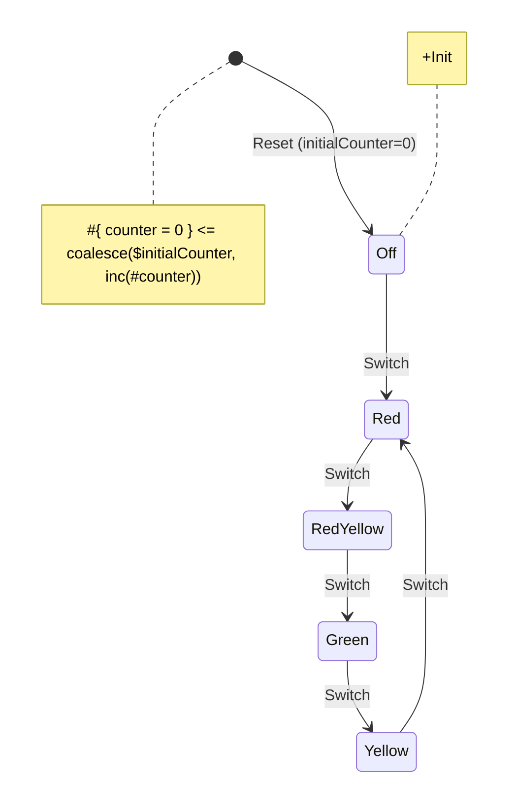

This is the Traffic Light example project.

## Demo

<iframe src="./01-traffic-light/index.html" style="width: 100%; height: 500px;"></iframe>

## Diagram

```mermaid
stateDiagram-v2
	[*] --> Off: Reset (initialCounter=0)
	Off --> Red: Switch
	Red --> RedYellow: Switch
	RedYellow --> Green: Switch
	Green --> Yellow: Switch
	Yellow --> Red: Switch
note right of [*]
#{ counter = 0 } <= coalesce($initialCounter, inc(#counter))
end note
note left of Off
+Init
end note
```
