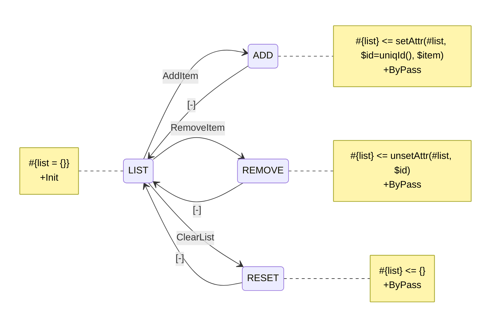
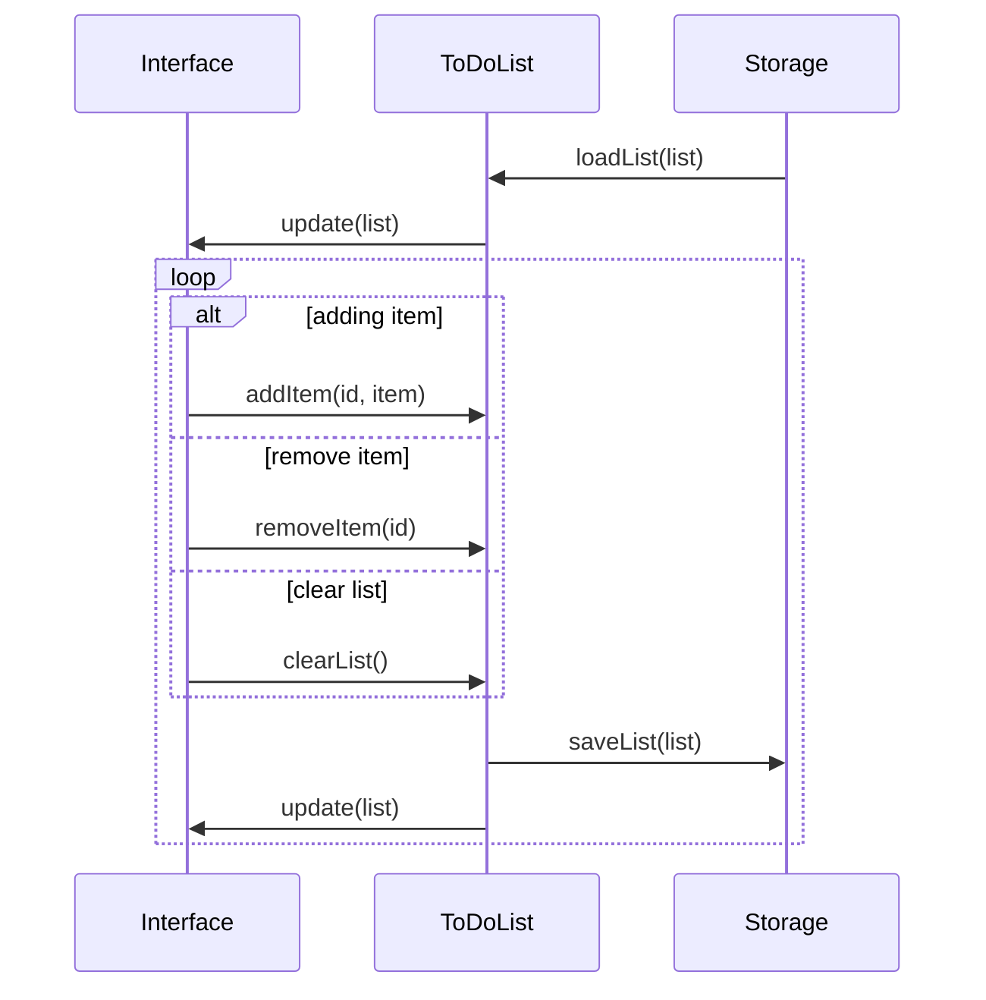

# Building a To-Do List

## Creating a control object for the list

Let's make a State Diagram for a simple object with 3, hopefully self-explaining, actions:
- `AddItem`
- `RemoveItem`
- `ClearList`

Object also would have a storage named `list`, while technically it's a hash table, so that every assigned To-Do item has a unique id, so it can be addressed for removals.

Technically, our object doesn't have control states, because it is, well, just a list. However, for precise control over operations and easier syntax it's always beneficial to create "transitionary" states for every derived change. Those states would be `+ByPass`, meaning they switch in one transaction along with previous Action that lead to them.



## Creating a step machine to control the execution flow

Whichever app we want, it has to have an interface, be it a React component, an API or a CLI. Also, we don't want our list to go for good on reload, so the state of the list will be synced to some persistent storage, i.e. a file, a Database or `LocalStorage`.



## Building an implementation

Now let's create a Yantrix config to use premaid or custom adapters for different stacks and frameworks. For instance, let's build a frontend app that uses a simplistic React UI for `Interface` and `SessionStorage` for persistence.

```yaml
Target: Typescript # the output language
FSM:
  # state diagram files are loaded into FSMs with arbitrary aliases
  ToDoList: ./src/fsm/ToDoList.ytx

# Sequence diagram is describing the main thread of the micro-app
Sequence: ./src/sequence/todo.ytx

# Adapters are modules that implement Participants from the sequence diagram
Adapters:
  ToDoList: ToDoList # referencing an FSM alias creates EventAdapter
  Interface: ./src/ui/reactAdapter.ts # referencing a self-made adapter for the target language
  Storage: Yantrix/LocalStorageAdapter # referencing a premade Yantrix package
```
