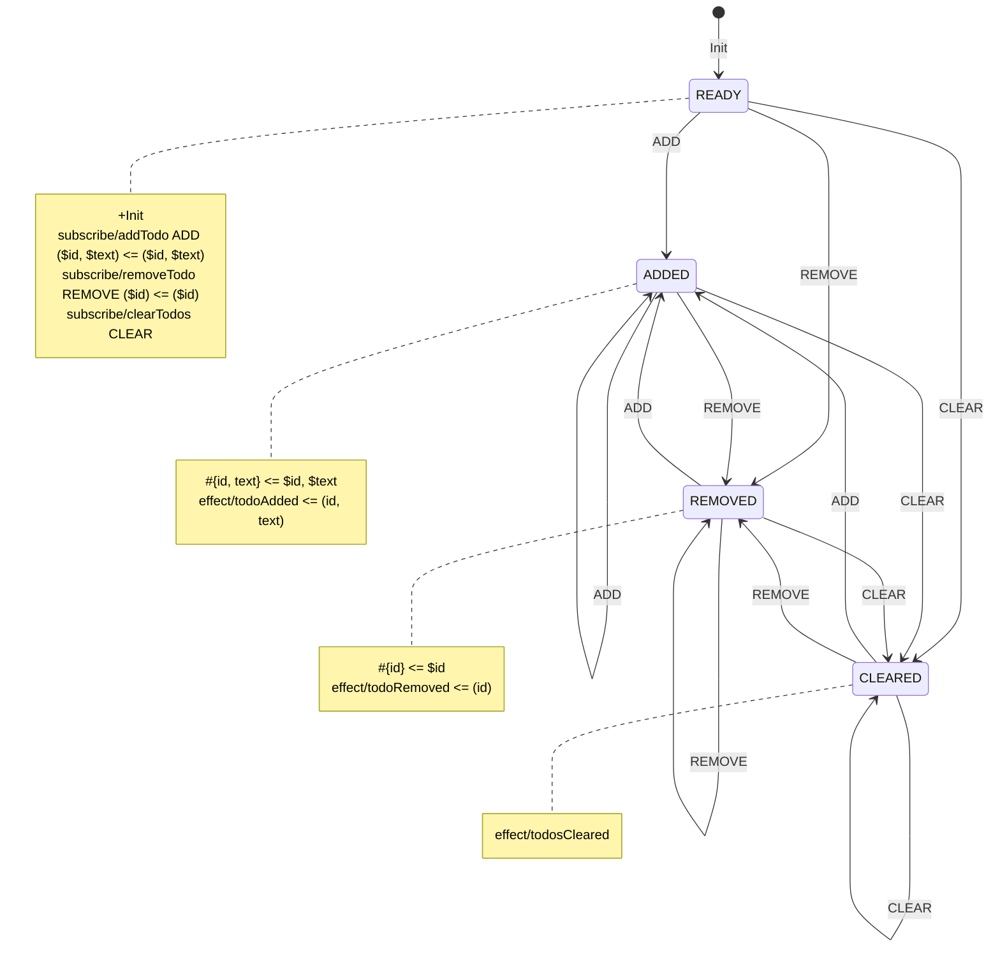

# Persistent Todo List

This example extends the [Data Model and Effects Counter](500_effect_counter.html)
with browser persistence. Todo items belong to the global Data Model; FSM Context
only carries command data between an Event and the emitted Effect Event.

## Data Model

```ts
interface TodoItem {
  id: string;
  text: string;
}

interface TodoModel {
  items: Record<string, TodoItem>;
}

type TodoSnapshot = Pick<TodoModel, 'items'>;

const defaultModel: TodoModel = { items: {} };
```

The Data Model is a plain snapshot. `ModelStore` owns it in memory, while the
Storage binding below persists only the `items` projection.

## FSM and Effects


```mermaid
stateDiagram-v2
  [*] --> READY: Init

  READY --> ADDED: ADD
  READY --> REMOVED: REMOVE
  READY --> CLEARED: CLEAR
  ADDED --> ADDED: ADD
  ADDED --> REMOVED: REMOVE
  ADDED --> CLEARED: CLEAR
  REMOVED --> ADDED: ADD
  REMOVED --> REMOVED: REMOVE
  REMOVED --> CLEARED: CLEAR
  CLEARED --> ADDED: ADD
  CLEARED --> REMOVED: REMOVE
  CLEARED --> CLEARED: CLEAR

  note right of READY
    +Init
    subscribe/addTodo ADD ($id, $text) <= ($id, $text)
    subscribe/removeTodo REMOVE ($id) <= ($id)
    subscribe/clearTodos CLEAR
  end note

  note right of ADDED
    #{id, text} <= $id, $text
    effect/todoAdded <= (id, text)
  end note

  note right of REMOVED
    #{id} <= $id
    effect/todoRemoved <= (id)
  end note

  note right of CLEARED
    effect/todosCleared
  end note
```

Generate a TypeScript automata named `TodoFlow`. The generated Slice factory
requires one Model Transformer for each declared Effect:

```ts
import {
  CoreLoop,
  EffectScheduler,
  hydrateModel,
  LocalStorageAdapter,
  ModelStore,
  StorageSyncLoop,
  type TStorageBinding,
} from '@yantrix/core';
import {
  createTodoFlowSlice,
  eventDictionary,
} from './generated/TodoFlow.js';

const todoStorage = new LocalStorageAdapter<TodoSnapshot>({
  id: 'todo-list',
  key: 'yantrix:todo-list:v1',
});

const todoBinding: TStorageBinding<TodoModel, TodoSnapshot> = {
  storage: todoStorage,
  select: model => ({ items: model.items }),
  hydrate: (model, snapshot) => ({ ...model, items: snapshot.items }),
};

// Hydration is a startup phase and happens before ModelStore/CoreLoop exist.
const hydration = await hydrateModel(defaultModel, [todoBinding]);
for (const failure of hydration.failures) {
  console.error('Todo hydration failed', failure);
}

const modelStore = new ModelStore(hydration.model, {
  development: { freeze: true, validateSerializable: true },
});
const effectScheduler = new EffectScheduler<
  TodoModel,
  number,
  Record<number, unknown>
>({ store: modelStore });
const coreLoop = new CoreLoop<
  number,
  Record<number, unknown>,
  TodoModel
>({ effectScheduler });

const todoSlice = createTodoFlowSlice<TodoModel>({
  todoAdded: (event, model) => {
    const id = String(event.meta?.id ?? '');
    const text = String(event.meta?.text ?? '');
    if (id.length === 0 || text.length === 0) return model as TodoModel;
    return {
      ...model,
      items: { ...model.items, [id]: { id, text } },
    };
  },
  todoRemoved: (event, model) => {
    const id = String(event.meta?.id ?? '');
    if (!Object.hasOwn(model.items, id)) return model as TodoModel;
    const items = { ...model.items };
    delete items[id];
    return { ...model, items };
  },
  todosCleared: (_event, model) => Object.keys(model.items).length === 0
    ? model as TodoModel
    : { ...model, items: {} },
});

coreLoop.registerSlice(todoSlice);

const storageSync = new StorageSyncLoop({
  store: modelStore,
  bindings: [todoBinding],
  debounceMs: 150,
  onError: failure => console.error('Todo persistence failed', failure),
}).start();

// Persist defaults or a successfully migrated snapshot even before a command.
storageSync.requestSync();
```

`LocalStorageAdapter` can accept an injected `storage`, `serialize` and
`deserialize`, which makes the same composition testable without browser
globals.

## UI commands and rendering

The UI publishes commands and renders committed Data Model snapshots. It never
edits the FSM Context or Storage directly.

```ts
function render(model: TodoModel): void {
  // Replace this with React, DOM, CLI or an API Destination.
  console.table(Object.values(model.items));
}

render(modelStore.get());
const stopRendering = modelStore.subscribe(render);

export async function addTodo(id: string, text: string): Promise<void> {
  coreLoop.getBus().dispatch({
    event: eventDictionary.addTodo,
    meta: { id, text },
  });
  await coreLoop.whenIdle();
}

export async function removeTodo(id: string): Promise<void> {
  coreLoop.getBus().dispatch({
    event: eventDictionary.removeTodo,
    meta: { id },
  });
  await coreLoop.whenIdle();
}

export async function clearTodos(): Promise<void> {
  coreLoop.getBus().dispatch({
    event: eventDictionary.clearTodos,
    meta: null,
  });
  await coreLoop.whenIdle();
}
```

`coreLoop.whenIdle()` means the command's Event cascade and Effect commit are
complete. Persistence is deliberately asynchronous. Tests and graceful shutdown
paths can await it explicitly:

```ts
await addTodo('first', 'Try Yantrix Effects');
await storageSync.whenIdle();

async function shutdown(): Promise<void> {
  stopRendering();
  coreLoop.unregisterSlice(todoSlice.id);
  await storageSync.stop(true); // flush the latest projection
}
```

Reloading the application repeats `hydrateModel()` and restores the saved
`items` projection before the UI and Main Loop start.
