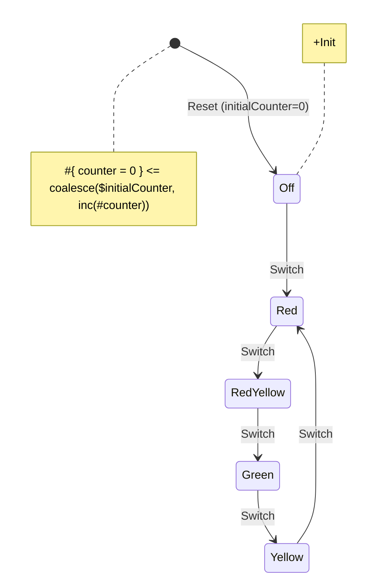

# Redux Examples

## [Traffic light](01-traffic-light/index.html){target="_blank"}

Source code: [01-traffic-light](https://github.com/tfcp68/yantrix/tree/main/examples/01-traffic-light)

### Diagram

