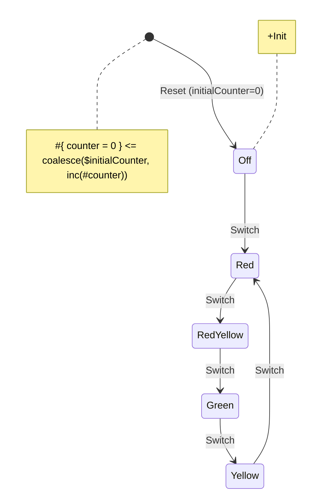

# Redux Examples

## Traffic light

Traffic light is a classic example of a finite state machine.
A traffic light system follows a strict sequence of states (e.g., Red → Green → Yellow → Red).
In this example, states are being switched whenever you press a "Switch" button below the traffic light block.
You can press "Reset" to return to the initial state of the application. (All lights are disabled)

### Demo

You can check out the working example [here](01-traffic-light/index.html){target="_blank"}.

### Source code

Source code for the example is located [here](https://github.com/tfcp68/yantrix/tree/main/examples/01-traffic-light).

<iframe
style="width: 100%; height: 900px; outline: 1px solid #252525; border: 0; marginBottom: 16px"
src="https://codesandbox.io/p/devbox/github/tfcp68/yantrix/main/examples/01-traffic-light"
></iframe>

### Diagram



### Installation and usage

If you want to install this example locally, follow these steps:

1. Clone the Yantrix repository:
```
git clone https://github.com/tfcp68/yantrix.git
```
2. Open the example folder:
```
cd yantrix
cd examples
cd 01-traffic-light
```
3. Install the dependencies:
```
pnpm install
```
4. *(Optional)* To re-generate the automata (for example, if you want to play around with the state diagram), use the following command:
```
yantrix codegen ./src/diagrams/traffic-light.mermaid -l TypeScript -o src/generated/TrafficLightAutomata.ts -c TrafficLightAutomata
```
5. To run the project in development mode:
```
pnpm dev
```
You can check out the example application at http://localhost:5173.

6. To build for production:
```
pnpm build
```
