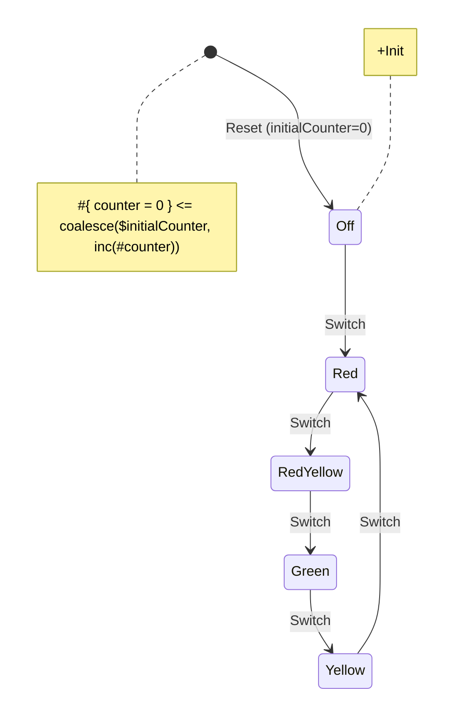

# React Examples
## [Traffic light](02-traffic-light-react/index.html){target="_blank"}

Source code: [02-traffic-light-react](https://github.com/tfcp68/yantrix/tree/main/examples/02-traffic-light-react)

### Diagram

