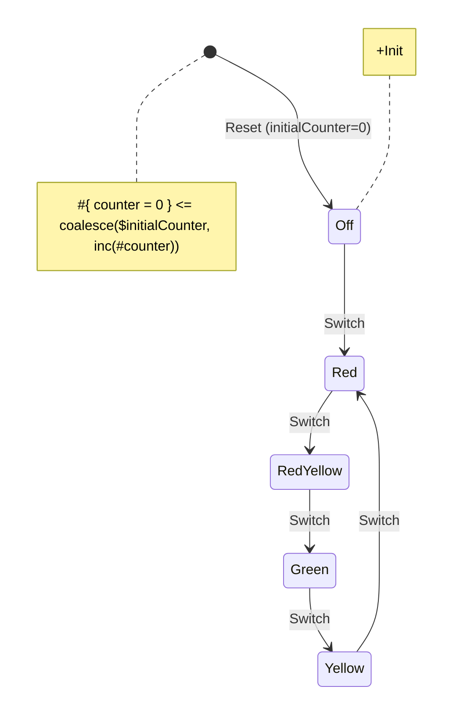

# React Examples

## Traffic light

Traffic light is a classic example of a finite state machine.

### Demo

You can check out the working example [here](02-traffic-light-react/index.html){target="_blank"}.

### Source code

Source code for the example is located [here](https://github.com/tfcp68/yantrix/tree/main/examples/02-traffic-light-react).

### Diagram



### Manual installation and usage

If you want to install this example manually, do the following:

- Clone the Yantrix repository:
```
git clone https://github.com/tfcp68/yantrix.git
```

- Navigate to the example directory:
```
cd yantrix/examples/02-traffic-light-react
```

- Install the dependencies:
```
npm install
```

- To generate the automata for the example, you can run the following command:
```
yantrix codegen ./src/diagrams/traffic-light.mermaid -l TypeScript -o src/generated/TrafficLightAutomata.ts -c TrafficLightAutomata
```

- To run in dev mode:
```
npm run dev
// View the result at http://localhost:5173/
```

- Build for production:
```
npm run build
```
