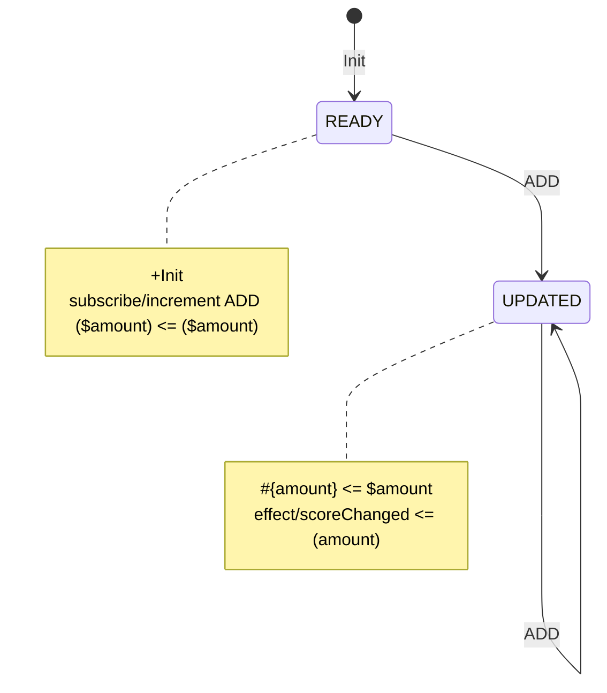

# Data Model and Effects Counter

This minimal end-to-end example uses generated FSM code, a Slice, the Main Loop,
an Effect and the Data Model. It intentionally has no persistence; the
[Todo example](1000_todo.html) adds the Storage lifecycle.

## Diagram



Generate TypeScript with class name `CounterFlow`. The generated module exports
`eventDictionary`, `createCounterFlowEffectMatrix()` and
`createCounterFlowSlice()`.

## Composition root

```ts
import {
  CoreLoop,
  createModelPredicate,
  createModelTransformer,
  EffectScheduler,
  ModelStore,
  whenModel,
} from '@yantrix/core';
import {
  createCounterFlowSlice,
  eventDictionary,
  type TCounterFlowEventMeta,
} from './generated/CounterFlow.js';

interface CounterModel {
  score: number;
  maximum: number;
}

const initialModel: CounterModel = { score: 0, maximum: 10 };
const modelStore = new ModelStore(initialModel, {
  development: { freeze: true, validateSerializable: true },
});

const belowMaximum = createModelPredicate<
  CounterModel,
  CounterModel,
  typeof eventDictionary.scoreChanged,
  TCounterFlowEventMeta
>(
  model => model,
  (_event, model) => model.score < model.maximum,
);

const addScore = createModelTransformer<
  CounterModel,
  CounterModel,
  typeof eventDictionary.scoreChanged,
  TCounterFlowEventMeta
>(
  model => model,
  (_model, nextModel) => nextModel,
  (event, model) => ({
    ...model,
    score: Math.min(
      model.maximum,
      model.score + Number(event.meta?.amount ?? 0),
    ),
  }),
);

const counterSlice = createCounterFlowSlice<CounterModel>({
  scoreChanged: whenModel(belowMaximum, addScore),
});
const effectScheduler = new EffectScheduler({ store: modelStore });
const coreLoop = new CoreLoop({ effectScheduler });
coreLoop.registerSlice(counterSlice);

coreLoop.getBus().dispatch({
  event: eventDictionary.increment,
  meta: { amount: 3 },
});
await coreLoop.whenIdle();

console.log(modelStore.get()); // { score: 3, maximum: 10 }
```

The external `increment` Event only causes an FSM transition. Entering `UPDATED`
emits `scoreChanged`; that emitted Event selects the generated Effect Matrix and
updates the Data Model. `whenIdle()` covers both steps and the Effect commit.

## What to test

```ts
modelStore.subscribe((next, previous) => {
  // One command may run several Effects, but the batch commits once.
  console.log({ next, previous });
});

coreLoop.getBus().dispatch({
  event: eventDictionary.increment,
  meta: { amount: 100 },
});
await coreLoop.whenIdle();

expect(modelStore.get().score).toBe(10);
```

The Predicate prevents later increments after the maximum is reached. A no-op
Transformer preserves the model reference, so subscribers and model-bound
Destinations are not called unnecessarily.
