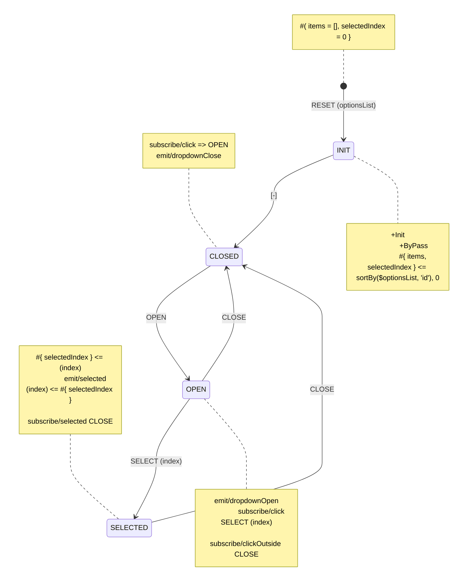

# Yantrix

Yantrix is a TypeScript framework that provides a set of tools to create robust and self-documented functional applications by code generation.
The business logic is represented by declarative, event-driven [finite state machines](https://en.wikipedia.org/wiki/Finite-state_machine), while the application state is an [Anemic Domain Model](https://en.wikipedia.org/wiki/Anemic_domain_model), making it great a counterpart to any traditional state manager like [Redux](https://redux.js.org/), while allowing devs to focus on describing contracts and workflows, rather than writing and debugging the
actual code.

Lends itself perfectly to [Architecture-as-Code](https://jondavid-black.github.io/AaC/) paradigm and no-code/less-code tools for developers, like [n8n](https://github.com/n8n-io/n8n).

## Quick Start

Let's suppose you are building a slider component. First, you need a diagram for your State Machine, written in [Yantrix subsyntax](./syntax/) of [Mermaid](https://mermaid.js.org/):


Assume it's saved to a file named `slider.mermaid`. Then, you pass that source to a code generator and choose a language you need

```shell
$ yantrix codegen ./slider.mermaid --outfile slider_controller.js --language Javascript --className Slider
```

Now, import the generated file into your projects:

```javascript
import Slider from './slider_controller.js';

const SLIDER_MAX = 1000;
const SLIDER_MIN = -1000;

const SliderController = new Slider();

SliderController.dispatch(
	Slider.createAction('RESET', {
		min: SLIDER_MIN,
		max: SLIDER_MAX,
	}),
); // adjusted to local needs

/* somewhere later on in UI */

// bind these to buttons and/or keys
const rightHandler = () => SliderController.dispatch(Slider.createAction('INCREASE', { by: 50 }));
const leftHandler = () => SliderController.dispatch(Slider.createAction('DECREASE', { by: 50 }));

// bind this to a click handler, using relative coordinate
const setHandler = (percentage) =>
	SliderController.dispatch(
		Slider.createAction('SET', {
			value: SLIDER_MIN + percentage * (SLIDER_MAX - SLIDER_MIN),
		}),
	);

// use this to display value in the GUI
const getSliderValue = () => SliderController.getContext().value;

// and this - to prevent UI from changing the slider value
const isDisabled = () => Slider.hasState(SliderConroller, 'DISABLED');
```

Or you can use one of the available [Integrations](./integrations/) with a framework of your choice, i.e. [Redux](./integrations/200_redux.html)

## Syntax Breakdown

Let's see what's happening in depth. The diagram describes an [`FSM`](concepts/200_FSM.html), &ndash; a finite state machine, a control object that is characterized by a limited set of `States`, and it always resides in one and only one of them.

### States

Every `State` is independent on another and difference between `States` is _qualitative_, i.e. they represent some orthodox scenarios in App:

-   Slider is usable and idle (enabled)
-   Slider can't be interacted with (disabled)
-   Slider is being switched to a particular position
-   Slider is being nudged left or right


### Actions

To change the `State` of the machine, an `Action` must be invoked. Every `Action` has a unique name, and the first layer of diagram is essentially a graph that depicts which `Actions` lead to which `States`.


Also note that not every `Action` can be invoked from every `State` by default. A `[*]` node is used to define an `Action` that can be invoked from every `State`. The binding between `States` and `Action` define a [many-to-many relation](https://en.wikipedia.org/wiki/Incidence_matrix), called `Transition Matrix`, that is another way to define the `FSM`. Every item in this matrix is either null or an `Action` name, while columns and rows correspond to `States` in the same order.

| From/To      | ENABLED | DISABLED |
| ------------ | ------- | -------- |
| _any_        | RESET   |          |
| **ENABLED**  |         | DISABLE  |
| **DISABLED** | ENABLE  |          |

### Payload

Every `Action` can carry a `Payload`, which is a plain data object that represents some meta information about the change requested by it. For instance, when resetting (instantiating) a Slider, it's wise to provide it's min and max values. `Payload` is represented with a list of parameters in parentheses, each possible having a default value:


Technically, nudging Slider can be processed the same way as setting it directly, by an only `Action`, carrying a polymoprhic `Payload`, allowing to either adjust value or to set it directly:


However, different behaviours are better to be represented with different `States`.

### Intermediary States

While `FSM` is transactional and synchronous (i.e. no further computation is done until the invoked `Action` has been processed), most interactions are asynchronous by nature, and they have some in-between state, usually called "pending" in this context.

In fact, even synchronous operations could have an intermediate `State` which actually does computations, and this would be an advised design pattern. As you can guess, those operations then could be easily plugged in with async functionality, behaving as a [Promise](https://developer.mozilla.org/en-US/docs/Web/JavaScript/Reference/Global_Objects/Promise).


here we define 3 `Actions` and 3 corresponding intermediate `States` for them:

-   `SET (value)` &ndash; a direct assignment of the Slider value, leading to **SETTING** `State` and carrying new value in `Payload`
-   `INCREASE (by)` &ndash; an increment of the Slider value, leading to **INCREMENT** `State` and carrying a difference in `Payload`
-   `DECREASE (by)` &ndash; a decrement of the Slider value, leading to **DECREMENT** `State` and carrying a difference in `Payload`

Here we use `[-]` labels on `Actions`, which is a special symbol for [ByPass](/syntax/100_data_objects.html#bypass) `Action`. Now, to emphasize that we need to add _Notes_ to `States` to describe their behaviour:


Our Transition Matrix now looks like this:

| From/To   | ENABLED  | DISABLED | INCREMENT | DECREMENT | SETTING |
| --------- | -------- | -------- | --------- | --------- | ------- |
| _any_     | RESET    |          |           |           |         |
| ENABLED   |          | DISABLE  | INCREASE  | DECREASE  | SET     |
| DISABLED  | ENABLE   |          |           |           |         |
| INCREMENT | INCREASE |          |           |           |         |
| DECREMENT | DECREASE |          |           |           |         |
| SETTING   | SET      |          |           |           |         |

### Context

Now, we need to define `Context` &mdash; values that are stored within `FSM` along with the current `State` and represent some of its _quantitative_ properties. We define it with [Reducers](./syntax/110_reducers.html) along with `State`, and they are calculated whenever the `FSM` is switched to that `State`. The `Reducers` defined at `[*]` node are run on **every** transition, and the `Context` properties found there are persistent through every `Action`, unless specified otherwise.


here we have defined 3 `Context` properties, that are copied from the previous values with every `Action`:

-   **value** stores current Slider position
-   **min** stores minimal selectable value
-   **max** stores maximal selectable value

### Initial Context

When **RESET** `Action` is invoked, a new **min** and **max** values can be set with `Payload`. Since that `Action` resolves to **ENABLED** `State`, that's where the related `Reducer` belongs:


Here we have also specified that **ENABLED** is the starting `State` of the `FSM` with [Init flag](/syntax/100_data_objects.html#init).

### Operations on data

Now we specify the arithmetics for intermediate "nudge" `States` **INCREMENT** and **DECREMENT**, which will add or substract, respectively, the provided `Payload` property **by** to/from stored **value** in `Context` :


Note that we use built-in [Transformer Functions](./syntax/160_transformers.html) `min`,`max`,`add` and `diff` here in such a manner, that the resulting **value** always stays within **min** and **max** bounds.

Finally, we write a simple assignment `Reducer` for **SETTING** intermediate `State`, that will copy **value** from `Paylod` to `Context`, and we are done:


Now, it's only about dispatching proper `Payloads` to the `FSM`.

## Sample Diagrams

### Dropdown Control



-   `+Init` marks that **INIT** is the initial `State` of the `FSM`. `+ByPass` also implies that transition through
    this `State` is synchronous, i.e. the `State` is [intermediary](#intermediary-states)
-   `#{items, selectedIndex}` describes a shape of `Context` for all `States`. `items` is the list of dropdown values,
    and `selectedIndex` stores currently selected item. Without extra expressions these values are copied from the
    preceding `Context`
-   `#{items=[], selectedIndex = 0}` sets the initial value for that `Context`
-   `#{items, selectedIndex} <= sortBy($optionsList, 'id'), 0` fills both `Context` properties from `Payload`:
    -   `items` is a sorted `optionsList` property, assuming it's a List of Objects that have property of `id`.
    -   `selectedIndex` is set to 0, when the options list is updated
-   `subscribe/click => OPEN` in **CLOSED** state produces **OPEN** `Action` on incoming `click` `Event`, which
    transitions the `FSM` into **OPEN** state
-   likewise, `subscribe/click SELECT (index)` produces **SELECT** `Action` and passes `index` property
    from `Event Meta` to its `Payload`, which transitions the `FSM` into the **SELECTED** `State`
-   `subscribe/clickOutside => CLOSE` produces a **CLOSE** `Action` to return the dropdown to the
    original `State` (**CLOSED**)
-   Both **CLOSED** and **OPEN** `States` emit corresponding `Events`, that are pipelined into `Event Bus` and connect the
    component to others.
-   **SELECTED** is another sort of [intermediary State](#intermediary-states): while `emit/selected (index) <= #{ selectedIndex }` lets the `Event Bus` know
    which item was selected, at the same time `subscribe/selected => CLOSE` transitions the `FSM`
    back to **CLOSED** `State` via **CLOSE** `Action`. It behaves similar to **INIT** `State` &ndash; the `FSM` goes
    through it. However, unlike that case, here it will emit `Event` and wait for its settlement before it runs further
    processing.
