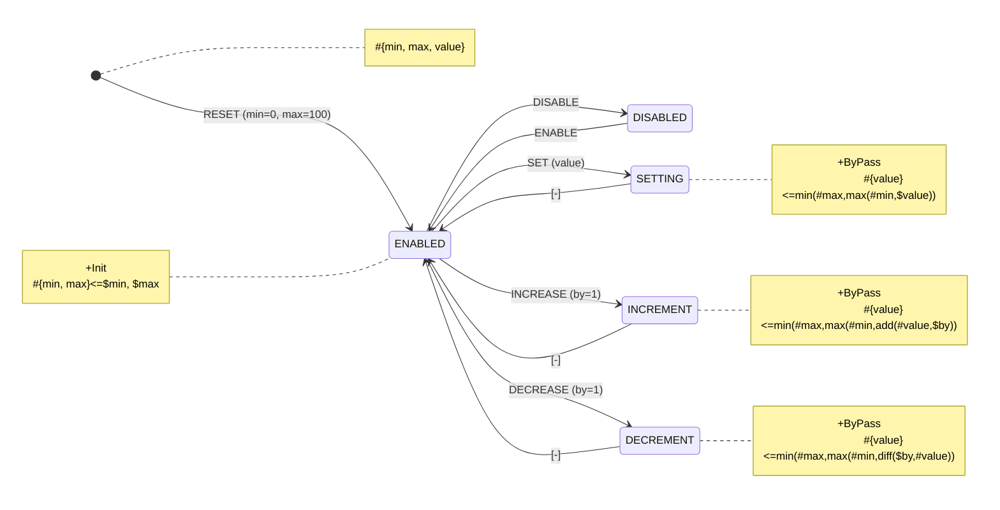

# Javascript API

When generating a JS/TS class, which instance inherits [IAUtomata](../API-Reference/automata/interfaces/IAutomata.html), there are also static properties added to it to help operating the `FSM`

In this section all snippets are provided with the same diagram that is analyzed in [Introduction](../):



## Identifier

Yantrix codegen lets you specify a paremeter `className`, which whill result in the name of the generated Class. However, when using default imports, this name is lost, while it's could be a good unique identifier, when using a lot of `FSM`s. To keep it, every exported class has a static property `id` containing the same name

```shell
$ yantrix codegen ./slider.mermaid --outfile slider_controller.js --language Javascript --className Slider
```

```javascript
import { Slider } from '../slider_controller.js';
// or
import Slider from '../slider_controller.js';

Slider.id === 'Slider'; // true
```

## State Helpers

Internally, `IAutomata` operates on numeric states. To address `States` from the diagram, they must be wrapped in a helper:

```javascript
import Slider from '../slider_controller.js';

Slider.getState('ENABLED'); // returns a numeric internal id of this State, or Null if it's incorrect
```

There's also a helper to check if the `FSM` is in a particular `State` right now:

```javascript
const SliderInstance = new Slider({
	min: 1,
	max: 10,
	value: 5,
});

Slider.hasState(SliderInstance, 'ENABLED'); // true
// this is the same as
Slider.getState('ENABLED') === SliderInstance.getContext().state;
```

## Action Helpers

To invoke an `Action`, a [dispatch](../API-Reference/automata/interfaces/IAutomata.html#dispatch) method should be used. Since it accepts numeric ids, they also have to be mapped.

```javascript
Slider.getAction('DISABLE');
Slider.getAction('ENABLE');
```

Since most of the time you need to pass a `Payload` object into `dispatch`, there's a helper to create a `Payload`:

```javascript
const payload = Slider.createAction('RESET', {
	min: 0,
	max: 50,
});

Slider.dispatch(payload);
```

## Dictionaries

Generated modules export two kinds of dictionaries both for `Actions` and `States`, that are suggested to be used as reference constants when addressing their identifiers:

```javascript
import { actionDictionary, actionMap } from '../slider_controller.js';

assert.isEqual(actionMap, {
	RESET: 'RESET',
	ENABLE: 'ENABLE',
	DISABLE: 'DISABLE',
	SET: 'SET',
	INCREASE: 'INCREASE',
	DECREASE: 'DECREASE',
}); // true

// actionDictionary keys are the same as of actionMap
// actionDictionary values are generated semi-randon numbers, that are actually used in the FSM

SliderInstance.dispatch(Slider.createAction(actionMap.DISABLE));
```

Same dictionaries are provided for `State`s:

```javascript
import { stateDictionary, stateMap } from '../slider_controller.js';

Slider.getState(stateMap.ENABLED);
```

## Typescript

In typescript versions [Dictionaries](#dictionaries) are available as types too:

```typescript
import { actionMap, TActionLiteral, stateMap, TStateLiteral } from '../slider_controller.js';

type TActionLiteral = keyof typeof actionMap;
type TStateLiteral = keyof typeof stateMap;
```
