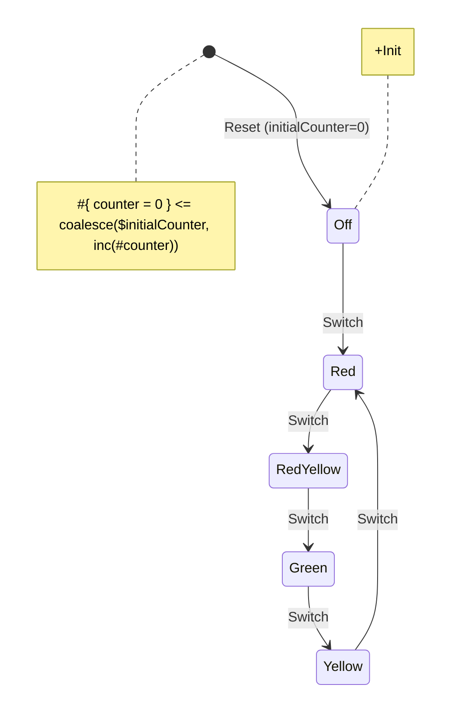

# Integrating with React

Since React team advocates consistently for functional style, we also aim to provide functional API with [Hooks](https://react.dev/reference/react/hooks). However, Yantrix still exports [objective API](../API/automata/interfaces/IAutomata.html), so it has to be tuned in a way.

## Setup

Define a diagram, for instance, a simple traffic light scheme:



build your `FSM`:

```shell
$ yantrix codegen ../schemas/traffic_light.mermaid --outfile ../generated/traffic_light.ts --language TypeScript --className TrafficLight
```

**(Optional):** Import the adapters and the generated `Automata` into your project

```typescript
// importing bridge toolset
import * as Yantrix from '@yantrix/react';

// import a generated automata
import TrafficLight from '../generated/traffic-light.ts';

// will export `className` passed to codegen in static variable:
const fsmId = TrafficLight.id; // 'TrafficLight'
```

## Hook

To use imported `FSM` in React, there's a hook provided by integration bridge. The following example implements reading from `Context` property as well as dispatching `Actions` to the created FSM.
The hook returns an object with key APIs and some helper functions to make usage of Yantrix with React smooth and easy

```javascript
import { useFSM } from '@yantrix/react';
import TrafficLight from '../generated/traffic-light.ts';

const ToggleComponent = () => {
	// creates a singleton FSM
	const { getContext, dispatch } = useFSM(TrafficLight);

	// Event handlers are redux-like and can be wrapped in React.useCallback
	const clickHandler = () =>
		dispatch({
			action: TrafficLight.getAction('switch'),
		});

	// obtains a value from FSM Context
	const { counter } = getContext().context;

	// defines a mapping between FSM State and a CSS class property
	const bgClasses = {
		[TrafficLight.getState('Red')]: 'bg-red',
		[TrafficLight.getState('RedYellow')]: 'bg-red bg-yellow',
		[TrafficLight.getState('Yellow')]: 'bg-yellow',
		[TrafficLight.getState('Green')]: 'bg-green',
	};

	const defaultClass = 'bg-white';

	// Key-based dispatching is eloquent and extendable with no effort
	const className = bgClasses[getContext().state] ?? defaultClass;

	return (
		<div class={className} onClick={clickHandler}>
			{counter}
		</div>
	);
};
```

## Multiple instances

Since an `IAutomata` created by a hook call is a singleton, every component will receive the same `Context` at the given moment of time. Thus, dispatching an `Action` will update all subscribed components. If you need a different behavior, i.e., create a separate instance of the generated `FSM` for a component, you can specify a unique handle for a created `FSM`. All hooks invoked with the same handle share a single instance of `FSM` requested. In the previous example the `id` property is inherited from class static property `id` (i.e., `TrafficLight.id === "TrafficLight"`)

**WARNING:** note that you still don't need to instantiate an `FSM` and should pass a constructor as a property value

```tsx
const Toggler = ({ id: string }) => {
	const { dispatch } = useFSM({
		fsm: TrafficLight,
		id
	});

	const clickHandler = React.useCallback(
		() =>
			dispatch({
				action: TrafficLight.getAction('switch')
			}),
		[dispatch]
	);

	return (
		<div
			class='toggle'
			onClick={clickHandler)
			}></div>
	);
};

const Counter = ({ id: string }) => {
	const { getContext } = useFSM({
		fsm: TrafficLight,
		id
	});

	const { counter } = getContext();

	return <div class='counter'>{counter}</div>;
};

// The parent component creates a unique ID that makes both children Components use the same FSM
const TrafficLight = () => {
	const [id, setId] = useState(Math.random().toFixed(6));
	return (
		<div class='trafficLight'>
			<Toggler id={id} />
			<Counter id={id} />
		</div>
	);
};
```

## Dictionaries

To avoid importing generated class into your modules for the sake of having access to `Action` and `State` dictionaries, you could rather import those helpers from the same hook:

```tsx
const Toggler = () => {
	const FSM = useFSM(TrafficLight);

	const { getState, StateDictionary } = FSM;
	const { getAction, ActionDictionary } = FSM;

	const state = FSM.getContext().state;

	const className = [
		StateDictionary.Red, // same as getState('Red')
		getState('RedYellow'), // same as StateDictionary.RedYellow
	].includes(getContext().state)
		? 'red'
		: '';
	return (
		<div
			class={className}
			onClick={() =>
				dispatch({
					action: getAction('switch'),
				})}
		>
		</div>
	);
};
```

## Debugging

`trace` method returns the last dispatched `Payload` and the preceding `Context`, which is useful for debugging or even for building some kind of dev tools. The resulting `Context` is not returned by this function as it is always identical to `getContext()` return value at the moment of call.

```tsx
const DebugBar = ({ id: string }) => {
	const { trace } = useFSM({
		fsm: TrafficLight,
		id,
	});

	const { lastPayload, previousContext } = trace();

	// Warning: the shape of the Context may differ from getContext()
	// since the FSM could have been in a different State
	const previousState = previousContext.state;

	return (
		<div class="debug">
			<span>{JSON.stringify(lastPayload)}</span>
			<hr />
			<span>{JSON.stringify(previousContext)}</span>
		</div>
	);
};

const TrafficLight = () => {
	const [id, setId] = useState(Math.random().toFixed(6));
	return (
		<>
			<div class="trafficLight">
				<Toggler id={id} />
				<Counter id={id} />
			</div>
			<div class="debugContainer">
				<DebugBar id={id} />
			</div>
		</>
	);
};
```

Each dispatched `Action` gets a unique transaction id and timestamp, so essentially `trace` is a one-entry log. It's probably easy enough to extend this instrument to a full debug log, however, we believe such a functionality is something that React-Yantrix integration bridge should not be responsible for. The transaction stores the call stack of the original `dispatch` call.

```typescript
type TTraceTransaction<StateType, ContextType, ActionType, PayloadType> = {
	lastPayload: TAutomataActionPayload<ActionType, PayloadType>;
	previousContext: TAutomataStateContext<StateType, ContextType>;
	timestamp: Date; // in local timezone
	id: string; // random uuid
	stack: Error['stack'];
};
const transaction: TTraceTransaction = trace();
logs.push(transaction);
```
