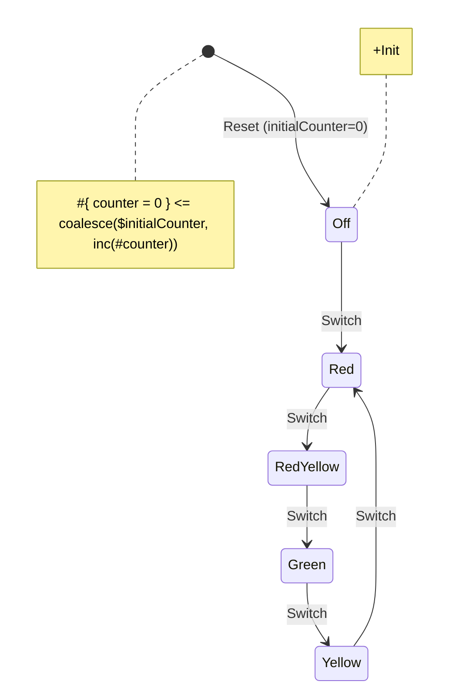
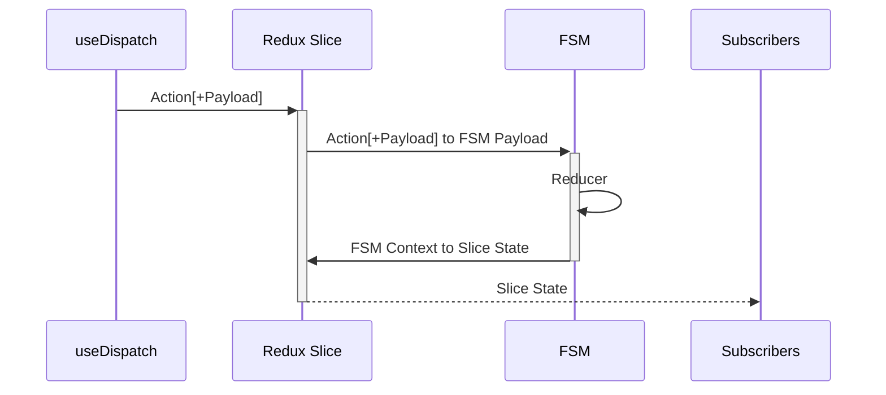
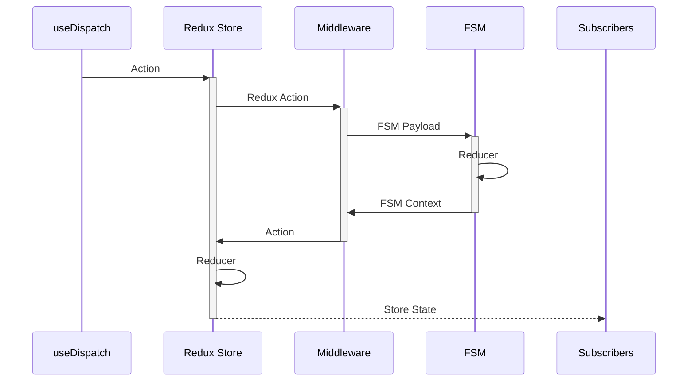
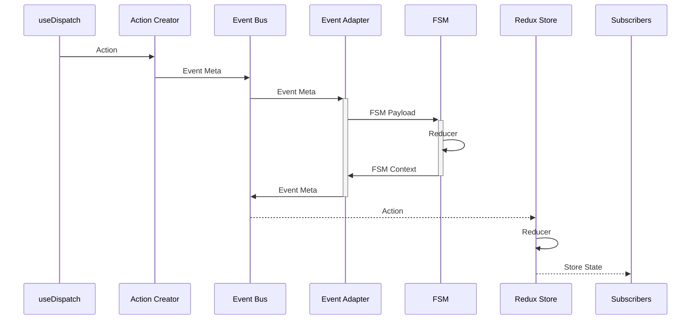

# Integrating with Redux

The connector allows for integration both with native Redux and with Redux-Toolkit Library. FSMs for Redux integration must be complemented using Typescript codegen, thus providing a [`@yantrix/automata`](..API-Reference/automata/) implementation.

```shell
$ npm install @yantrix/redux @yantrix-codegen
```

## Setup

Define a diagram, for instance, a simple traffic light scheme:



build your `FSM`:

```shell
$ yantrix codegen ../schemas/traffic_light.mermaid --outfile ../generated/traffic_light.ts --language TypeScript --className TrafficLight
```

**(Optional):** Import the adapters and the generated `Automata` into your project

```typescript
// importing bridge toolset
import * as Yantrix from '@yantrix/redux';

// import a generated automata
import TrafficLight from '../generated/traffic-light.ts';

// will export `className` passed to codegen in static variable:
const fsmId = TrafficLight.id; // 'TrafficLight'
```

You might be more specific with imports depending on the integration scheme

## RTK Slice

If you must, you can use a generated `Automata` as is within your Redux Store, explicitly exporint its `Actions` to Redux and possibly providing a mapper to produce a Redux Store from FSM `Context`. If the latter is not provided, which is the default scenario, that mapper would be replaced by shallow copyin. That is not exactly a Redux way, but it works.



`@yantrix/redux` lib provides a `createFSMSlice` method which creates a Redux Toolkit Slice which exports all `FSM`s `Actions` as reducers, that invoke [`dispatch`](../API-Reference/automata/interfaces/IAutomata.html#dispatch) method of an FSM to resolve the next state of the produced slice

You shall provide a string constant do discriminate every particular integration. If you must, you can use a same constant for different slices, assuming `Actions` of `FSM`s are globally unique.

```typescript
import { createFSMSlice } from '@yantrix/redux';

// import a generated FSM
import TrafficLight from '../generated/traffic-light.ts';

// provide an integration id as action prefix
const YantrixSliceId = 'yantrix';

const YantrixSlice = createFSMSlice(TrafficLight);
```

this will instantiate a `TrafficLight` class and connect it to Redux.

```typescript
// create a slice for one Automata or for any number of them

const store = configureStore({
	reducer: combineReducers({
		// here go all your other slices
		// ...
		[YantrixSliceId]: YantrixSlice.reducer,
	}),
});
```

### API

```typescript
declare type CreateFSMSliceOptions<StateType, ContextType = object> = {
	name: string;
	fsm: ClassConstructor<IAutomata>;
	contextToRedux?: (context: ContextType) => StateType;
	reducerPath?: string;
	selectors?: Record<string, (state: StateType) => any>;
};

declare function createFSMSlice(options: CreateFSMSliceOptions): ReturnType<createSlice>;
```

### State

The type of the return value is also the shape of `initialState` of a produced slice. In this case it would be:

```typescript
type TAutomataContext = {
	state: 'Off' | 'Red' | 'RedYellow' | 'Yellow' | 'Green';
	context: {
		counter: number;
	};
};

const initialState: TAutomataContext = {
	state: 'Off',
	context: {
		counter: 0,
	},
};
```

The State of the RTK Slice is represented by the return value of an optional functional parameter:

```typescript
import { combineReducers, configureStore } from '@reduxjs/toolkit';

const YantrixSlice = createFSMSlice({
	name: TrafficLight.id,
	fsm: TrafficLight,
	contextToRedux: (context) => context, // optional, default mapper
});
```

If needed, a `Context` of an FSM can be transformed in a different manner to reduce polymorphism and optimize execution:

```typescript
const YantrixSlice = createFSMSlice({
	name: TrafficLight.id,
	fsm: TrafficLight,
	contextToRedux: (context) => ({
		counter: context.counter,
		redColorOn: ['Red', 'RedYellow'].includes(context.state),
		yellowColorOn: ['Yellow', 'RedYellow'].includes(context.state),
		greenColorOn: ['Green'].includes(context.state),
	}), // this function can be memoized
});
```

In this case, `initialState` is derived by applying the mapper to the automata initial `Context`. It might seem a slightly more reduxish way of using transitional state mapping, however, this makes sense only if the produced flags are used directly by components in respective selectors. Otherwise, flag programming should be evaded as much as possible to enjoy the virtues of finite state machines, like determinism and low cyclomatic complexity.

### Actions

The produced object, which is essentially a common RTK Slice, exports redux action creaters, named by pattern `slice.name/fsm.id/action.id`

-   `yantrix/TrafficLight/reset`, having an `initialCounter` parameter
-   `yantrix/TrafficLight/switch`, having no parameters

dispatching an action to Redux will actually invoke an `Action` upon the `FSM` and map its resulting `Context` to Redux slice state

## Middleware

Another very controllable option to integrate FSMs with Redux would be to use `FSM`s as an independent asynchronous logic to transduce Redux Actions before they reach already existing reducers. The `FSM` logic then is applied to the whole Redux Store rather than a particular slice, allowing for operating behavior of existing apps. This approach is also super convenient when using Redux Actions as value setters, however, this is not a Redux way either.

The proper way is to dispatch a specific Redux Action that would pass the control to the `FSM`, which, in turn, returns a new `Action` to be dispatched to `Redux`. The original Redux Action may have a separate reducer, or maybe ignored completely.



Since `FSM` should not have knowledge about a particular Redux Store at time being, the middleware requires a couple of mappers:

-   A function that maps Redux Action to the particular `FSM` `Payload`
-   A function that maps `FSM` `Context` to the particular Redux Action

```typescript
import { PayloadAction } from '@reduxjs/toolkit';
import { Middleware } from 'redux';

function createMiddleware<ActionType extends PayloadAction, AutomataType extends IAutomata, StoreType = any>(
	FSM: AutomataType,
	// if the following mapper returns null, the Payload is not dispatched to FSM
	mapActionToFSMPayload: (action: ActionType) => TInferAutomataPayload<AutomataType>,
	// if the following mapper returns null, the Action is not dispatched to Redux
	mapContextToAction: (context: TInferAutomataContext<ActionType>) => ActionType,
): Middleware<ActionType, StoreType>;
```

Note that the outbound mapping relies on the `State` of the `FSM` rather than on the `Action` produced on the first stage. This behaviour intentionally copies the [Event Adapter](#event-adapters) API, so that the mappers could be at least somewhat composable/reusable.

```typescript
import { combineReducers, configureStore } from '@reduxjs/toolkit';
import { createMiddleware } from '@yantrix/redux';
import TrafficLight from '../generated/traffic-light.ts';

export const store = configureStore({
	reducer: combineReducers({
		/*... */
	}),
	middleware: (getDefaultMiddleware) =>
		getDefaultMiddleware().concat(
			createMiddleware(
				TrafficLight,
				({ type, payload }) => (type !== 'yantrix/trafficLight') ?
					null :
					TrafficLight.createAction('Switch'),
				({ state, context }) => ({
					type: 'changeTrafficLight', // assume this action is handled elsewhere in Redux
					payload: { color: state, counter: context.counter }
				})
			)
});
```

## Event Adapters

Event Adapters present yet another way to plug `FSM`s into Redux, which is the most recommended way when you have several (or many) intertwined `FSM`s that communicate with `Events`, allowing for asynchronous processing outside of Redux. Redux itself becomes an observer of `Events` of a `Slice`, connecting with `Event Bus` directly. The Actions are selectively mapped to `Events` which somehow update `FSM`s in `Slice` stack, and, if any `Events` in generated in response to `FSM` transitions, they are selectively mapped to another Redux Actions, which are then dispatched asynchronously (like a thunk)



```typescript
// here goes the listing with Event Bus...
```
