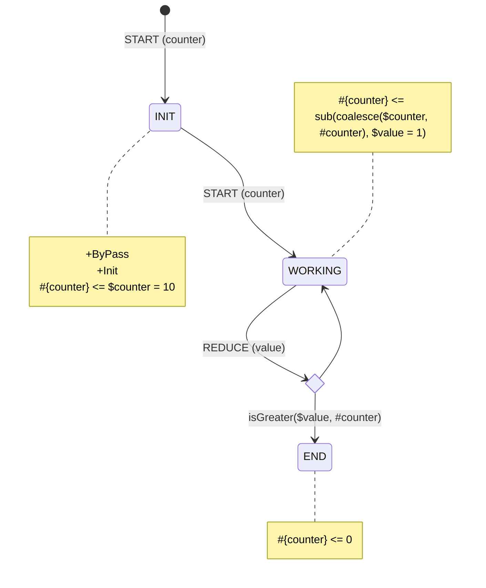

# Data Objects

Yantrix implies that business logic is deterministic and is built upon a single anemic `Data Model`. Framework
controller, meanwhile, consists of small building blocks described as Dictionaries/Records. Most notable of those blocks
are

-   `Context`: current condition of a `FSM`, including it's control state and various meta fields
-   `Payload`: a useful data transferred to a `FSM` with each dispatched `Action`, including its id and various meta
    fields
-   `Event Meta`: the same as `Payload` but for `Events` &mdash; messages dispatched through `Event Bus` between `FSMs`

Each of those is represented as keyed object (dictionary, record, etc.) with each key being processed as a separate var.
In most cases variables are immutable and their names are basically labels for the results
of [Expressions](130_expressions.html) calculation assignment.

## Declaring States

Each node of Mermaid State diagram creates a State and must hava an unique name. It's allowed to use note aliases, bit
they are ignored by Yantrix, and `States` are named with node's literal name.

Therefore, this diagram will create a `FSM` with two `States` **A** and **B**, regardless of node **B** title.

## Declaring Actions

In fact, an `Action` is created automatically with every transition between `States`. If not specified, it's given a
descriptive name based on its starting and ending `State`. However, it's wiser to specify names for transitions. They
will be then be exported as [`ActionDictionary`](../API-Reference/automata/interfaces/IActionDictionary.html), allowing
for
better typing and [Integrations](../integrations/). `Actions` can be dispatched directly into `FSM` API, or be generated
automatically by the attached `Event Adapter`, that translates an `Event` from `Event Bus` to an `Action`
with `Payload`.

This diagram is exported as `FSM` with 4 `Actions`:

-   **AtoB**
-   **BtoC**
-   **Loop**
-   **Reset**

## Creating Context

To access the `Context` of a given `State`, one should create a `note` for this `State` and
use [`Reducers`](110_reducers.html).

Whenever you list a value on the left side of a `Reducer`, it is added to a `Context` of an attached `State`:

Every `State` has its own shape of `Context`, but if they are explicitly listed and have identical names &ndash; they
are copied by default. Members that are not mentioned are not copied

## Default Context

If you define a member on a default node (`[*]`), it will be copied through every transition and present for
every `State`. The default node also usually leads to a default `State` with a reset-like `Action`, that can be fired
from every other `State`. The following diagram behaves identical to the previous one.

**Tip:** It's a good practice to assign default values to `Context` members, and even more important to do so for the
default `Context`

## Creating Payload

`Payload` is a set of properties that is attached to an `Action` and has, like `Context`, a unique shape for every
possible `Action` value. Since `Action` name is a primary key, all `Actions` defined in a diagram must provide
identical `Payload` signature, and this signature is enclosed in brackets (`()`)

Here, whenever a **START** Action is dispatched into a `FSM`, `Payload` _must_ contain a `counter` property, which
always brings the FSM to **INIT** `State` and sets `Context` property with the same name. **INIT** `State` itself is
in `ByPass` (see [below](#bypass)), so `FSM` will transition through it synchronously. That means, it is never in
that `State`, so receiving a **START** `Action` will trigger the next transition with that `Action` attached.

## Forks

In the last diagram there is a `Fork` following **WORKING** `State`. Dispatching a **REDUCE** `Action` at that state
will transition to one of two `States` depending on the [`Predicate`](150_predicates.html) execution result.
If `isGreater(#value,#counter)` resolves to a truthy **Binary**,
this `Action` will transition the `FSM` into **END** `State`.
If not, the same `Payload` will be invoked upon **WORKING** `State` again

## State Flags

Flags are special modifiers that alters the behavior of the `State` they a attached to.

### +Init

A created `FSM` will have this `State` at initialization. A diagram can't have more than 1 `State` with `+Init` flag

### +ByPass

A bypassed `State` automatically propagates the acquired `Action` to the next `State`, if such connection exists in the
diagram. The attached `Reducers` are run beforehand, and then the reducers of the outbound `State` are run next.

**WARNING:** `Payload` is not propagated through `ByPass` nodes and must be consumed in them.

This is the same as emitting an `Event` and subscribing to it at the same time, except for this is shorter and must be
used whenever a control `State` must be switched through without any information getting out of the `FSM`. Also note,
that a `+ByPass` `State` can have any number of incoming transitions, but only one outgoing, which is not an `Action`, but is rather coded with `[-]` label:

