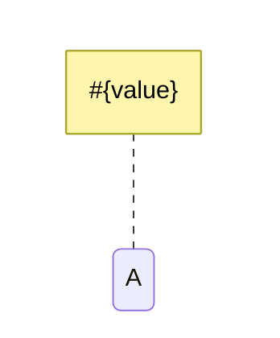
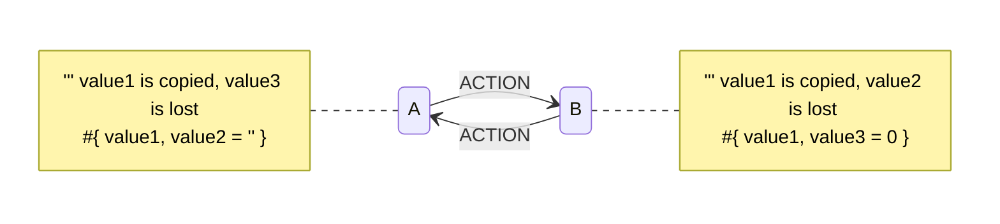
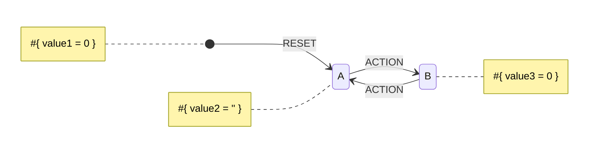
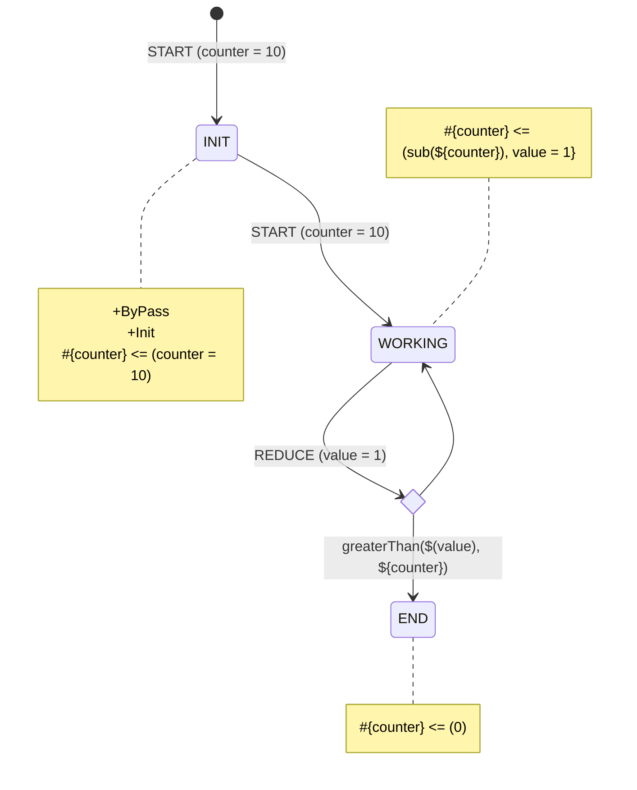

# Data Objects

Yantrix implies that business logic is deterministic and is built upon a single anemic `Data Model`. Framework controller, meanwhile, consists of small building blocks described as Dictionaries/Records. Most notable of those blocks
are

- `Context`: current condition of a `FSM`, including it's control state and various meta fields
- `Payload`: a useful data transferred to a `FSM` with each dispatched `Action`, including its id and various meta
  fields
- `Event Meta`: the same as `Payload` but for `Events` &mdash; messages dispatched through `Event Bus` between `FSMs`

Each of those is represented as keyed object (dictionary, record, etc.) with each key being processed as a separate var.
In most cases variables are immutable and their names are basically labels for the results
of [Expressions](130_expressions.html) calculation assignment.

## Creating Context

Whenever you list a value on the left side of a `Reducer`, it is added to a `Context` of an attached `State`:



Every `State` has its own shape of `Context`, but if they have identical &ndash; names - they are copied by default. Members that are not listed explicitly are not copied


## Default Context

If you define a member on a default node (`[*]`), it will be copied through every transition and present for every `State`. The default node also usually leads to a default `State` with a reset-like `Action`, that can be fired from every other `State`. The following diagram behaves identical to the previous one.

**Tip:** It's a good practice to assign default values to `Context` members, and even more important to do so for the default `Context`




## Default values

Default values are assigned to vars when the requested property is missing in a `Data Object`. To assign a default value
the `KEY_ITEM` is followed by `=` and a [`Constant`](constants.html) or [`Expression`](expressions.html). For instance:

```
#{anyValue, stringValue = 'foobar', numericValue = 3.14}
```

Default values can be used both in `Source Objects` and in `Target Objects`

When used on both sides of a transaction, the `Source Object` default value takes priority. I.e. the
code `#{a = 1} <= {b = 2}` is processed in the following manner:

- `b` is read from the `previousContext`. If it's not there, the expressions resolves to `2`
- the result of expression is assigned to `newContext.a`. If it was not there, it would save as `1`. However, it would
  have already be assigned `2` from the right side.

## Creating Payload

`Payload` is a set of properties that is attached to an `Action` and has, like `Context`, a unique shape for every possible `Action` value. Since `Action` name is a primary key, all `Actions` defined in a diagram must provide identical `Payload` signature, and this signature is enclosed in brackets (`()`)



Here, whenever a **START** Action is dispatched into a `FSM`, `Payload` _must_ contain a `counter` property, which always brings the FSM to **INIT** `State` and sets `Context` property with the same name. **INIT** `State` itself is in `ByPass` (see [below](#bypass)), so `FSM` will transition through it synchronously. That means, it is never in that `State`, so receiving a **START** `Action` will trigger the other transition with that `Action` attached.  

## State Flags

Flags are special modifiers that alters the behavior of the `State` they a attached to.

### +Init

A created `FSM` will have this `State` at initialization. A diagram can't have more than 1 `State` with `+Init` flag

### +ByPass

A bypassed `State` automatically propagates the acquired `Action` to the next `State`, if such connection exists in the diagram. The attached `Reducers` are run beforehand

This is the same as emitting an `Event` and subscribing to it at the same time, except for this is shorter and must be used whenever a control `State` must be switched through without any information getting out of the `FSM`. 

