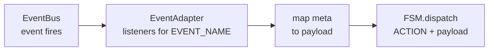

# Subscribing to Events

`Subscribe` statements appear in state `notes` and register listeners on the `EventAdapter`. When a matching event arrives on the `EventBus`, the adapter translates it into an `Action` and dispatches it to the FSM — regardless of which state the machine is currently in.

## Syntax

```text
subscribe/<EVENT_NAME> <ACTION_NAME>
subscribe/<EVENT_NAME> <ACTION_NAME> (<PAYLOAD_KEY_LIST>)
subscribe/<EVENT_NAME> <ACTION_NAME> (<PAYLOAD_KEY_LIST>) <= (<META_KEY_LIST>)
```

| Part                   | Description                                                      |
| ---------------------- | ---------------------------------------------------------------- |
| `EVENT_NAME`           | Globally unique event identifier (see [Events](200_events.md))   |
| `ACTION_NAME`          | Action to dispatch when the event fires                          |
| `PAYLOAD_KEY_LIST`     | `$key` names exposed as action payload properties                |
| `<= (<META_KEY_LIST>)` | Maps incoming event `meta` fields (by position) to payload keys  |

## Examples

```text
note right of Idle
  subscribe/userLoggedIn AUTHENTICATE
  subscribe/userLoggedIn AUTHENTICATE ($userId)
  subscribe/userLoggedIn AUTHENTICATE ($userId) <= ($id)
end note
```

| Form                | Dispatched payload        | Meta field used           |
| ------------------- | ------------------------- | ------------------------- |
| bare                | `{}`                      | -                         |
| with payload        | `{ userId: meta.userId }` | `meta.userId` (same name) |
| with meta mapping   | `{ userId: meta.id }`     | `meta.id` mapped to `$userId` |

Multiple subscriptions in one note are allowed. Each fires independently.

## Flow



> **Note:** Subscription is not state-gated. The listener fires regardless of the FSM's current state.

## Placement

`subscribe` statements may appear in any state's `note`. The note's host state does not affect when the listener fires — the placement is purely organizational.

See [Events](200_events.md) and [Event Model](../concepts/300_event_model.md).
