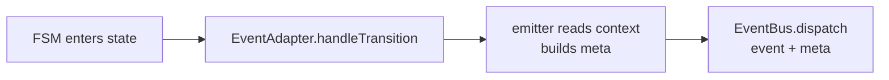

# Emitting Events

`Emit` statements appear in state `notes` and register emitters on the `EventAdapter`. When the FSM enters that state, the emitter runs and pushes events onto the `EventBus`.

## Syntax

```text
emit/<EVENT_NAME>
emit/<EVENT_NAME> (<META_KEY_LIST>)
emit/<EVENT_NAME> (<META_KEY_LIST>) <= #{<CONTEXT_KEY_LIST>}
```

| Part | Description |
| --- | --- |
| `EVENT_NAME` | Globally unique event identifier (see [Events](200_events.md)) |
| `META_KEY_LIST` | Keys to include in emitted event's `meta` object |
| `<= #{<CONTEXT_KEY_LIST>}` | Maps FSM context fields to meta keys (by position) |

Meta keys use `$key` prefix for named slots; `#key` prefix reads context directly (same name).

## Examples

```text
note right of Authorized
  emit/sessionStarted
  emit/sessionStarted (#token)
  emit/sessionStarted ($tok) <= #{authToken}
  emit/sessionStarted ($tok, $exp='never') <= #{authToken}
end note
```

| Form | Emitted `meta` | Source |
| --- | --- | --- |
| bare | `{}` | - |
| `#key` reference | `{ token: context.token }` | context, same key name |
| `$key <= #{ctx}` mapping | `{ tok: context.authToken }` | context field remapped |
| with literal default | `{ tok: context.authToken, exp: 'never' }` | context + fallback literal |

## Flow



> **Note:** Emit fires on state *enter*, not on action dispatch. Only emitters for the new state run.

See [Events](200_events.md) and [Event Model](../concepts/300_event_model.md).
