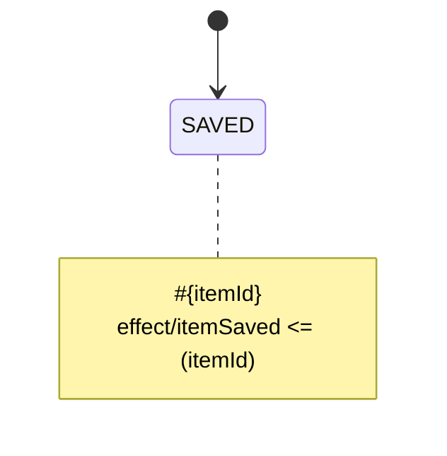

# Side Effects

`Effects` are pure functions that take `Data Model` and `Event Meta` as parameters and return updated `Data Model`. Every `FSM` is locked onto oneself and cannot directly update the "outer world data" that is expressed by `Data Model`. To do so, `Effects` are invoked by `Event Stack` every time it repeats its cycle.

While every `FSM` can declare its own `Effects`, in fact they are invoked all at once, when (if) all `FSM`s have been already done with their `Reducer` loops and some `Events` have been emitted by `Event Adapters`. Only the emitted `Events` would be translated to `Effects`.

```
effect/<EFFECT_NAME> [<= (<META_KEY_LIST>)]
```

An Effect declaration makes the generated `Event Adapter` emit an Event named `<EFFECT_NAME>` when its `FSM` enters
the state containing the declaration. The optional keys are copied from that state's `Context` into `Event Meta`, in
declaration order. Reusing an Effect name in several states is allowed, but every declaration of that name must have
the same Event Meta keys.

For the following state:



JavaScript and TypeScript codegen export `create<ClassName>EffectMatrix(modelTransformers)` and
`create<ClassName>Slice(modelTransformers)`. The application composition root provides the actual Model Transformer;
the diagram declares its Event binding and Event Meta contract:

```ts
type MyDataModel = { lastSavedId: unknown };

const slice = createSaveFlowSlice<MyDataModel>({
  itemSaved: (event, model) => ({
    ...model,
    lastSavedId: event.meta?.itemId,
  }),
});

coreLoop.registerSlice(slice);
```

The generated TypeScript API includes the Effect Event, Event Meta, Model Transformer registry and Effect Matrix
types. Yantrix syntax does not currently declare the complete application Data Model schema, so the generated Data
Model type defaults to `Record<string, unknown>` and the factory is generic over the application's concrete model.

In the TypeScript runtime an Effect has the `(event, readonlyModel) => nextModel` contract. A
[`Model Transformer`](160_transformers.html#model-transformers) already has that shape; `whenModel` combines one with a
[`Model Predicate`](150_predicates.html#model-predicates) when a conditional Effect is required. The Effect Scheduler
applies matching Effects in order and commits at most one resulting snapshot for the complete Main Loop batch.
The normative ordering, batch boundary and failure behavior are documented in
[Core Runtime API](../integrations/180_core_runtime.html#effect-batch-contract).

Side Effects codegen currently targets the `javascript` and `typescript` dialects. Other output dialects reject a
diagram containing `effect/` instead of silently generating code without its Effect Matrix.
