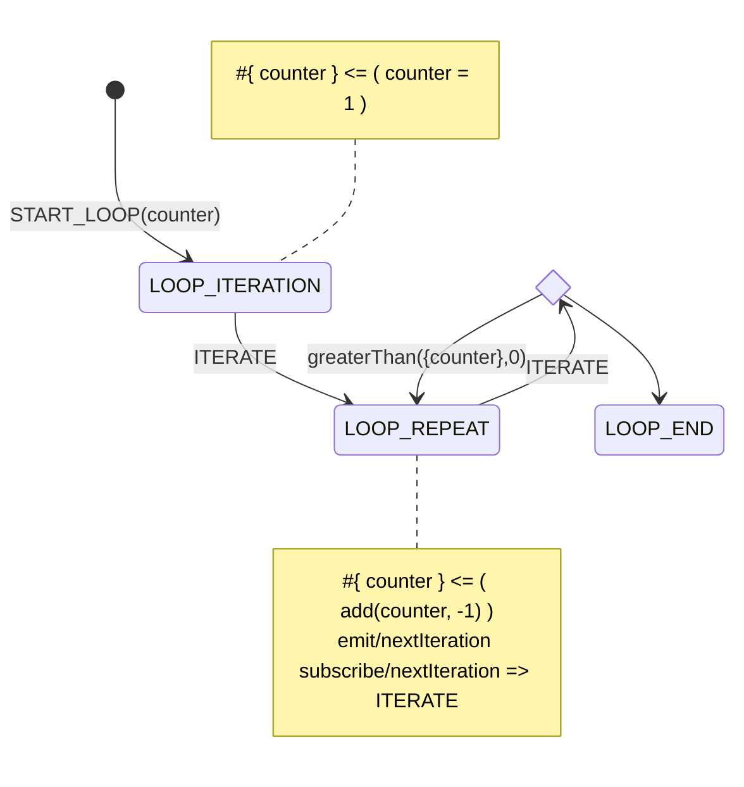

# Yantrix diagram syntax

## Mermaid

Yantrix extends [MermaidJS](https://mermaid.js.org/) syntax to describe business logic, which is then transpiled into one of popular programming languages. This allows to effortlessly visualize data flow and control states, blending well into [Documentation-As-Code](https://www.writethedocs.org/guide/docs-as-code/) and [Everything-As-Code](https://hackernoon.com/everything-as-code-explained-0ibg32a3) paradigms.

Yantrix currently supports [State Diagrams](https://mermaid.js.org/syntax/stateDiagram.html) and aims to support [Sequence Diagrams](https://mermaid.js.org/syntax/sequenceDiagram.html) and [Class Diagrams](https://mermaid.js.org/syntax/classDiagram.html) as well.

Example of a State Diagram, implementing an `until` loop:
```
state loop_ends <<choice>>
[*] --> LOOP_ITERATION: START_LOOP(counter)
note left of LOOP_ITERATION
    #{ counter } <= ( counter = 1 )
end note
LOOP_ITERATION --> LOOP_REPEAT: ITERATE
LOOP_REPEAT --> loop_ends: ITERATE
note right of LOOP_REPEAT
    #{ counter } <= ( add(counter, -1) )
    emit/nextIteration 
    subscribe/nextIteration => ITERATE
end note
loop_ends --> LOOP_REPEAT: greaterThan({counter},0)
loop_ends --> LOOP_END
```

And this is how Mermaid renders it:



**Notice:** Please be informed that this partucular diagram is not a good application of Yantrix, but rather is presented for demonstration purposes.

## State Machine
The first layer of syntax is describing a `FSM` - Finite State Machine, that is a control object, that:
- has a limited list of control states, named just `State`
- stores local `Context` for every `State` and can modify it when transitioning to another `State` 
- reacts to dispatched `Actions`, atomically transitioning to another `State`, based on current `Context` and dispatched `Payload`
- reacts to observed `Events`, translating them into `Actions`
- can emit `Events` when transitioning to certain `States`

### States
the diagram above creates a `FSM` with 3 `States`:
- LOOP_ITERATION
- LOOP_REPEAT
- LOOP_END

They are written in uppercase on purpose, to be easily identified in a diagram source, but generally can be any alphanumeric identifiers.

### Actions
`Actions` are dispatched to `FSM` via:
- an [API](),
- using [Integrations](../integrations/index.html)
- from `Event Bus` using `Event Adapter` and mappings, declared in the diagram

The `States` are switching as a reaction to an `Action` that might also carry a `Payload`. In the diagram `Actions` are declared as names of `State` transitions. If not specified, `Action` name is assigned automatically based on its traversal path 

The diagram aboves declares 2 `Actions`:
- START_LOOP with a `Payload` that carries a single `counter` variable
- ITERATE without a `Payload`

Note that by default declared `Actions` can only be dispatched when the `FSM` is in relevant `State`, otherwise the `Action` is ignored. If an `Action` is declared as transition from `[*]`, it can be invoked from any `State` and performs the corresponding transition. 

### Forks
Nodes that are declared using Mermaid's `<<choice>>` directive are not translated into `States`, but rather represent a conditional transition, that can resolve into different `States` and attached transition rules. To define a fork:
- create a `<<choice>>` node
- define an `Action` in the transition incoming to that node
- label the outgoing transitions from that node with a `Predicate` that can draw properties both from current `Context` and the incoming `Payload`.

**Notice:** `Predicates` are being validated in order of appearance, so mind the sequence.

## Subsyntax
Yantrix adds on top of Mermaid syntax for State Machines: there's an embedded subsyntax to describe data flow, effects and event model, which makes Yantrix itself a programming language that requires a bit of learning in order to use efficiently. The syntax reflects the state-machine lifecycle and mostly translates to or from reducers implemented via code generation.

Subsyntax is extendable in a functional way, and comes with most programming primitives typical for reactive (event-driven) functional frameworks:

-   [Constants](1_constants.html)
-   [Variables](2_variables.html)
-   [Expressions and Functions](3_functions.html)
-   [Events](events.html)
-   [Side Effects](effects.html)

## State Transformers

To project values between `Action Paylowd` and `State Context` the following syntax is used:

-   `#{<KEY_LIST>}<=(<KEY_LIST>)` : maps `Payload` to `Context`, where `Payload` keys referenced on the right side, and `Context` keys are referenced on the left side- `#(<KEY_LIST>)<=(<KEY_LIST>)` : maps previous `Context` to `Context`, where the previous `Context` keys referenced on the right side

## Event Subscriptions

`subscribe/<EVENT_NAME> => <ACTION_NAME> [(<KEY_LIST>)]`

## Event Emitters

`emit/<EVENT_NAME> [<= (<KEY_LIST>)]`

## Side Effects

`effect/<EFFECT_NAME> [<= (<KEY_LIST>)]`
