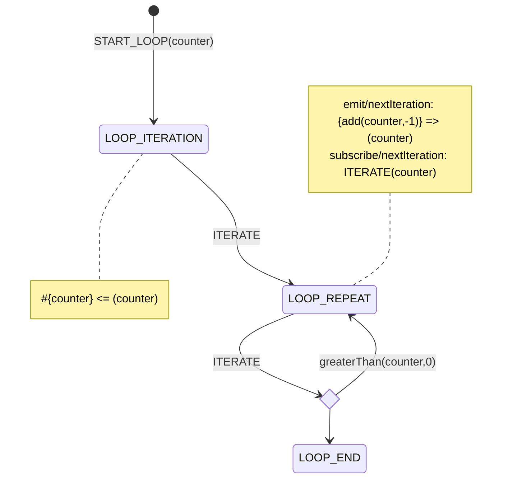

# Yantrix diagram syntax

## Mermaid

Yantrix extends [MermaidJS](https://mermaid.js.org/) syntax to describe business logic, which is then transpiled into one of popular programming languages. This allows to effortlessly visualize data flow and control states, blending well into [Documentation-As-Code](https://www.writethedocs.org/guide/docs-as-code/) and [Everything-As-Code](https://hackernoon.com/everything-as-code-explained-0ibg32a3) paradigms.

Yantrix currently supports [State Diagrams](https://mermaid.js.org/syntax/stateDiagram.html) and aims to support [Sequence Diagrams](https://mermaid.js.org/syntax/sequenceDiagram.html) and [Class Diagrams](https://mermaid.js.org/syntax/classDiagram.html) as well.

Example of a State Diagram, implementing an `until` loop:

## Subsyntax

There's a embedded subsyntax to describe data flow, effects and event model, which makes Yantrix itself a programming language that requires a bit of learning to use efficiently. The syntax reflects the state-machine lifecycle and mostly translates to or from fold reducers implemented via code generation.

Subsyntax is extendable in a functional way, and comes with most programming primitives typical for reactive (event-driven) functional frameworks:

-   [Constants](constants.html)
-   [Variables](variables.html)
-   [Expressions and Functions](functions.html)
-   [Events](events.html)
-   [Side Effects](effects.html)

## State Transformers

To project values between `Action Paylowd` and `State Context` the following syntax is used:

-   `#{<KEY_LIST>}<=(<KEY_LIST>)` : maps `Payload` to `Context`, where `Payload` keys referenced on the right side, and `Context` keys are referenced on the left side- `#(<KEY_LIST>)<=(<KEY_LIST>)` : maps previous `Context` to `Context`, where the previous `Context` keys referenced on the right side

## Event Subscriptions

`subscribe/<EVENT_NAME> => <ACTION_NAME> [(<KEY_LIST>)]`

## Event Emitters

`emit/<EVENT_NAME> [<= (<KEY_LIST>)]`

## Side Effects

`effect/<EFFECT_NAME> [<= (<KEY_LIST>)]`
