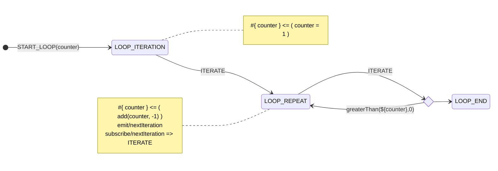

# Yantrix diagram syntax

## Mermaid

Yantrix extends [MermaidJS](https://mermaid.js.org/) syntax to describe business logic, which is then transpiled into
one of popular programming languages. This allows to effortlessly visualize data flow and control states, blending well
into [Documentation-As-Code](https://www.writethedocs.org/guide/docs-as-code/)
and [Everything-As-Code](https://hackernoon.com/everything-as-code-explained-0ibg32a3) paradigms.

Yantrix currently supports [State Diagrams](https://mermaid.js.org/syntax/stateDiagram.html) and aims to
support [Sequence Diagrams](https://mermaid.js.org/syntax/sequenceDiagram.html)
and [Class Diagrams](https://mermaid.js.org/syntax/classDiagram.html) as well.

Example of a State Diagram, implementing an `until` loop:

```
[*] --> LOOP_ITERATION: START_LOOP(counter)
LOOP_ITERATION --> LOOP_REPEAT: ITERATE
state loop_ends <<choice>>
LOOP_REPEAT --> loop_ends: ITERATE
loop_ends --> LOOP_REPEAT: greaterThan(${counter},0)
loop_ends --> LOOP_END
note right of LOOP_ITERATION
    #{ counter } <= ( counter = 1 )
end note
note left of LOOP_REPEAT
    #{ counter } <= ( add(counter, -1) )
    emit/nextIteration
    subscribe/nextIteration => ITERATE
end note
```

And this is how Mermaid renders it:



**Notice:** Please be informed that this partucular diagram is not a good application of Yantrix, but rather is
presented for demonstration purposes.

## State Machine

The first layer of syntax is describing a `FSM` - [Finite State Machine](../architecture/200_fsm.html).

The diagram above creates a `FSM` with 3 `States`:

- **LOOP_ITERATION**
- **LOOP_REPEAT**
- **LOOP_END**

They are written in uppercase on purpose, to be easily identified in a diagram source, but generally can be any alphanumeric identifiers.

The diagram also defines 2 `Actions`:

- **START_LOOP** with a `Payload` that carries a single `counter` variable
- **ITERATE** without a `Payload`

Since **ITERATE** can be invoked in two of three `States`(**LOOP_ITERATION** and **LOOP_REPEAT**), `LOOP_END` has no transitions out of it. However, an `Action` that is coming ot ouf a default node (`[*]`) can be dispatched from any `State`. Thus, **START_LOOP** `Action` effectively resets the whole machine to starting conditions. That is a very useful pattern for proper `FSM` designs 

Invoking **ITERATE** `Action` at **LOOP_REPEAT** `State` leads to a `Fork`, which has to calculate the predicate `greaterThan(${counter}, 0)`. If its truthy, the transition leads to **LOOP_END**. If not, the remaining transition makes a loop, invoking **LOOP_REPEAT** -> **LOOP_REPEAT** transition, yet again executing all operations in `notes` blocks, as described below.


## Subsyntax

Yantrix diagrams are built on top of Mermaid syntax for State Machines: there's an embedded subsyntax to describe data flow, effects and event model. That makes Yantrix itself a programming language that requires a bit of learning in order to use efficiently. The syntax reflects the state-machine lifecycle and mostly translates to or from reducers implemented via
code generation.

Yantrix subsyntax is a functional language by design, and each line of it is supposed to be independent of the others.
The best comparison could be Excel/Google Sheets formulas, that are:

- are computed derivatives of the state
- are executed and calculated in rounds
- can depend on each other but not within one round of calculation

So despite lines of code are written in order, the result of their transpilation should not be dependent on line order
as much as it goes.

Every line starts with a `Directive` which defines the character of operation and is the most basic semantic entity in
Yantrix:

- [**Reducers**](100_reducers.html)
    - [Data Objects](110_data_objects.html)
    - [Values and Constants](120_values_and_constants.html)
    - [Expressions](130_expressions.html)
    - [Functions](140_functions.html)
- [**Event pub/sub**](200_events.html)
    - [subscribe](210_subscribe.html)
    - [emit](220_emit.html)
- [**Side Effects**](300_side_effects.html)
