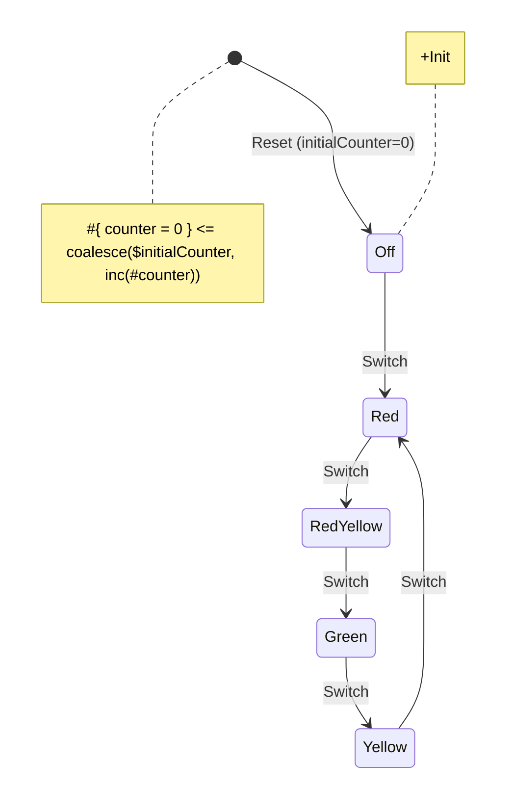

<div align="center">
  
  <h1><code>Traffic Light React Example</code></h1>
  <p>A simple example showcasing the integration of the Yantrix framework with React, showcasing how to create a state machine, use it in a React component, and handle events and state changes.</p>
</div>

## 📖 Documentation

[Example documentation](https://tfcp68.github.io/yantrix/examples/110_react.html)

## ⭐ Installation and usage

If you want to run this example locally, follow these steps:

1. Clone into the Yantrix repository:

```sh
git clone https://github.com/tfcp68/yantrix.git
```

1. Open the example folder:

```sh
cd yantrix/examples/02-traffic-light-react
```

1. Install the dependencies:

```sh
pnpm install
```

1. Generate the automata code from the diagram:

```sh
pnpm --filter 02-traffic-light-react generate
```

1. To run the project in development mode:

```sh
pnpm --filter 02-traffic-light-react dev
# Check out the example at http://localhost:5173
```

1. To build for production (also runs generate automatically):

```sh
pnpm build
```

For more information on how the example works, refer to the documentation.

## Source diagram



[Yantrix syntax reference](https://tfcp68.github.io/yantrix/syntax/)

## 🌱 Contributing

See [Contributing](https://tfcp68.github.io/yantrix/contributing/)

## 📜 License

Made with 💜. Published under [MIT License](./LICENSE).
