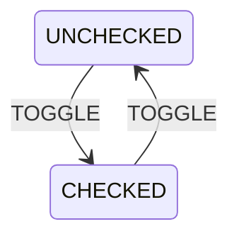

<div align="center">
  
  <h1><code>Checkbox Example</code></h1>
  <p>A simple example showcasing the integration of the Yantrix framework with React, demonstrating how to create a basic checkbox component using finite state machines. The example implements a two-state toggle functionality (checked/unchecked) with proper type safety and state management.</p>
</div>

## ⭐ Installation and usage

If you want to run this example locally, follow these steps:

1. Clone into the Yantrix repository:

```sh
git clone https://github.com/tfcp68/yantrix.git
```

1. Open the example folder:

```sh
cd yantrix/examples/03-checkbox
```

1. Install the dependencies:

```sh
pnpm install
```

1. Generate the automata code from the diagram:

```sh
pnpm --filter 03-checkbox-react generate
```

1. To run the project in development mode:

```sh
pnpm --filter 03-checkbox-react dev
# Check out the example at http://localhost:5173
```

1. To build for production (also runs generate automatically):

```sh
pnpm build
```

## Source diagram



[Yantrix syntax reference](https://tfcp68.github.io/yantrix/syntax/)

## 🌱 Contributing

See [Contributing](https://tfcp68.github.io/yantrix/contributing/)

## 📜 License

Made with 💜. Published under [MIT License](./LICENSE).
