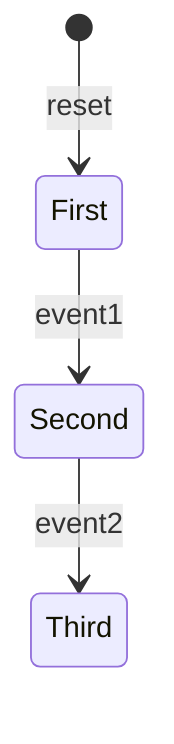

# `@yantrix/cli`

>Yantrix is a _(mostly)_ TypeScript framework and a DSL, that make up a full instrumental chain to implement robust and self-documented functional applications by code generation in multiple programming languages.

Command-line interface for [Yantrix](https://github.com/tfcp68/yantrix/) framework. This package is a console wrapper for certain Yantrix tooling, most notably [code generation](https://www.npmjs.com/package/@yantrix/codegen)

<p>
	<a href="https://github.com/tfcp68/yantrix/blob/main/LICENSE" target="_blank"></a>
	<a href="https://github.com/tfcp68/yantrix/actions/workflows/tests.yml" target="_blank"></a>
	<a href="https://www.npmjs.com/package/@yantrix/cli"></a>
	<a href="https://www.npmjs.com/package/@yantrix/cli"></a>
	<a href="https://codecov.io/gh/tfcp68/yantrix" target="_blank"></a>
	
</p>

## 📖 Usage

Install both `@yantrix/cli` and `@yantrix/codegen` using your prefered package manager. All the secondary dependencies will be installed automatically.

```bash
# Via NPM
$ npm install @yantrix/codegen @yantrix/cli

# Via Yarn
$ yarn add @yantrix/codegen @yantrix/cli

# Via PNPM
$ pnpm install @yantrix/codegen @yantrix/cli

# ✨ Auto-detection
$ npx nypm install @yantrix/codegen @yantrix/cli
```

> We suggest using `pnpm`

To get help on the `codegen` command, run:
```bash
yantrix codegen -h
```

It will print the following:
```bash
yantrix codegen [diagramFile]

Generates Automata from given mermaid state diagram

Positionals:
  diagramFile  Diagram file to be parsed. It should have .mermaid extension
                                                                        [string]

Options:
  -l, --language      Output file language. Currently supported: javascript, typ
                      escript, python, java                             [string]
  -o, --outfile       Output Automata file path                         [string]
  -c, --className     Name of the generated Automata class              [string]
  -j, --constants     Stringified JSON with constants to be used in generated Au
                      tomata                                            [string]
  -J, --constantFile  Path to JSON file with constants to be used in generated A
                      utomata                                           [string]
  -e, --eval          Evaluate the given state diagram                  [string]
      --verbose       Verbose mode                                     [boolean]
  -i, --interactive   Enter interactive mode                           [boolean]
  -h, --help          Show help                                        [boolean]
  -v, --version       Show version number                              [boolean]
```

For quick start, let's generate a simple Automata from a diagram saved in a file `diagram.mermaid`:


Just run:
```bash
$ yantrix codegen ./diagram.mermaid -o ./automata.ts -c MyAutomata -l typescript'
```

This will generate a file `automata.ts`. But that's not all - since we generated in Typescript, we should also install a couple of dependencies, that Automata depends on:
```bash
# Via NPM
$ npm install @yantrix/automata @yantrix/functions

# Via Yarn
$ yarn add @yantrix/automata @yantrix/functions

# Via PNPM
$ pnpm install @yantrix/automata @yantrix/functions

# ✨ Auto-detection
$ npx nypm install @yantrix/automata @yantrix/functions
```

In any case, this will be reported during the generation process, like this:
```bash
Since you have chosen the *-script language, you need to install additional packages to work with the generated Automata:
	- @yantrix/automata
	- @yantrix/functions
```

For more information, see also:
- [Quick start in Typescript](https://tfcp68.github.io/yantrix/)
- [Learn language options](https://tfcp68.github.io/yantrix/integrations/100_language_support.html)
- [Diagram examples](https://tfcp68.github.io/yantrix/concepts/999_design_examples.html)

## [🌱 Contributing](https://tfcp68.github.io/yantrix/contributing/)
## 📜 License

Made with 💜. Published under [MIT License](./LICENSE).
