# Eta Templates Hierarchy — Codegen

## The `it` object (built in `buildTemplateModel()`)

```
it = {
  className,
  hasTypes,                         // boolean — true for TS output
  imports,                          // TImports — { [pkg]: string[] }
  importNamespaces,                 // TNullable<TImports>
  diagram,                          // TStateDiagramMatrixIncludeNotes
  stateDictionary,                  // BasicStateDictionary
  actionDictionary,                 // BasicActionDictionary
  eventDictionary,                  // BasicEventDictionary
  expressions,                      // TExpressionRecord
  defines,                          // DefineStatement[]
  injects,                          // InjectStatement[]
  injectedPath,                     // TNullable<string>
  functions: {
    userFunctionsCheck,             // { injectIdentifiers: string[] }
    customRegistrations,            // TCustomRegistration[]
    userFunctionsNamespace,         // string | null
  },
  initialStateId,                   // string
  initialStateValue,                // number
  initialContext,                   // Record<string, unknown>
  startStateKey,                    // StartState
  byPassAction,                     // ByPassAction
  context: {
    reducer,                        // { entries: { stateValue, transition }[] }
    defaultContext,                  // { startStateValue, transition }
  },
  forks: {
    predicates,                     // Record<stateId, Record<actionId, { transitions }>>
  },
  events: {
    eventAdapter,                   // { emitters, listeners }
    createEventBus,                 // { resultVarName }
  },
  dictionaries: {
    actionToStateFromState,         // Record<stateId, Record<actionId, { state, withPredicate }>>
    byPassedList,                   // number[]
    actionsMap,                     // Record<string, number>
    statesMap,                      // Record<string, number>
  },
}
```

## Full template hierarchy diagram

```mermaid
flowchart TB
  classDef entryJs fill:#2d6a4f,color:#fff,stroke:#1b4332
  classDef entryTs fill:#1d3557,color:#fff,stroke:#0d1b2a
  classDef shared fill:#7209b7,color:#fff,stroke:#3a0ca3
  classDef sharedLeaf fill:#b5179e,color:#fff,stroke:#7209b7
  classDef jsOnly fill:#588157,color:#fff,stroke:#344e41
  classDef jsLeaf fill:#a3b18a,color:#000,stroke:#588157
  classDef tsOnly fill:#457b9d,color:#fff,stroke:#1d3557
  classDef tsLeaf fill:#a8dadc,color:#000,stroke:#457b9d

  %% ════════════════════════════════════════════════════
  %% ENTRY POINTS
  %% ════════════════════════════════════════════════════
  JS_MOD["<b>js/module.eta</b><br/><i>Entry point JS</i>"]:::entryJs
  TS_MOD["<b>ts/module.eta</b><br/><i>Entry point TS</i>"]:::entryTs

  %% ════════════════════════════════════════════════════
  %% js/shared — IMPORTS
  %% ════════════════════════════════════════════════════
  subgraph SHARED_IMPORTS ["js/shared/imports/"]
    direction TB
    SH_IMP_MOD["imports/module"]:::shared
    SH_IMP_NAMED["imports/named<br/><i>it.imports</i>"]:::sharedLeaf
    SH_IMP_NS["imports/namespace<br/><i>it.importNamespaces</i>"]:::sharedLeaf
  end
  SH_IMP_MOD -->|it| SH_IMP_NAMED
  SH_IMP_MOD -->|it| SH_IMP_NS

  %% ════════════════════════════════════════════════════
  %% js/shared — FORKS
  %% ════════════════════════════════════════════════════
  subgraph SHARED_FORKS ["js/shared/forks/"]
    direction TB
    SH_FORK_MOD["forks/module"]:::shared
    SH_FORK_STATE_ENTRY["forks/stateEntry<br/><i>stateId, actionPredicates</i>"]:::sharedLeaf
    SH_FORK_ACT_ENTRY["forks/actionEntry<br/><i>actionId, predicate</i>"]:::sharedLeaf
    SH_FORK_TRANS["forks/transition<br/><i>transition, transitionIndex</i>"]:::sharedLeaf
  end
  SH_FORK_MOD -->|"{ stateId, actionPredicates }"| SH_FORK_STATE_ENTRY
  SH_FORK_STATE_ENTRY -->|"{ actionId, predicate }"| SH_FORK_ACT_ENTRY
  SH_FORK_ACT_ENTRY -->|"{ transition, transitionIndex }"| SH_FORK_TRANS

  %% ════════════════════════════════════════════════════
  %% js/shared — DICTIONARIES
  %% ════════════════════════════════════════════════════
  subgraph SHARED_DICTS ["js/shared/dictionaries/"]
    direction TB
    SH_DICT_MOD["dictionaries/module"]:::shared
    SH_DICT_DECL["declarations<br/><i>states, actions, events, functionDictionary</i>"]:::sharedLeaf
    SH_DICT_RUNTIME["runtime<br/><i>byPassedStates, runtimeRegistries, epoch helpers</i>"]:::sharedLeaf

    subgraph TRANS ["transitions/"]
      direction TB
      SH_DICT_TRANS_MOD["transitions/module"]:::shared
      SH_DICT_A2S_STATE["transitions/stateEntry<br/><i>stateId, actions</i>"]:::sharedLeaf
      SH_DICT_A2S_ENTRY["transitions/entry<br/><i>stateId, actionId, entry</i>"]:::sharedLeaf
    end
  end
  SH_DICT_MOD -->|it| SH_DICT_DECL
  SH_DICT_MOD -->|it| SH_DICT_RUNTIME
  SH_DICT_MOD -->|it| SH_DICT_TRANS_MOD
  SH_DICT_TRANS_MOD -->|"{ stateId, actions }"| SH_DICT_A2S_STATE
  SH_DICT_A2S_STATE -->|"{ stateId, actionId, entry }"| SH_DICT_A2S_ENTRY

  %% ════════════════════════════════════════════════════
  %% js/shared — FUNCTIONS
  %% ════════════════════════════════════════════════════
  subgraph SHARED_FUNCS ["js/shared/functions/"]
    direction TB
    SH_FUNC_MOD["functions/module<br/><i>extracts: registrations = it.functions.customRegistrations</i>"]:::shared
    SH_FUNC_REG["registrations<br/><i>registerDefine, registerInject per registration</i>"]:::sharedLeaf

    subgraph USER ["user/"]
      direction TB
      SH_FUNC_USER_MOD["user/module<br/><i>it + registrations</i>"]:::shared
      SH_FUNC_RESOLVE["user/resolve<br/><i>namespace: it.functions.userFunctionsNamespace</i>"]:::sharedLeaf
    end
  end
  SH_FUNC_MOD -->|"{ ...it, registrations }"| SH_FUNC_USER_MOD
  SH_FUNC_MOD -->|"{ ...it, registrations }"| SH_FUNC_REG
  SH_FUNC_USER_MOD -->|"{ namespace }"| SH_FUNC_RESOLVE

  %% ════════════════════════════════════════════════════
  %% js/shared — EVENTS
  %% ════════════════════════════════════════════════════
  subgraph SHARED_EVENTS ["js/shared/events/"]
    direction TB
    SH_EVT_MOD["events/module"]:::shared

    subgraph ADAPTER ["adapter/"]
      direction TB
      SH_EVT_ADAPT_MOD["adapter/module"]:::shared
      SH_EVT_PAYLOAD["adapter/payload"]:::shared
      SH_EVT_SOURCE["adapter/source<br/><i>sourceValue</i>"]:::sharedLeaf

      subgraph EMIT ["emit/"]
        direction TB
        SH_EVT_EMIT_MOD["emit/module"]:::shared
        SH_EVT_EMIT_ENTRY["emit/entry<br/><i>emitter</i>"]:::sharedLeaf
        SH_EVT_EMIT_CODE["emit/code<br/><i>eventCode</i>"]:::sharedLeaf
      end

      subgraph LISTEN ["listen/"]
        direction TB
        SH_EVT_LISTEN_MOD["listen/module"]:::shared
        SH_EVT_LISTEN_ENTRY["listen/entry<br/><i>listener</i>"]:::sharedLeaf
      end
    end

    subgraph BUS ["bus/"]
      direction TB
      SH_EVT_BUS_MOD["bus/module"]:::shared
      SH_EVT_BUS_FACTORY["bus/factory<br/><i>it</i>"]:::sharedLeaf
      SH_EVT_BUS_SUBS["bus/subscriptions<br/><i>it.events.createEventBus</i>"]:::sharedLeaf
    end
  end
  SH_EVT_MOD -->|it| SH_EVT_ADAPT_MOD
  SH_EVT_MOD -->|it| SH_EVT_BUS_MOD

  SH_EVT_ADAPT_MOD -->|"{ emitters }"| SH_EVT_EMIT_MOD
  SH_EVT_ADAPT_MOD -->|"{ listeners }"| SH_EVT_LISTEN_MOD
  SH_EVT_EMIT_MOD -->|"{ emitter }"| SH_EVT_EMIT_ENTRY
  SH_EVT_EMIT_ENTRY -->|"{ eventCode }"| SH_EVT_EMIT_CODE
  SH_EVT_EMIT_CODE -->|"{ entries }"| SH_EVT_PAYLOAD
  SH_EVT_LISTEN_MOD -->|"{ listener }"| SH_EVT_LISTEN_ENTRY
  SH_EVT_LISTEN_ENTRY -->|"{ entries }"| SH_EVT_PAYLOAD
  SH_EVT_PAYLOAD -->|"{ source }"| SH_EVT_SOURCE

  SH_EVT_BUS_MOD -->|it| SH_EVT_BUS_FACTORY
  SH_EVT_BUS_MOD -->|it| SH_EVT_BUS_SUBS

  %% ════════════════════════════════════════════════════
  %% js/shared — EXPRESSIONS
  %% ════════════════════════════════════════════════════
  subgraph SHARED_EXPR ["js/shared/expressions/"]
    direction TB
    SH_EXPR_MOD["expressions/module<br/><i>{ model }</i>"]:::shared
    SH_EXPR_CALLS["expressions/calls<br/><i>functionCall + internalFunctionCall</i>"]:::shared
    SH_EXPR_DEF_PROP["expressions/context/defaultPropertyContext<br/><i>path, identifier, expression</i>"]:::sharedLeaf
  end
  SH_EXPR_MOD -->|"{ model }"| SH_EXPR_CALLS
  SH_EXPR_CALLS -.->|"recursive: each arg"| SH_EXPR_MOD

  %% ════════════════════════════════════════════════════
  %% js/context — shared for JS and TS (via it.hasTypes)
  %% ════════════════════════════════════════════════════
  subgraph JS_CTX ["js/context/"]
    direction TB
    JS_CTX_MOD["js/context/module"]:::jsOnly
    JS_CTX_REDUCER["context/reducer<br/><i>reducer entries</i>"]:::jsOnly
    JS_CTX_DEFAULT["context/defaultContext<br/><i>defaultContext</i>"]:::jsLeaf

    subgraph JS_REDUCERS ["js/context/reducers/"]
      direction TB
      JS_CTX_RED_MOD["reducers/module"]:::jsOnly
      JS_CTX_ITEM["reducers/item<br/><i>contextItemWithReducer + contextItemNoReducer</i>"]:::jsOnly
      JS_CTX_BV_CONST["reducers/constant<br/><i>expressionValueRight (constant)</i>"]:::jsLeaf
      JS_CTX_BV_EXPR["reducers/expression<br/><i>expressionValueRight (expression)</i>"]:::jsLeaf
    end
  end
  JS_CTX_MOD -->|"{ reducer: it.context.reducer }"| JS_CTX_REDUCER
  JS_CTX_MOD -->|"{ defaultContext: it.context.defaultContext }"| JS_CTX_DEFAULT
  JS_CTX_REDUCER -->|"{ stateValue, transition }"| JS_CTX_RED_MOD
  JS_CTX_RED_MOD -->|"{ transition }"| JS_CTX_ITEM
  JS_CTX_ITEM -->|"{ source, target, default }"| JS_CTX_BV_CONST
  JS_CTX_ITEM -->|"{ source, target, default }"| JS_CTX_BV_EXPR
  JS_CTX_ITEM -->|"{ path, identifier, expression }"| SH_EXPR_DEF_PROP
  JS_CTX_DEFAULT -->|"{ transition }"| JS_CTX_ITEM

  %% ════════════════════════════════════════════════════
  %% js/class
  %% ════════════════════════════════════════════════════
  subgraph JS_CLASS ["js/class/"]
    direction TB
    JS_CLS_MOD["js/class/module<br/><i>it (full)</i>"]:::jsOnly
    JS_CLS_STATIC["class/static<br/><i>getState, hasState, getAction, createAction<br/>typed variants when it.hasTypes</i>"]:::jsOnly

    subgraph JS_REDUCER_CLS ["js/class/reducer/"]
      direction TB
      JS_RED_MOD["reducer/module"]:::jsOnly
      JS_GET_NEW["reducer/getNew<br/><i>rootReducer body: validation, predicate resolution</i>"]:::jsOnly
    end
  end

  JS_CLS_MOD -->|it| JS_CLS_STATIC
  JS_CLS_MOD -->|it| JS_RED_MOD
  JS_RED_MOD -->|it| JS_GET_NEW

  %% ════════════════════════════════════════════════════
  %% TS-ONLY — TYPES
  %% ════════════════════════════════════════════════════
  subgraph TS_TYPES ["ts/types/"]
    direction TB
    TS_TYPES_MOD["ts/types/module"]:::tsOnly
    TS_TYPES_AUTOMATA["ts/types/automata<br/><i>TContext, TPayload types</i>"]:::tsLeaf
    TS_TYPES_REDUCER["ts/types/reducer<br/><i>TRootReducer type</i>"]:::tsLeaf
  end
  TS_TYPES_MOD -->|it| TS_TYPES_AUTOMATA
  TS_TYPES_MOD -->|it| TS_TYPES_REDUCER

  %% ════════════════════════════════════════════════════
  %% TS-ONLY — CLASS (static overrides only)
  %% ════════════════════════════════════════════════════
  subgraph TS_CLASS ["ts/class/"]
    direction TB
    TS_CLS_MOD["ts/class/module<br/><i>it (full) — extends js/class with TS types</i>"]:::tsOnly
    TS_CLS_STATIC["ts/class/static<br/><i>typed overrides for getState, getAction, createAction</i>"]:::tsLeaf
  end
  TS_CLS_MOD -->|it| TS_CLS_STATIC

  %% ════════════════════════════════════════════════════
  %% ENTRY: JS → children
  %% ════════════════════════════════════════════════════
  JS_MOD -->|it| SH_IMP_MOD
  JS_MOD -->|it| SH_FORK_MOD
  JS_MOD -->|it| SH_DICT_MOD
  JS_MOD -->|it| SH_FUNC_MOD
  JS_MOD -->|it| SH_EVT_MOD
  JS_MOD -->|it| JS_CTX_MOD
  JS_MOD -->|it| JS_CLS_MOD

  %% ════════════════════════════════════════════════════
  %% ENTRY: TS → children
  %% ════════════════════════════════════════════════════
  TS_MOD -->|it| SH_IMP_MOD
  TS_MOD -->|it| SH_FORK_MOD
  TS_MOD -->|it| SH_DICT_MOD
  TS_MOD -->|it| TS_TYPES_MOD
  TS_MOD -->|it| SH_FUNC_MOD
  TS_MOD -->|it| SH_EVT_MOD
  TS_MOD -->|"it (hasTypes=true)"| JS_CTX_MOD
  TS_MOD -->|it| TS_CLS_MOD
```



## Legend

| Color | Meaning |
|-------|---------|
| Dark green | JS entry point (`js/module.eta`) |
| Dark blue | TS entry point (`ts/module.eta`) |
| Purple | Shared templates (`js/shared/` — common for JS and TS) |
| Pink | Shared leaf templates (terminal, no includes) |
| Green | JS-only templates (also used by TS via `it.hasTypes`) |
| Light green | JS-only leaf templates |
| Blue | TS-only templates |
| Light blue | TS-only leaf templates |

## Arrow notation

Each arrow `A -->|data| B` represents an `<%~ include('B', data) %>` call.

- **`it`** — the full data object passed as-is, without modifications
- **`{ key: it.path.to.value }`** — an object with specific fields picked from `it`
- **`{ ...it, registrations }`** — spread of `it` with added/overridden fields
- **`it (hasTypes=true)`** — `it` with `hasTypes` set to `true`; enables typed output in shared templates
- **No label** — include without passing data (uses variables from parent closure)

## Include order in entry points

### `js/module.eta` (7 steps)
1. `js/shared/imports/module` ← `it` (it.imports, it.importNamespaces)
2. `js/shared/forks/module` ← `it` (it.forks.predicates)
3. `js/shared/dictionaries/module` ← `it` (it.stateDictionary, it.actionDictionary, it.eventDictionary, it.dictionaries.*)
4. `js/shared/functions/module` ← `it` (it.functions.*)
5. `js/shared/events/module` ← `it` (it.events.*)
6. `js/context/module` ← `it` (it.context.*)
7. `js/class/module` ← `it` (it.className, it.initialStateValue, it.initialContext, it.byPassAction)

### `ts/module.eta` (8 steps)
1. `js/shared/imports/module` ← `it`
2. `js/shared/forks/module` ← `it`
3. `js/shared/dictionaries/module` ← `it`
4. `ts/types/module` ← `it` (TContext, TPayload, TRootReducer type exports)
5. `js/shared/functions/module` ← `it`
6. `js/shared/events/module` ← `it`
7. `js/context/module` ← `it` (hasTypes=true — adds TS type annotations)
8. `ts/class/module` ← `it`

## Cross-directory includes

| From | To | Data |
|------|----|------|
| `js/context/reducers/item` | `js/shared/expressions/context/defaultPropertyContext` | `{ path, identifier, expression }` |
| `js/context/defaultContext` | `js/context/reducers/item` | `{ transition }` |
| `js/class/module` | `js/shared/dictionaries/runtime` | `it` |
| `ts/class/module` | `js/shared/dictionaries/runtime` | `it` |
| `js/shared/events/adapter/source` | `js/shared/expressions/context/defaultPropertyContext` | `{ path, identifier, expression }` |
| `js/shared/functions/registrations` | `js/shared/expressions/module` | `{ model: registration.bodyModel }` |
| `js/shared/expressions/calls` | `js/shared/expressions/module` (recursive) | `{ model: arg }` |
